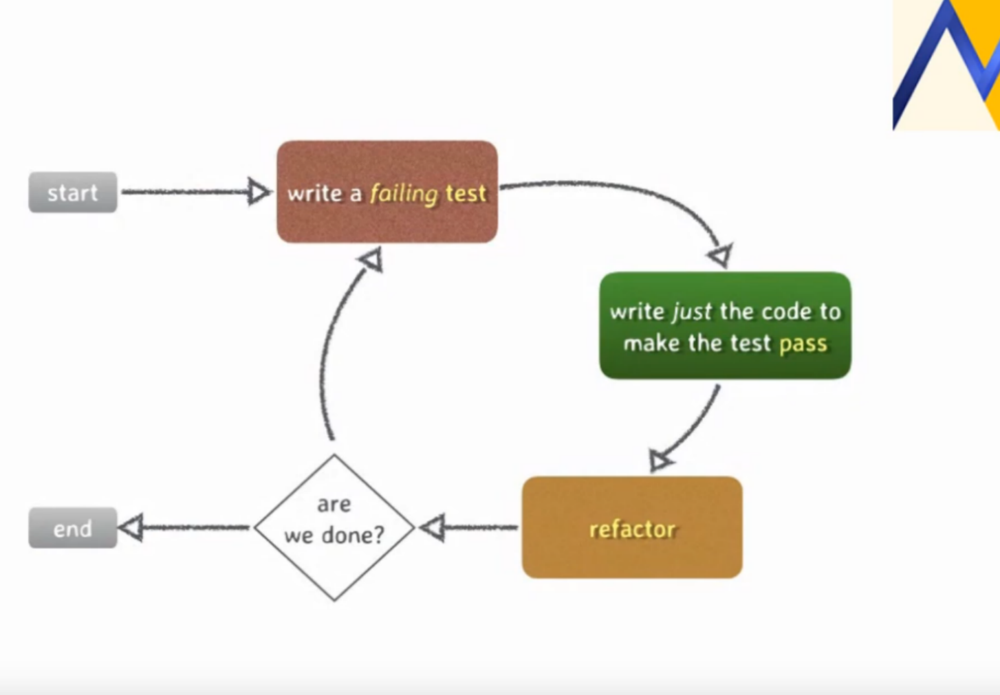
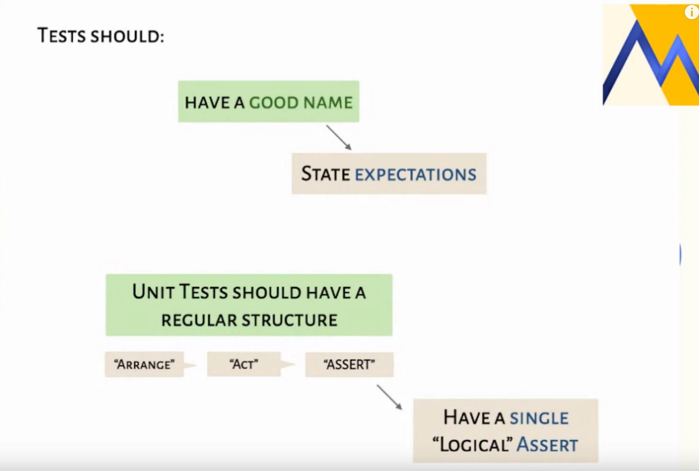
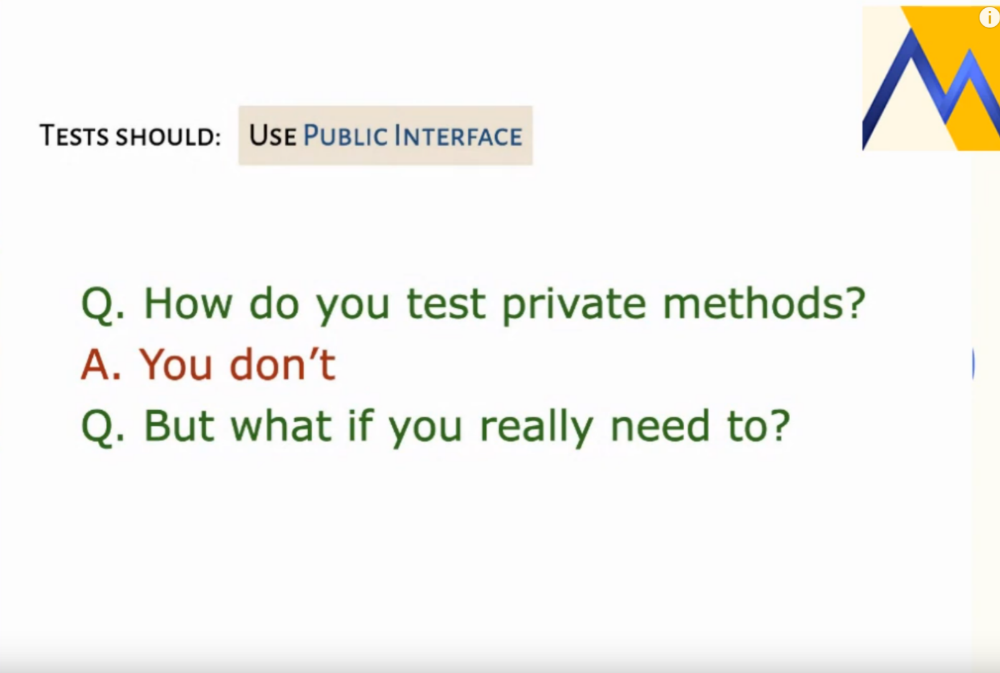
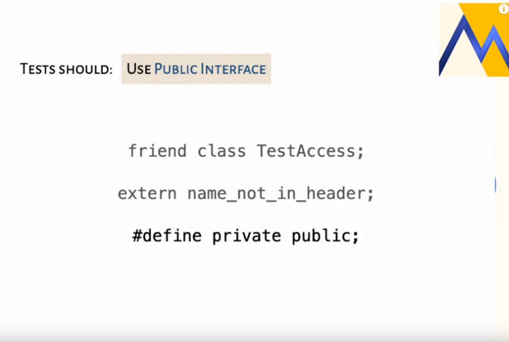
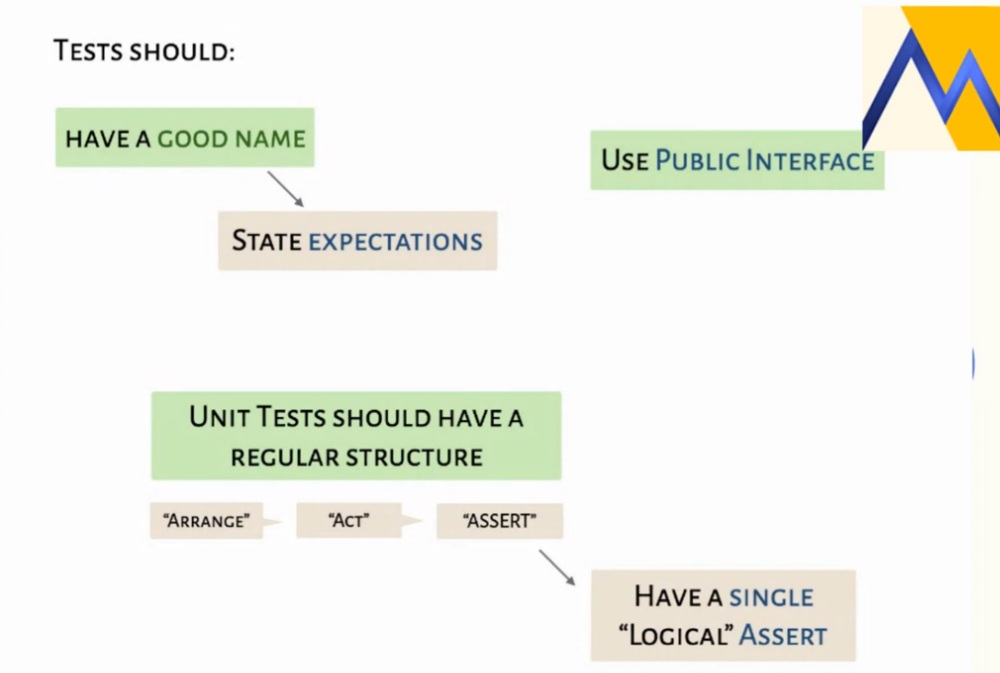
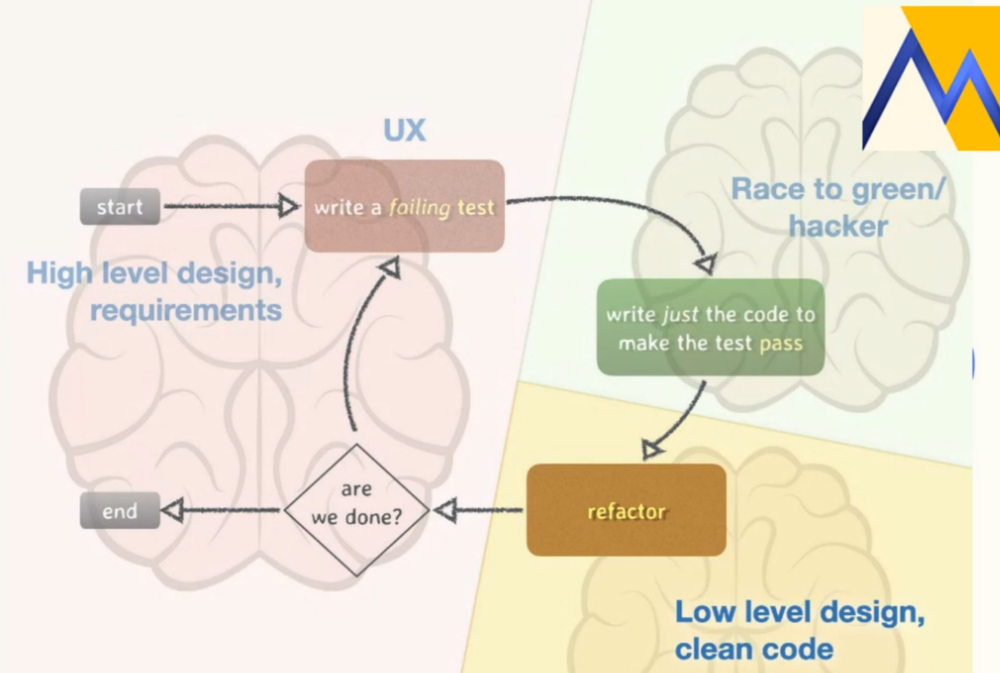

- Test driven development or test driven design
	- as an aim to mainly improve design
	- 
- Write afailing test:
	- failed calls are a failing test.
- write justt```
  git remote -v
  ``` the code to pass test
	- not clean ,just tinkery code to pass
- refactor
	- no functionality or test changes
	- dont miss unless very conscious about it
- SOLID
- functional requirment:
	- what can be test as value from the API
- Practicing takes time and requires a safe environment , deliberate repetitive problem
- limit test to the scope of your changes
- write good names for tests
	- helps code design and furture development
- 
- 
- 
- 
- 
- "only test things that can possibly break " ken beck