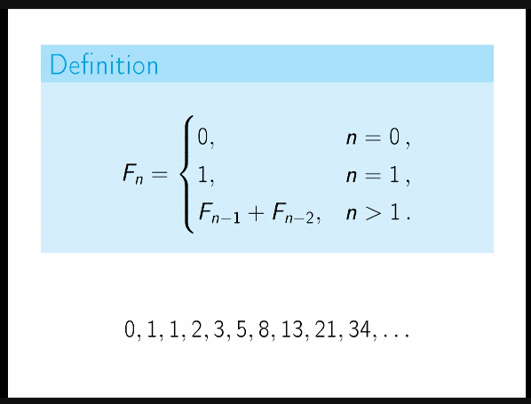
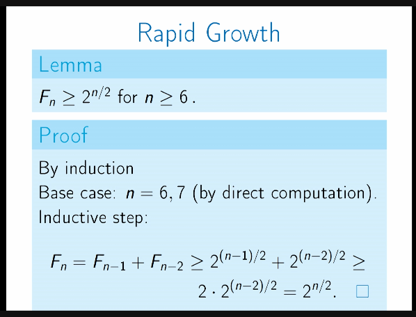
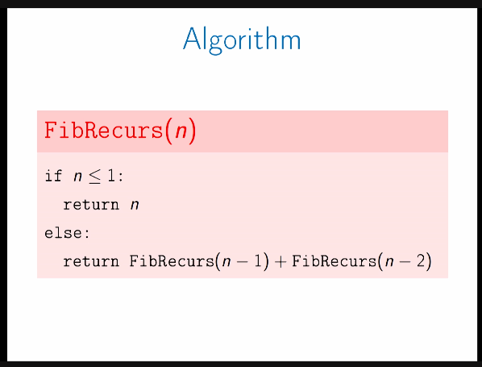
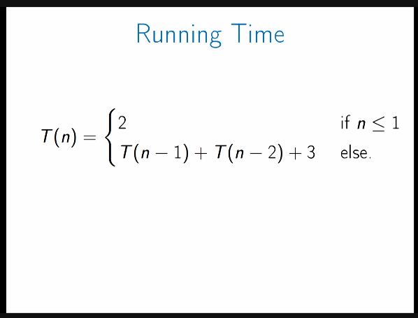
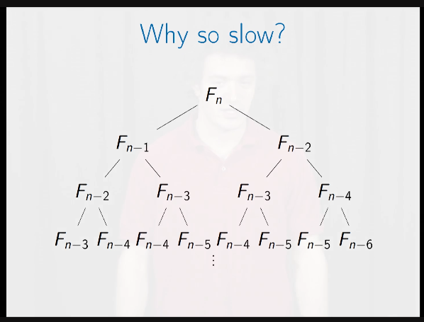
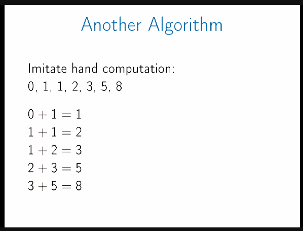
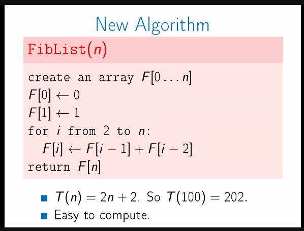

- straightforward algo
	- problem statement to algorithm
- Fibonacci numbers:
	- problem overview
	- 
	- 
	- compute fibonnacci
- compute:
	- 
	- runtime:
		- 
		- naive implementation is runtime intensive
		- a tree of recursive calls:
			- 
	- faster sloution:
		- 
		- 
		-