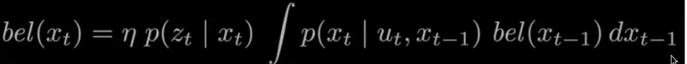

- a framework to perform recursive state estimation.
	- belief is our estimate of the state.
	- observation: what we/is precieve/d
	- motions: shift in state (movement)
- 
- 
- 
- simplified: 
- 
- realizations of bayes:
	- Histogram filter
	- kalman filter
	- particle filter
- bloom filters?? read
- 
-
- applying movements:
	- cyclic world of 5 distinct spaces.
- LOTP: redistributing belief according to a motion/change in the state space
- Bayes: updating/ changing the state space base on an input/ observation