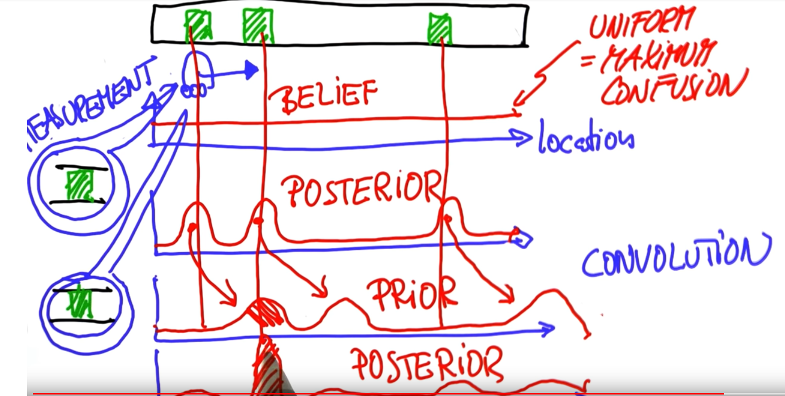
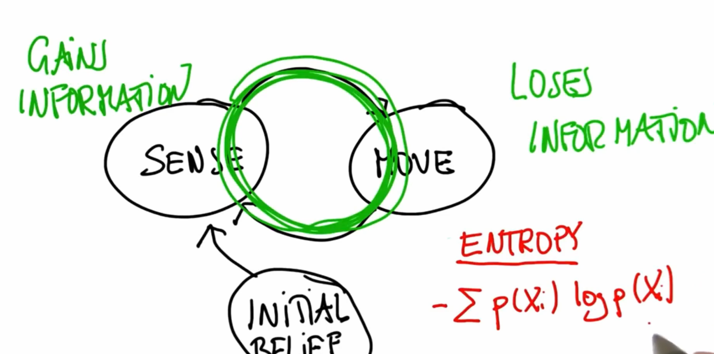
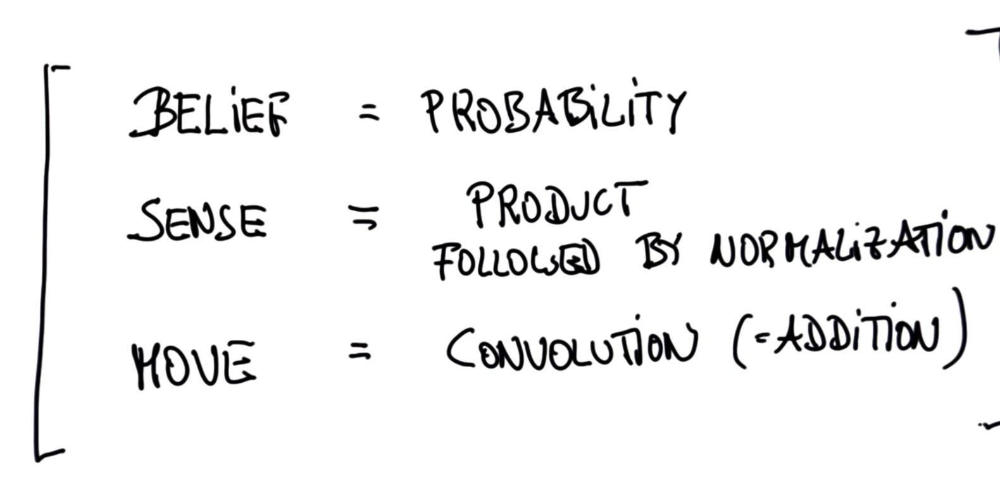
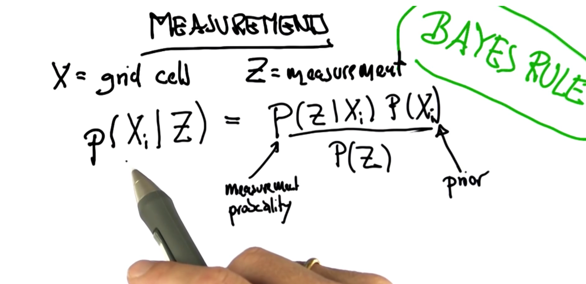
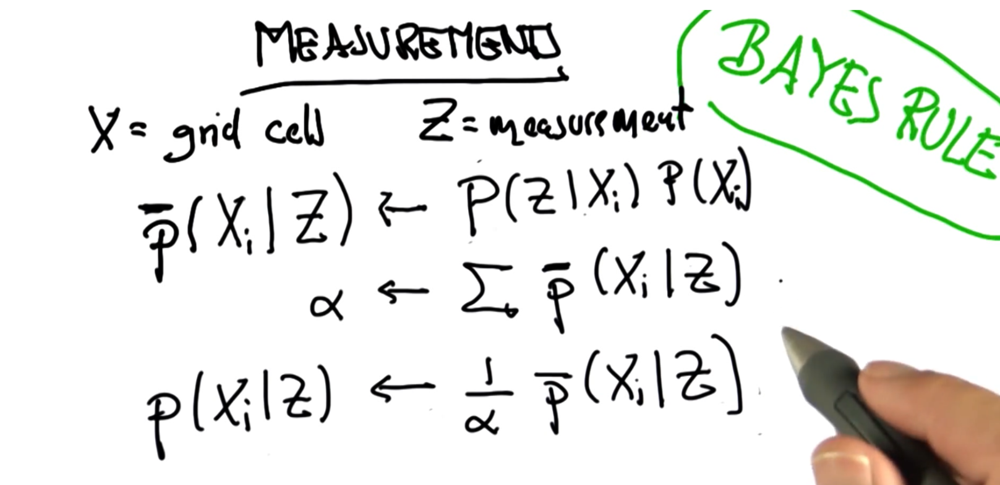
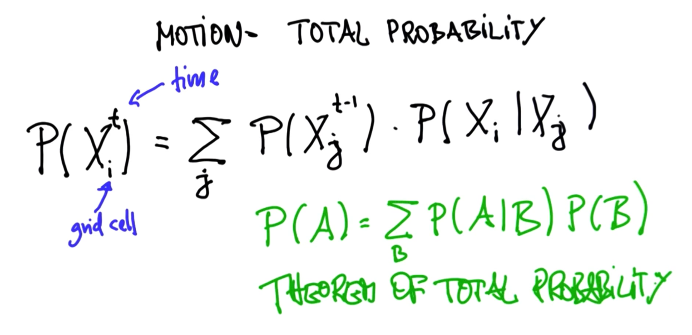
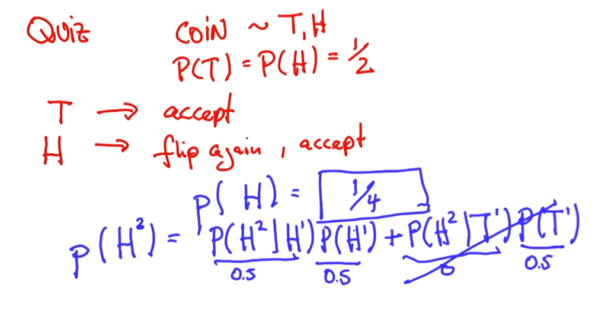
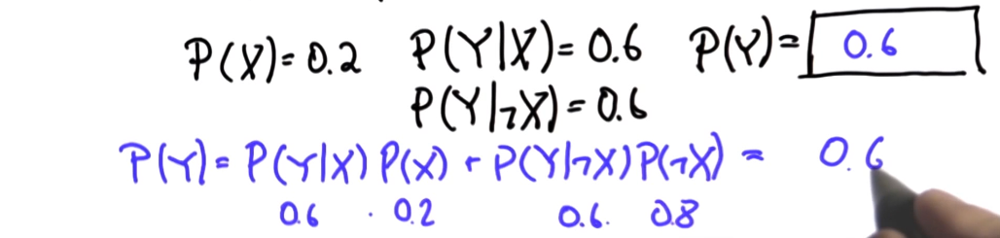

- Measurement affects how our belief function would look like. (posterior belief)
- we shit our belief then based on the motion, a convolution. since motion is uncertain convoluted positions are flatter or with less
- now the previous(prior belief ) is multiplies with the current.
- posterior means after measurement has been taken.
- 
- Probability after sense:
	- incorporate belief into probability by  us multiplication/ chain rule.
	- posterior distribution: is the normalized probability score of all possibilities( normalized == division by total probability score).
- 
-
- 
- 
-
- 
- theorem of total probability
- 
- 
  id:: 65b8a377-a3e2-40f5-ad0e-ffac886e7620
- bayes is for observations.
- total probability :
	- 