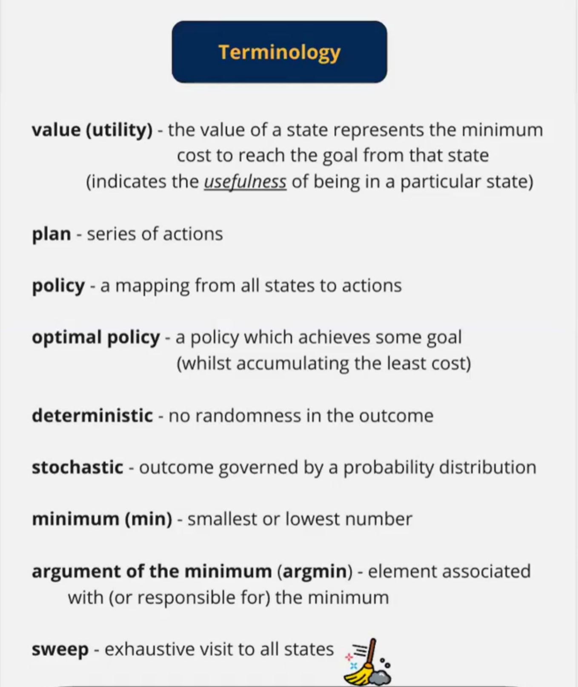
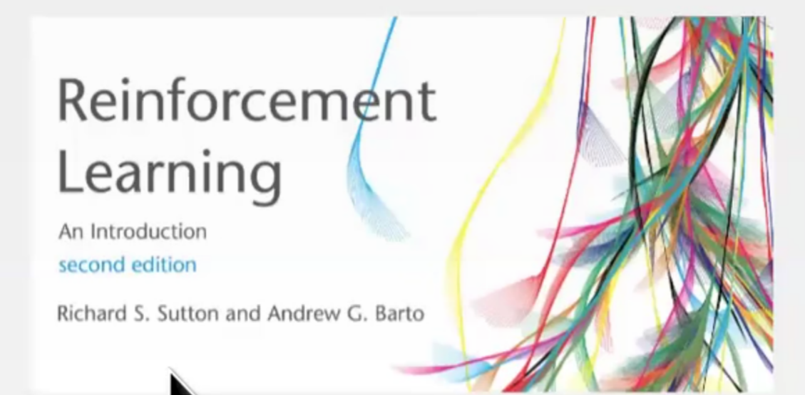
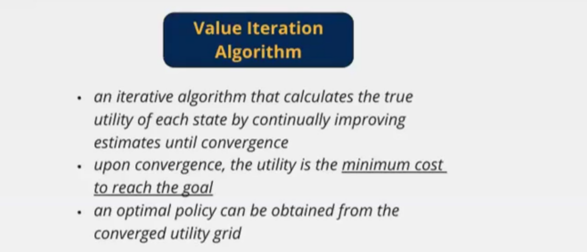
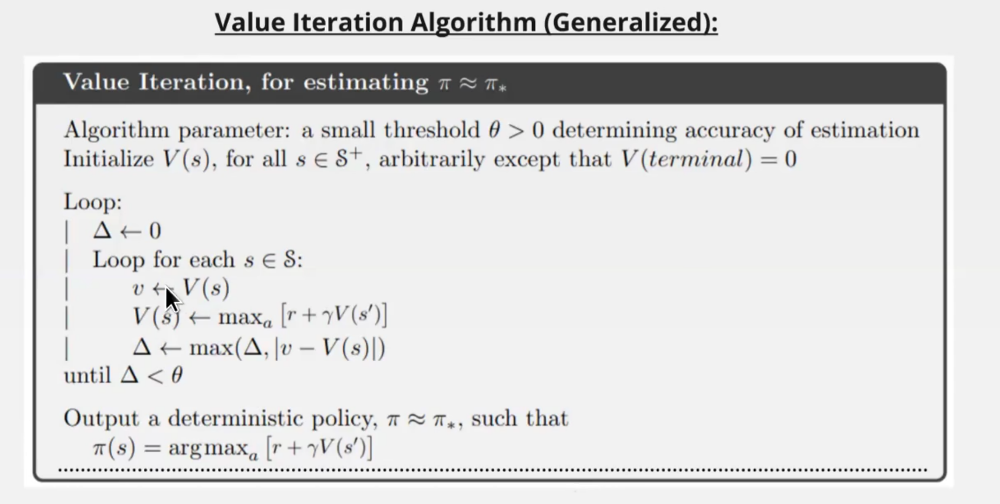
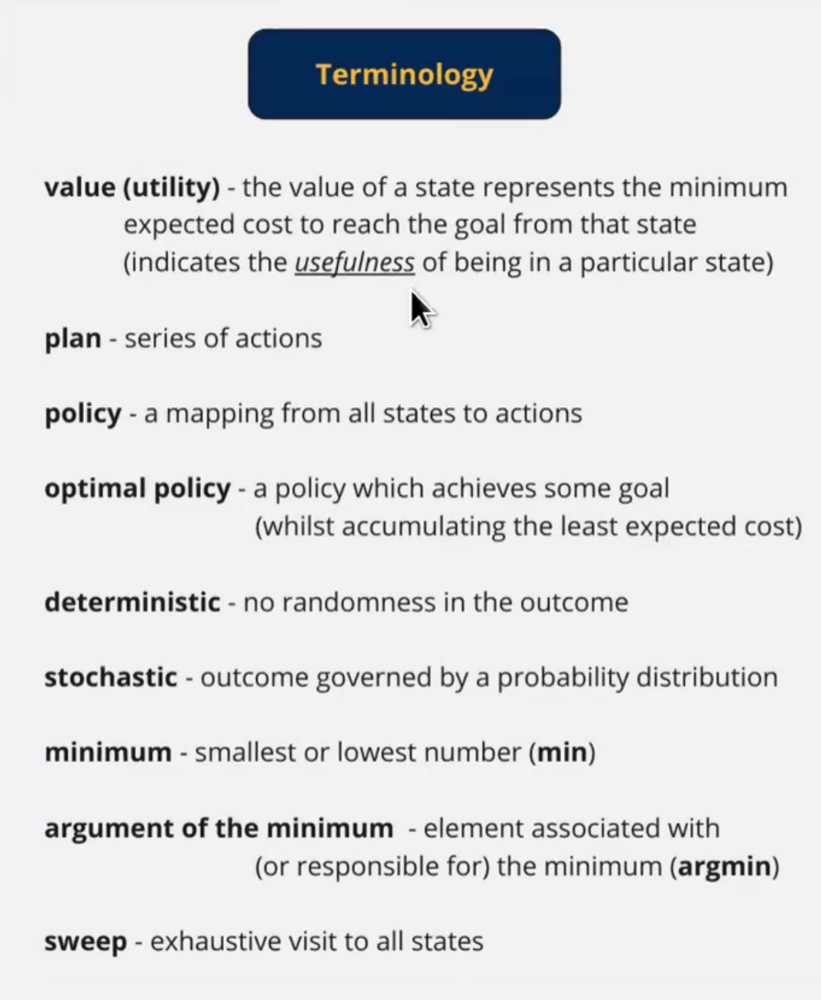
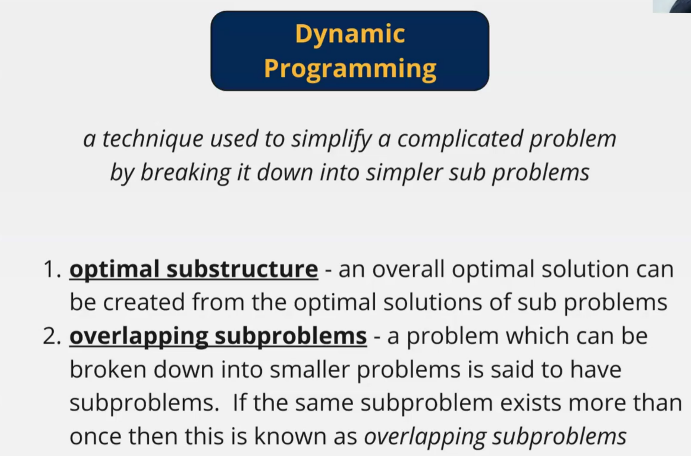
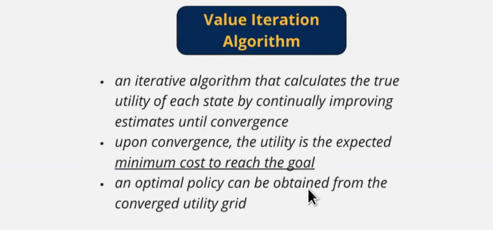
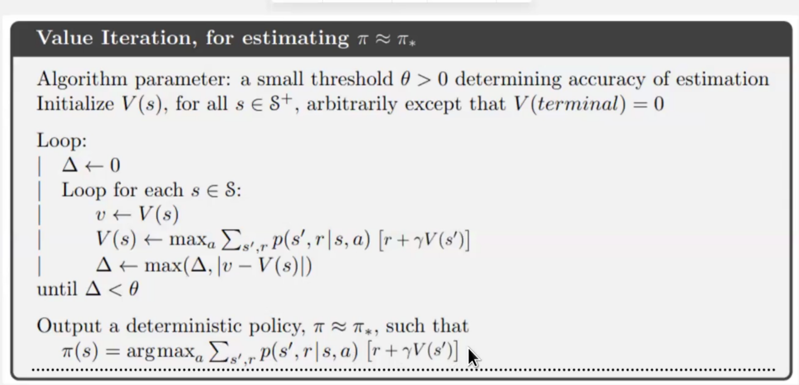
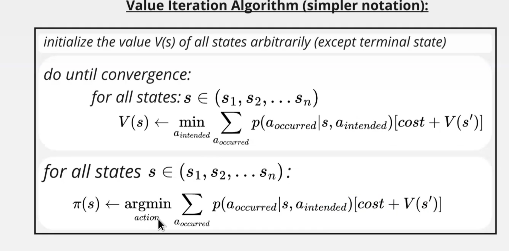

- Takeaways:
	- outcomes affect desicions.
	- options affect decisions
- types of actions:
	- Stochastic:
		- deterministic is a special case stochastic that has 100% of fulfillment
- confidence:
	- no errors
	- strenght in numbers
	- reference
	- ground truth
	- similar scenario
	- test on variations.
	- ###########
	- unit tests
	- sample problems with corner cases
	- full code coverage
	- robust to input deviations
- solution KPI:
	- robust:
		- action cost
		- success probabilty
		- wall cost
		- goal location
		- grid layout
		- allowable actions.
- [[Dynamic Programming]]:
	- value iteration:
	- decisions have both immediate consequences and long term
	- 
- Value iteration:
	- 
	- 
	- 
	- gamma is a discount factor. environment doesnt end till terminal change.
	- initialize with values that can be updated by VI
	- 
- when no change happened then convergence happened.
- 
- 
- for stochastic policy
- 
- fibonnacci == memoization
- value iteration is not cyclic/circular its different based on:
	- bellman equation
	- contract mapping
- stochastic VI:
	- 
	- 
	- 
	-