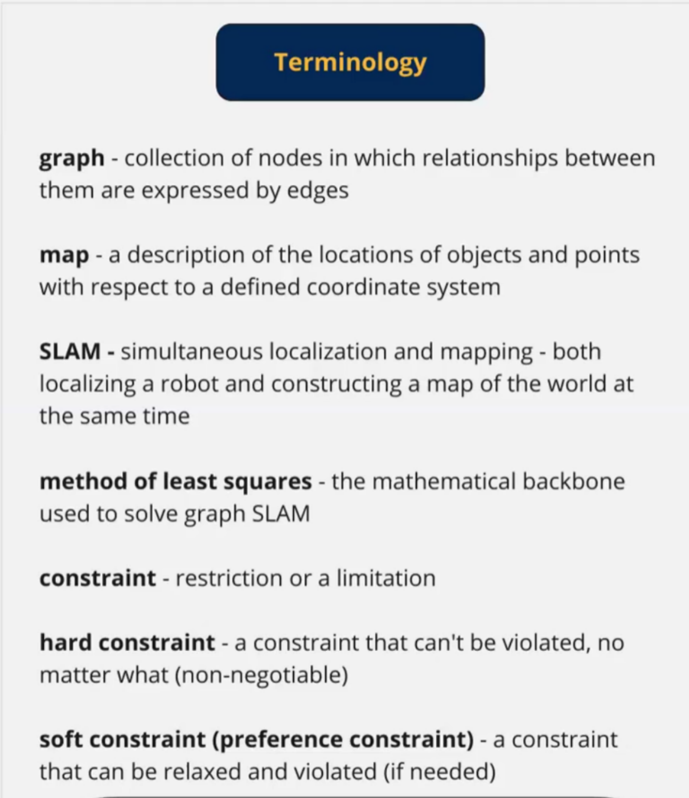
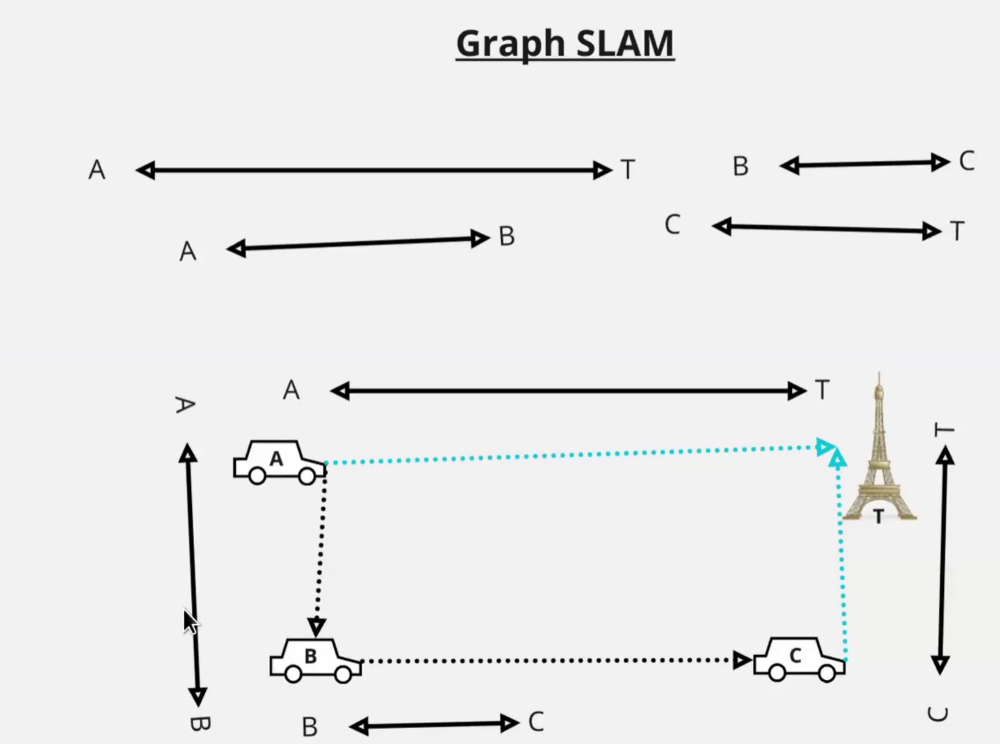
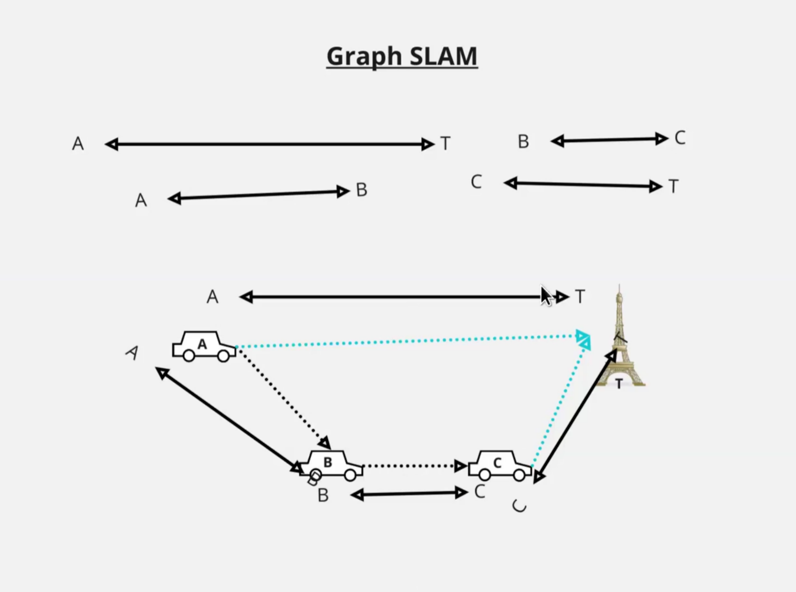
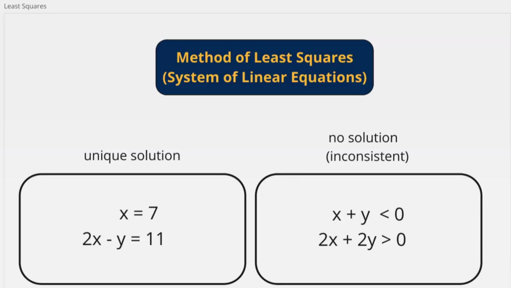
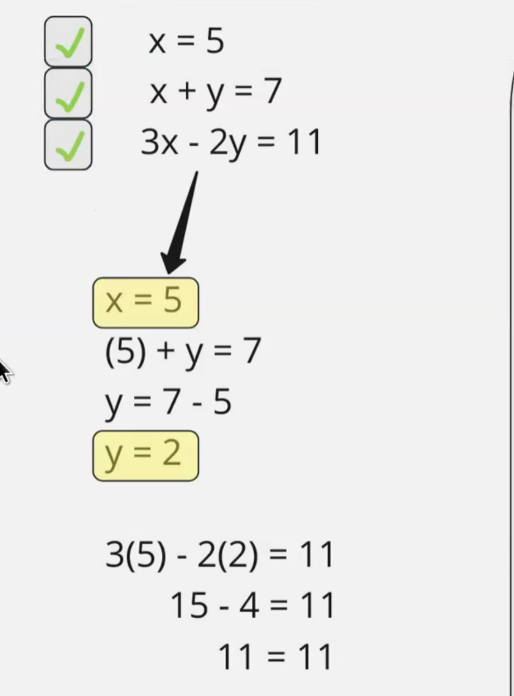
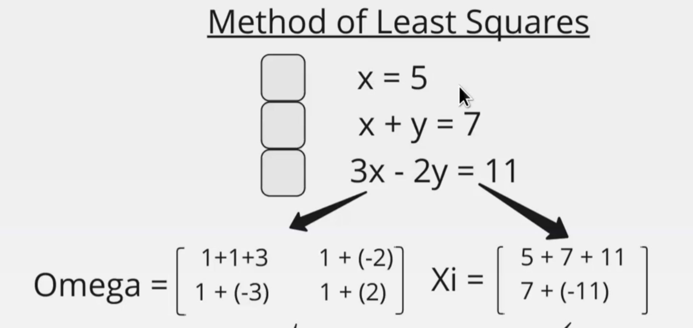
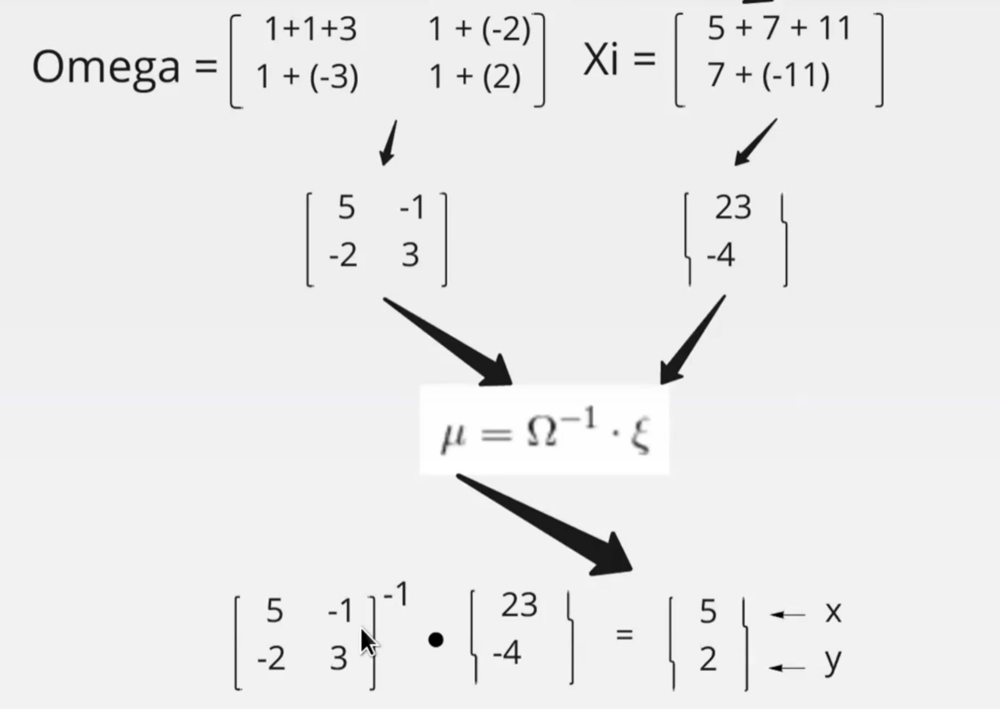
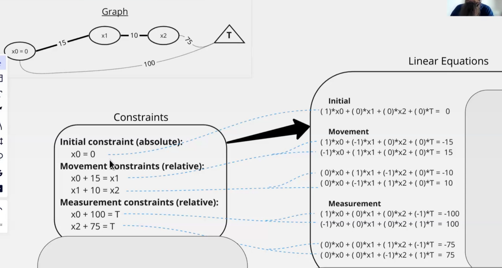
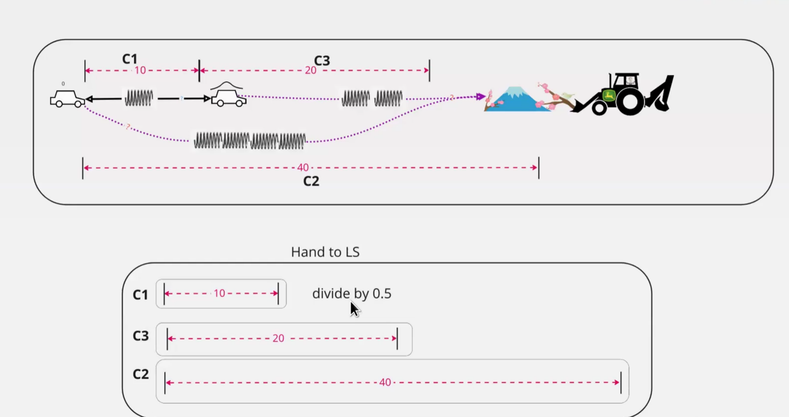
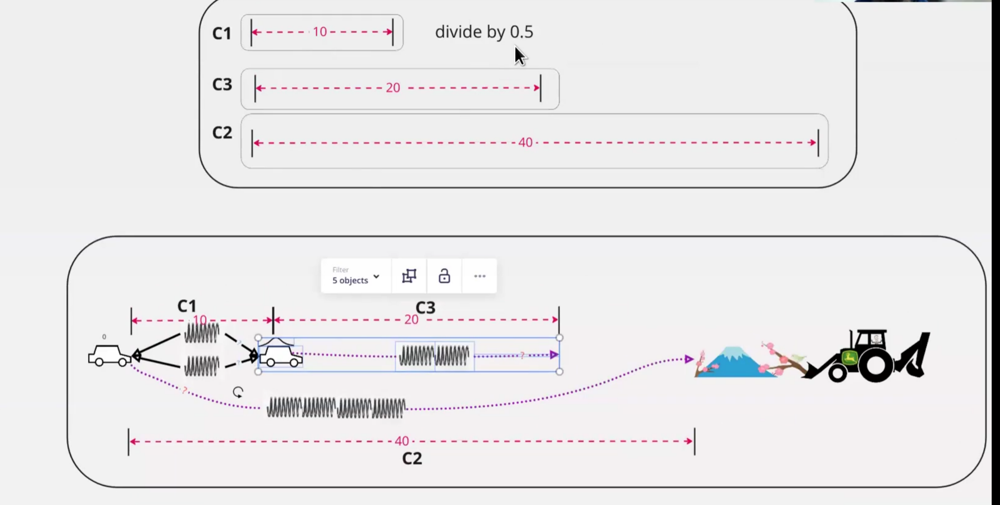

- 
- CSP: have to adhere to it in all solutions (Constraint satisfaction problem)
- global constraint
- Graph Slam:
	- given:
		- Constraints : used to sketch the world
		- 
		- correct to better match constraints
		- 
		- Graph Slam hard constraints:
			- no hard points in graph slam
		- Soft Constraints:
			- given distances , anchor point.
		- 
		- unique solution:
			- substitution:
				- 
			- method of least squares:
				- 
				- 
		- no solution :
			- least squares result in lower violation magnitude
		- unbounded : infinite solutions
			- without an anchor relevant to chosen coordinate system infinte solution are possible.
		- 
		- Least squares is least error in graph slam
		- UnCertainty:
			- 
			- dividing means more certainty
			- 
			-