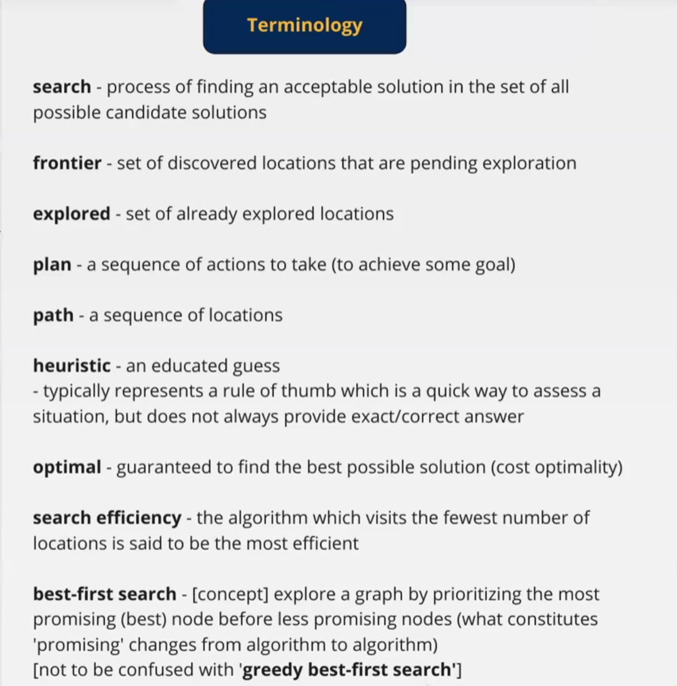
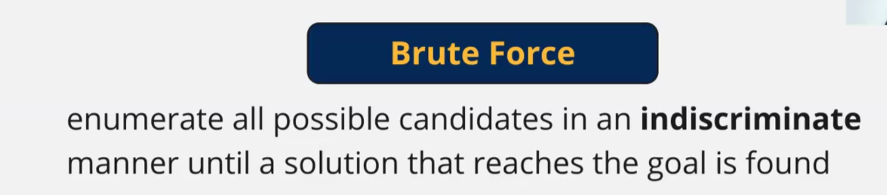
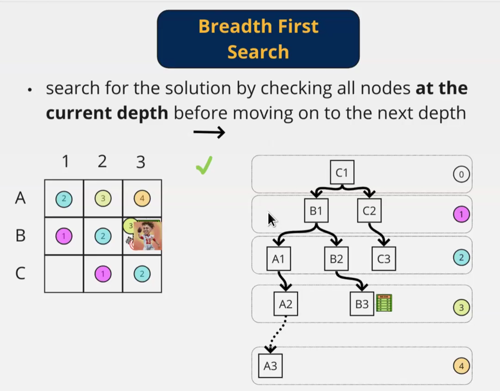
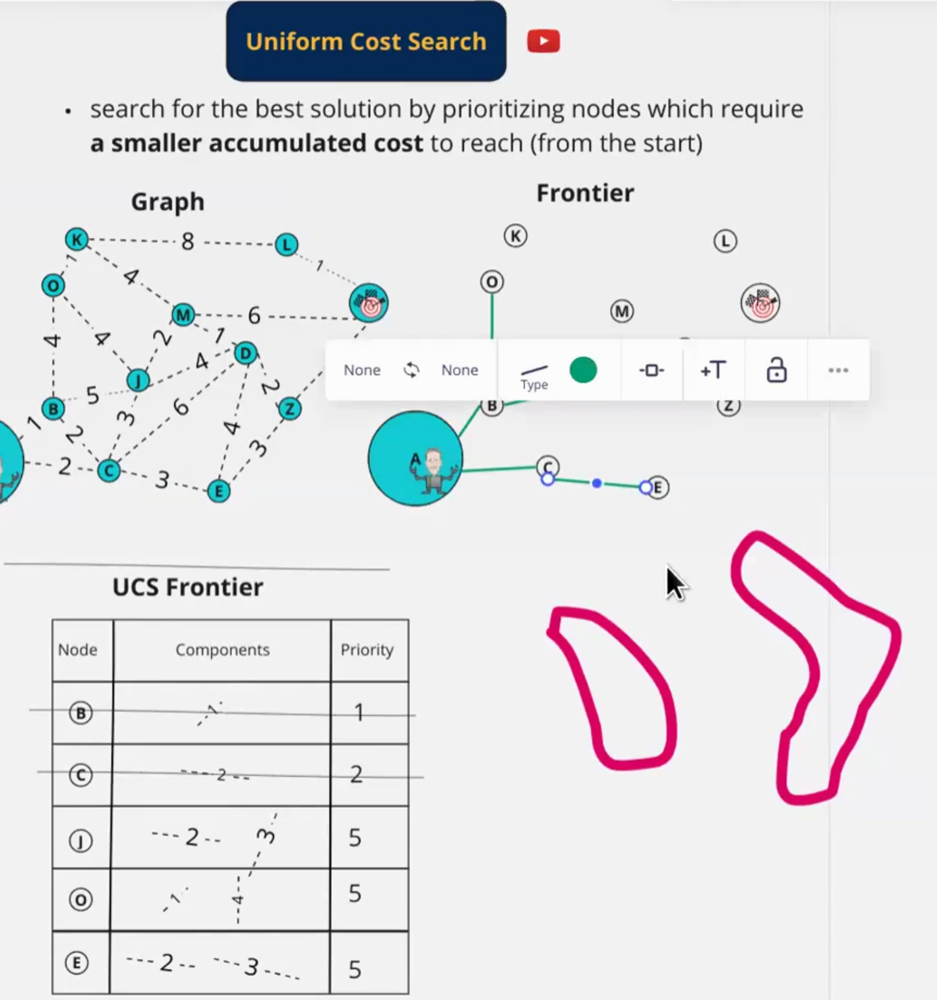
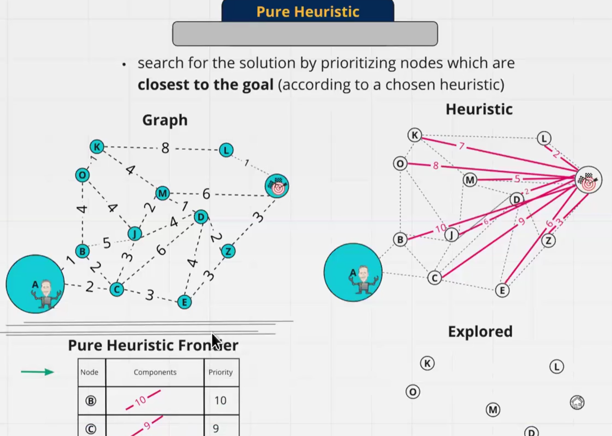
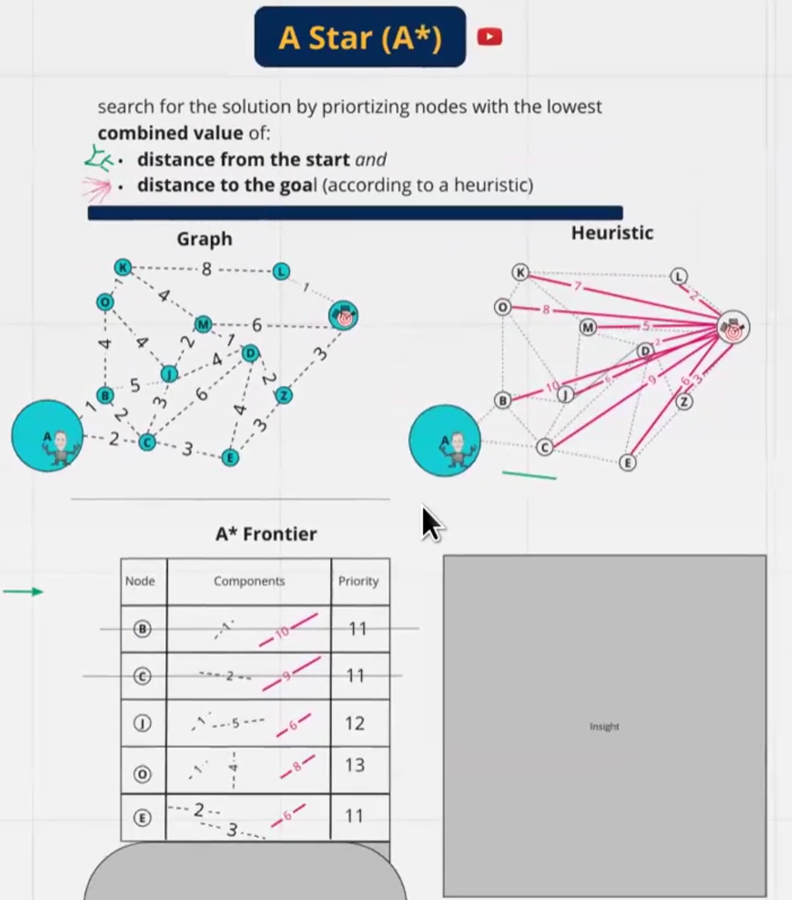

- minimum cost plan
-
-
-
- Dynamic programming: value iteration:
	- every step /position has a plan/computation.
	- work recursively from goal to current and add up cost.
	- hill climbing action
- 
- 
- 
	- assets:///home/ashabayek/Documents/Thoughts/Brain/assets/image_1709145924646_0.png
- brute force is not a best first search algo but its optimal.
- 
- is it a best fit search? yes. priority applied by looking at all current level. prioritazation makes it a breadth first search.
- is it optimal, yes.  this is under the assumption of uniform cost. otherwise it is not optimal. only with equal action cost.
- 
- best first search , yes
- optimal? yes.
- 
- best first search? yes
- optimal? no
- Also known as greedy best first search
- 
- best first search, yes
- optimal,yes. but
-
- Heuristics dont need to be the correct one
- should not strive for accuracy in heuristics.
- A* with admissible heuristics is optimal.
  id:: 65e056f4-89d2-47a9-bc31-680f339e43aa
- what is an admissible heuristic:
	- never overestimates cost, lower than lowest actual cost
	- optimistic by nature
	-