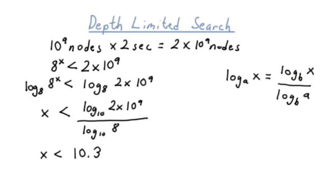
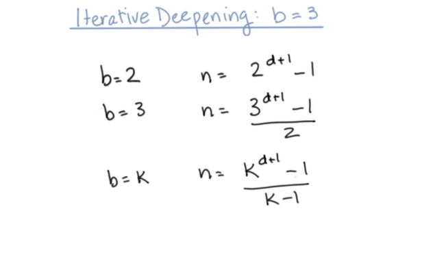
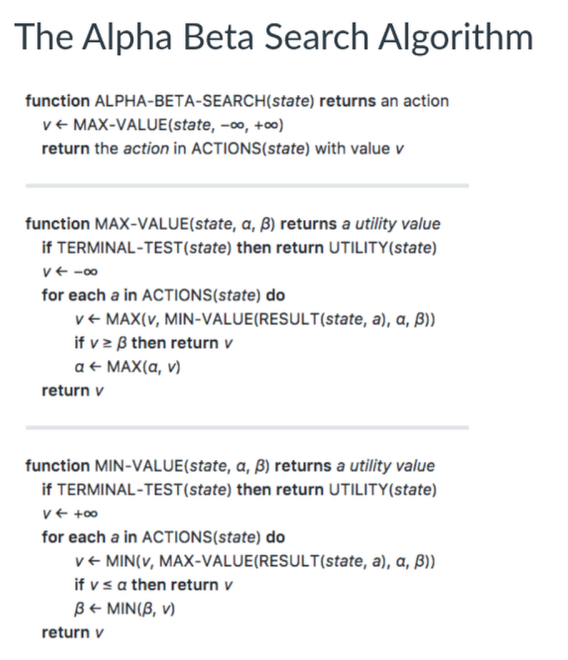
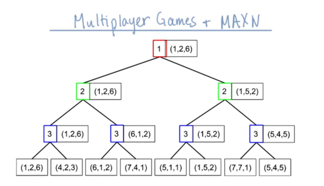
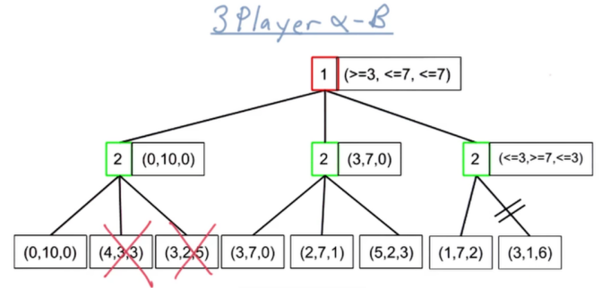

- Adversarial search
- Minmax Algorithm
- Alpha-Beta pruning
- Evaluation functions
- Isolation game player
- Multiplayer, probabilistic games
- 
- Building a game tree.
	- can grow exponentially b^d
	- Depth limited search
		- 
		- an evaluation function is then needed as trees might not reach deep enough for solution
		-
	- iterative deepening
		- 
		- almost free in exponential problems
		- always have an answer limited to time constraints
	- Horizon effect trouble
		- cant search enough in the future to see the problem
		- use better evaluation
	- MinMax
		- 
		-
	- ALpha Beta pruning
		- a more efficient min max, this is done by quiting branch exploration when a possible min or max is found
		- 
		- 
		-
- np hard
- Thads Asides
	- AI = Clever Solutions to Exponential Problems
- MAXN game tree:
	- 
	- pruning
		- 
- probabilistic games
	- Expectimax function
-
- Chapter 6 reading:
	- Perfect information: fully observable no uncertainty.
	- zero-sum games: good for one player bad for the other.