- 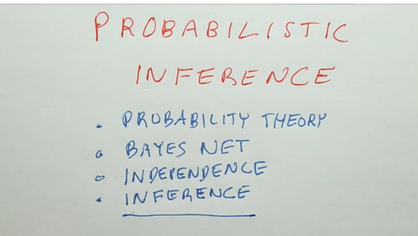
- 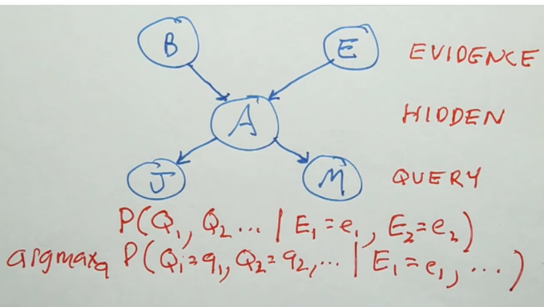
- 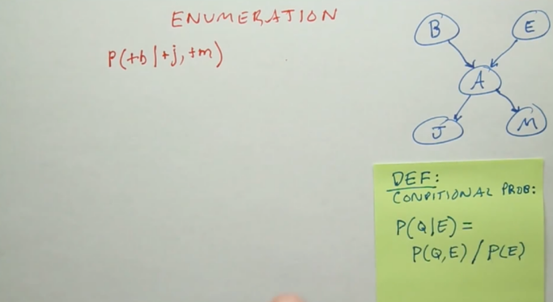
- 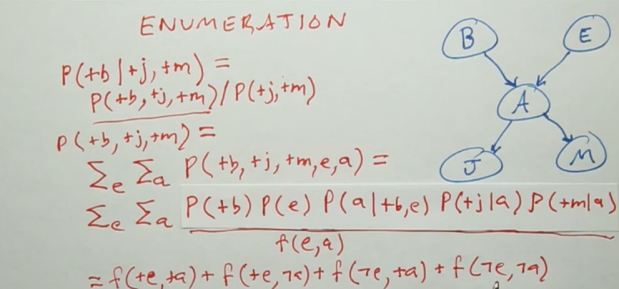
- 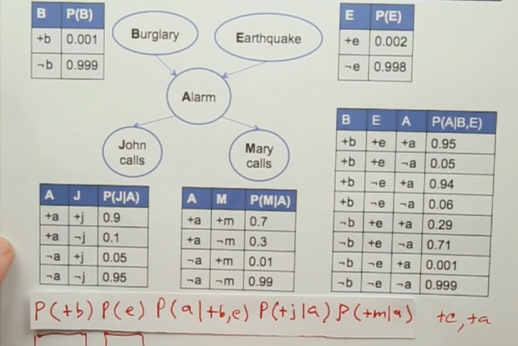
- 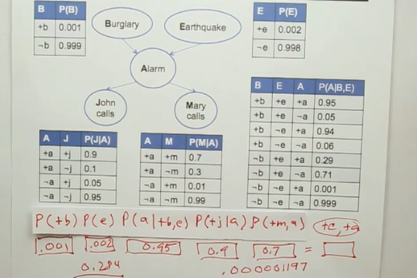
- 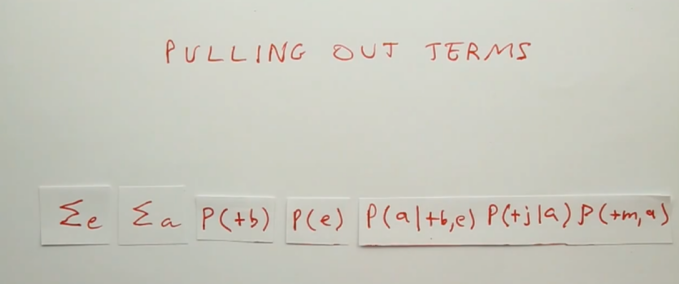
- 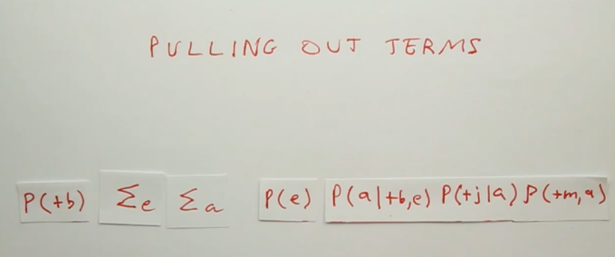
- 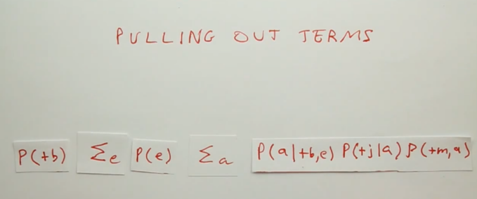
-
- 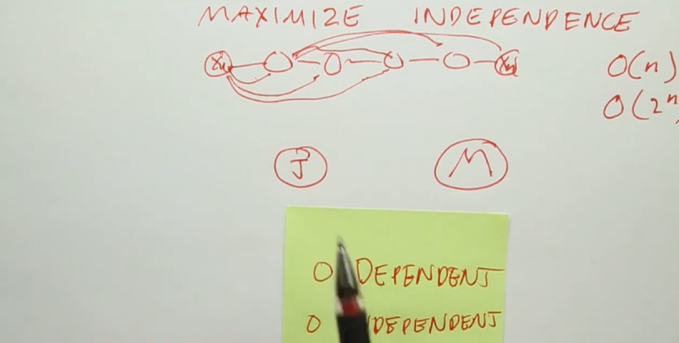
- 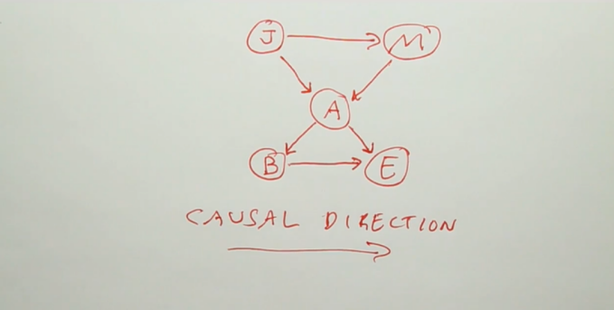
- network should flow from causes to effects
- 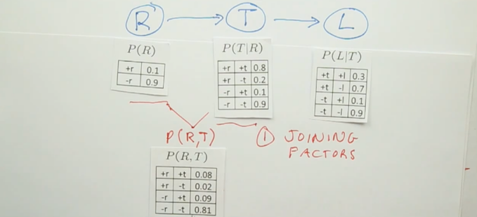
  id:: 66f85aa4-675a-4b45-ae62-c9704591e3d7
- 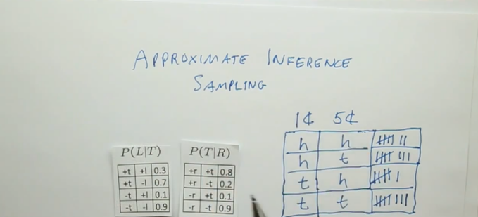
- sampling save computation power/time , also can ignore unknown values and proceed while with inference certain dependencies are required
- Rejection sampling for getting conditional probability that matches the sample.
	- 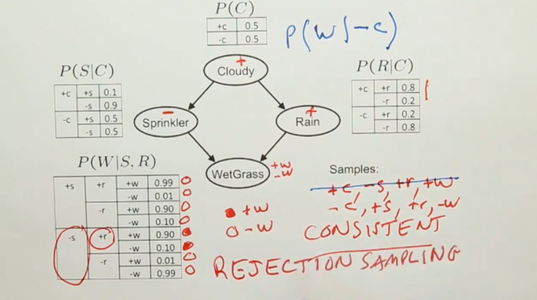
	- you can end up rejecting alot of the samples if probability is unlikely
	- we solve this by likelihood weighting
		- 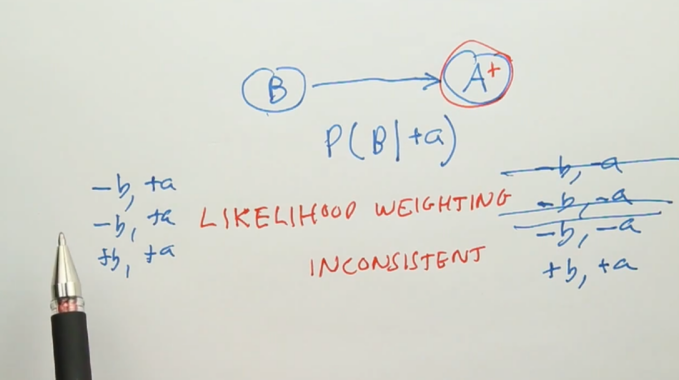
		- assign probability to each sample and weighting them together
		- 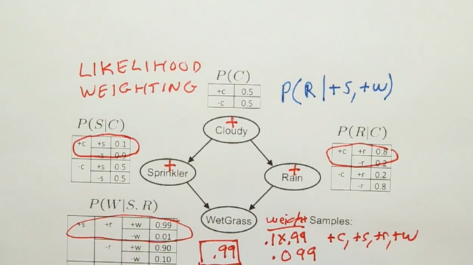
- Gibbs sampling:
	- Markov chain monte carlo: MCMC
	- 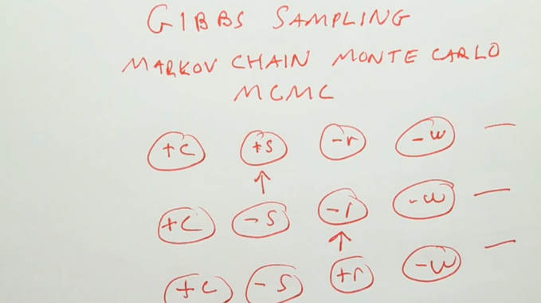
	-
-
-
-
- Chapter 13:
	- Directed Acyclic Graph(DAG)
	- Bayesian network:
		- each node corresponds to random variable discrete or continuous.
		- directed links is a pair of nodes
		- each node X has associated probability  information that quantifies the effect of parents using a finite number of parameters
	- CPT(Conditional probability table):
		- can only be used for discrete variables
	- Bayesian network semantics:
		- P(x1.....,xn) = $\prod_{i=1}^{n}P(xi|parents(Xi))$
		-
		-