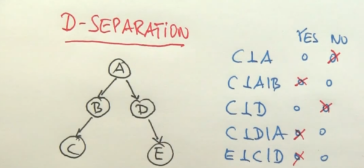

- Bayes network
	- 
	- 
	- 
	-
- 
-
- 
- 
- 
- 
- 
- 
-
- 
- 
- 
- 
- 
- 
- 
- 
- 
- 
- 
- 
-
-
- Chapter 12: Quantifying Uncertainty
	- Agent **uncertainty** is due to partial observability.
	- Agent keep track handles uncertainty by tracking a belief state.
	- **Qualification problem** page 259
	- Decision theory = probability theory + utility theory(heuristic defined)
		- to average highest possible  utility over all possible outcomes
		- **maximum expected utility (MEU)**
	- DT Agent(percept):
		- update belief based on percept
		- calculate outcome of probabilities based on actions
		- select action with highest expected utility
	- all set of possible worlds is **sample space**
		- mutually exclusive and exhaustive, two possible worlds cannot be the case and one possible world must be the case.
		- probability model associates numerical probability P with each world
		- sets of values== **events**
		- a set of worlds is a **proposition**
			- possibilities/worlds when a condition holds true
			-
	- if we have prior knowledge : **evidence**
		- we then calculate conditional or posterior probability
	- P(a|b) = P(a^b)/P(b)
	- Product rule : P(a^b) = P(a|b)P(b)
	- boolean variables in a range follow a **Bernoulli distribution**
	- when assignment is finite with a probability to each random variable its a **categorical distribution**
	- **Inclusion-exclusion principle**:
		- P(aUb) = P(a)+P(b)- P(a^b), probability of disjunction
		- **Kolomogorov's axioms**
	-
	-
	- Inference with Joint distributions
		- Probabilistic inference: computation of posterior probabilities for query propositions given observed evidence.
		- page 414
	-