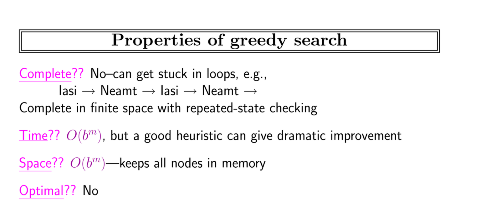
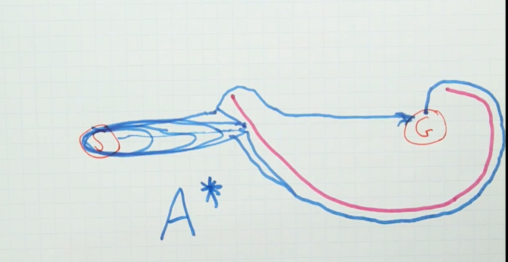
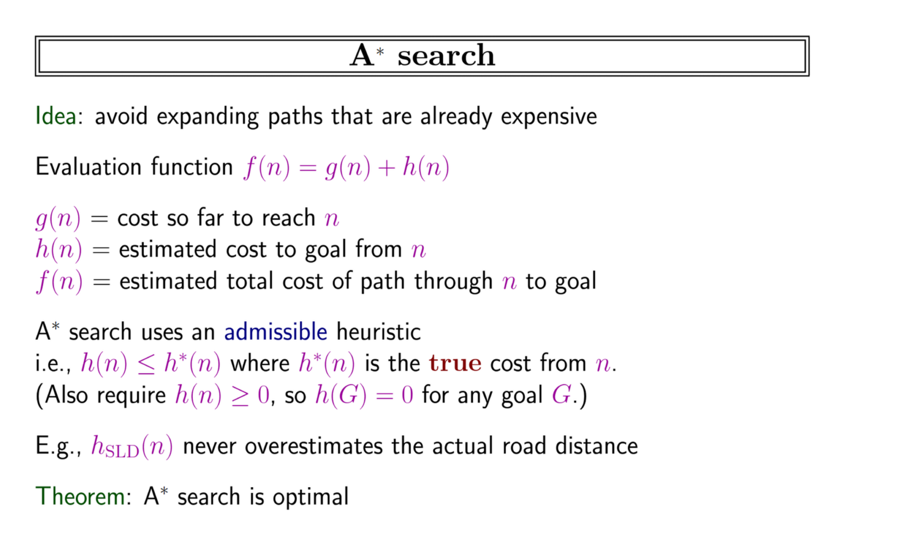
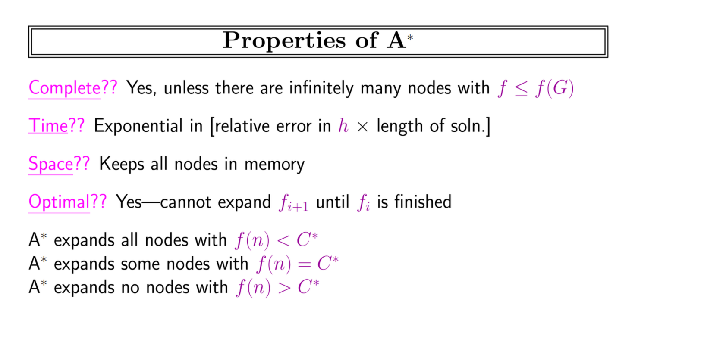
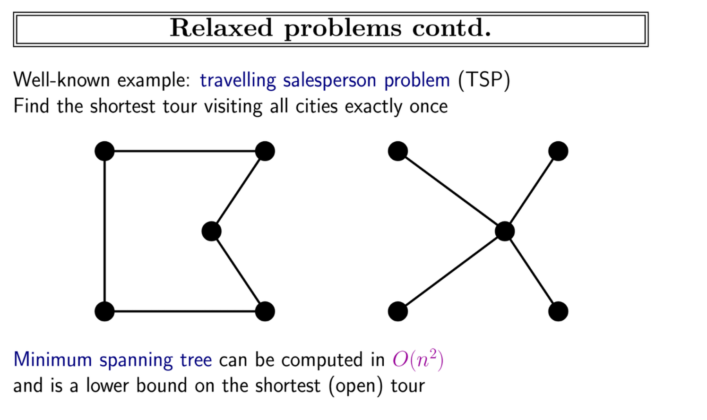
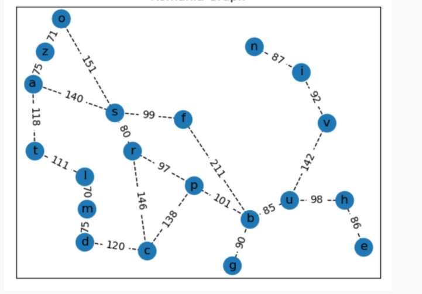

- state and action to reach goal state
- path cost function:
	- a sequence of state action sequence and returns a number/cost
	- step cost function
		- state , action and result state and returns cost.
	- Frontier: the max/end states of what we explored
	- explored
	- unexplored
	- Tree search:
		- ```python
		  def tree_search(problem):
		    frontier = {[intial_state]}
		    while frontier:
		      path = remove_selection(frontier)
		      s = path[-1]
		      if s is goal:
		        return path
		      for a in actions:
		        frontier = add(path, result(s,a))
		    raise 
		  ```
		- Breadth first search:
			- add all paths for all possible actions
			- remove a path from frontier
			- path created from all possible actions.
			- it does backtrack to previously visited states as tree search is unaware.
		- maintain set of explored states.
		- modify to make graph search instead.
		- Graph search:
			- Breadth first search:
			- ```python
			  def graph_search(problem):
			    frontier = {[intial_state]}
			    explored ={}
			    while frontier:
			      path = remove_selection(frontier)
			      s = path[-1]
			      explored.append(s)
			      if s is goal:
			        return path
			      for a in actions:
			        new_state = generate_state(state,action)
			        if new_state not in explored:
			          frontier = add(path, result(s,a))
			    raise 
			  ```
		- goal is reached/ algo terminated when we remove path from frontier not when reached so that optimal path is guaranteed.
	- Uniform cost search:
-
- search comparison:(n is depth)
	- breadth : optimal, 2^n,complete
	- cheapest/uniform cost:  optimal ,approximately 2^n, complete
	- depth first: non optimal, n memory, non complete(if infinite we will never reach solution as only one branch will be iterative explored infinitely )
- Informed search:
	- Greedy best first search:
		- O(b^m)
		- expanding towards goal
		- 
		-
	- 
	- we seek to find the best of uniform cost and greedy search.
	- A* search:
		- f= g+h
		- 
		- 
		- optimal depending on heuristic function h
			- never overestimates
			- optimistic
			- admissible
			- less than true cost
- Sliding blocks:
	- nxn!/(b!(n-b)!)
	- n = non obstacle cells, b= blocks
-
- Problem solving works when:
	- fully observable
	- known
	- discrete
	- domain deterministic
	- static
- TSP:
	- 
	-
- Readings:
	- Open loop system: solution is guaranteed to reach the goal
	- Closed loop system:  if there is a chance the system deviates into not reaching the goal.
	- transition model: describes what each action does
	- action cost function
	- abstraction
	- levels of abstraction
	-
- BI-Directional search:
	- 
	- 
	-
-   
- Chapter 13:
	- **Problem solving agent** seeks a goal through a sequence of actions in a **search** process
	- removing detail from presentation to be able to solve it **abstraction**
	- Transition model , egocentric actions, goal states, action cost.
	-
	-