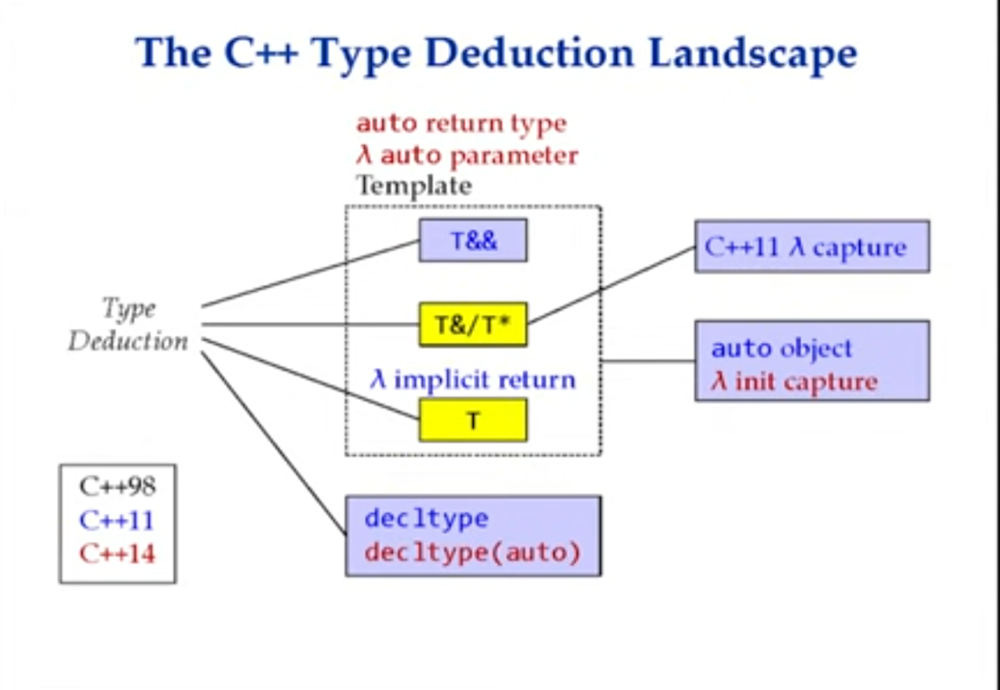
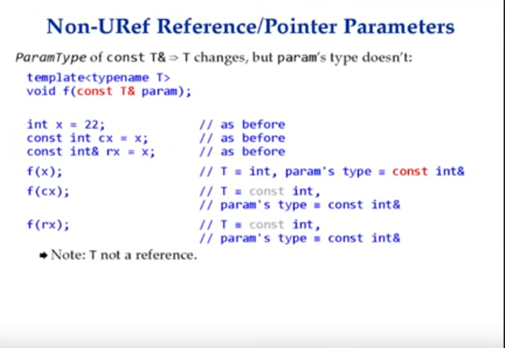

- Item 1 : Template type deduction
	- there are 3 cases :
		- ParamType: is a pointer or reference type but not a universal reference.
		- ParamType universal reference
		- ParamType is neither
	- 
	- 
	-