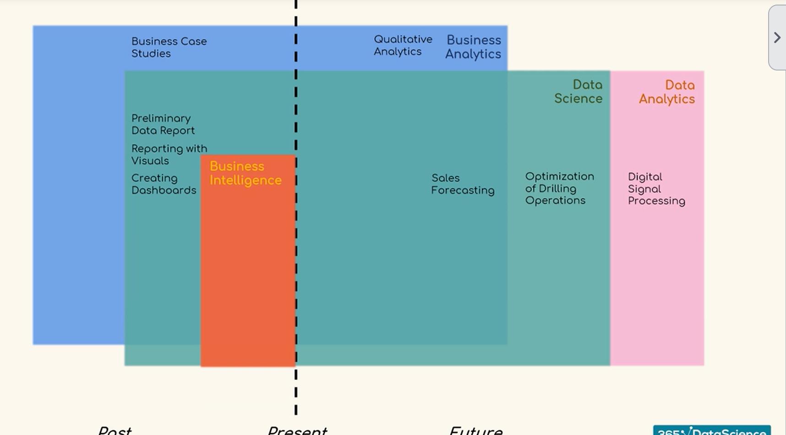
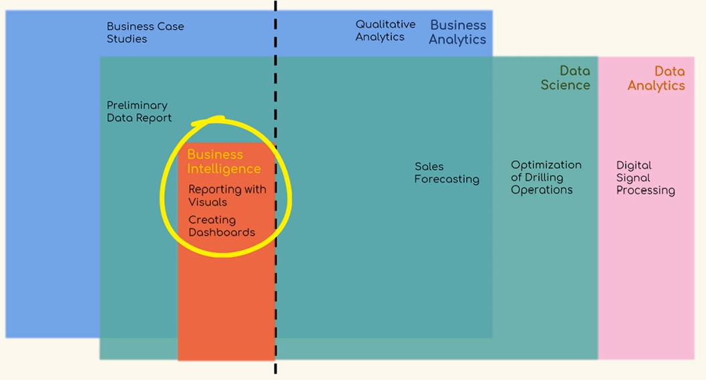
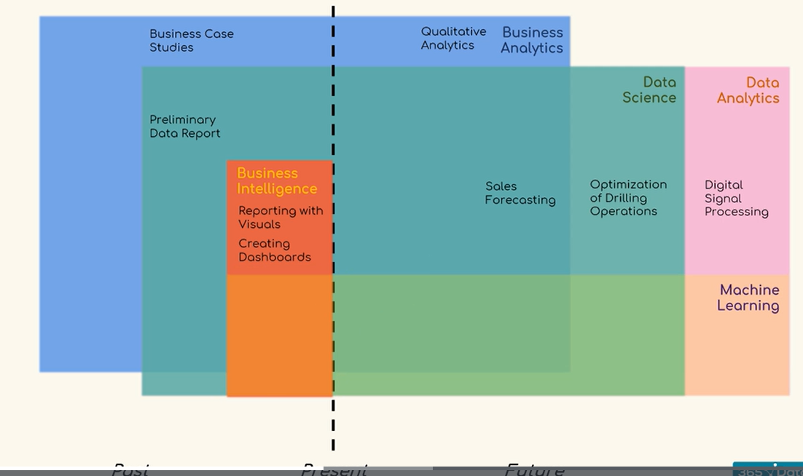

- #[[Data Science]]
- 
- 
- 
- #[[Artificial Intelligence ]] is the ability to simulate human knowledge and decision making.
- #[[machine learning]] ability to predict outcomes without being explicitly programmed.
- #[[machine learning]] is about creating and implmenting algorithms that let machines recieve data a
-