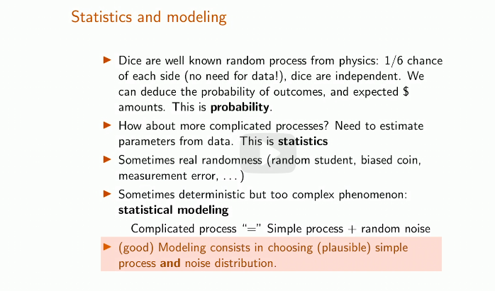
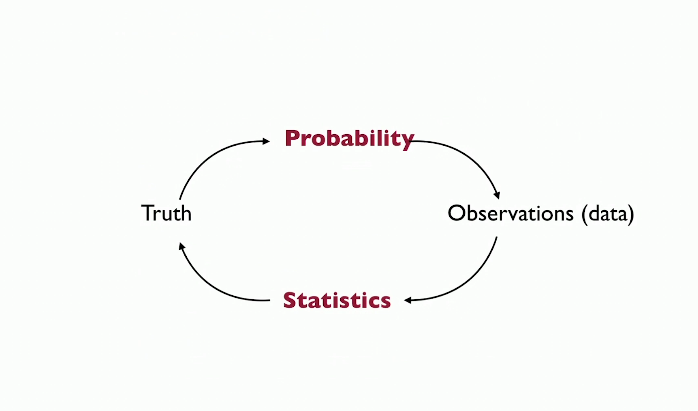
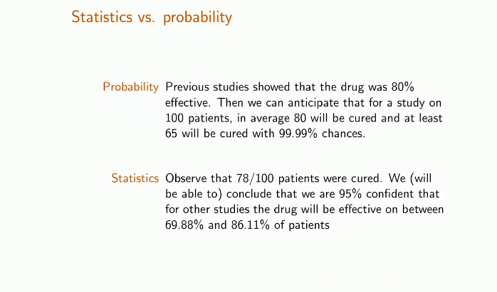
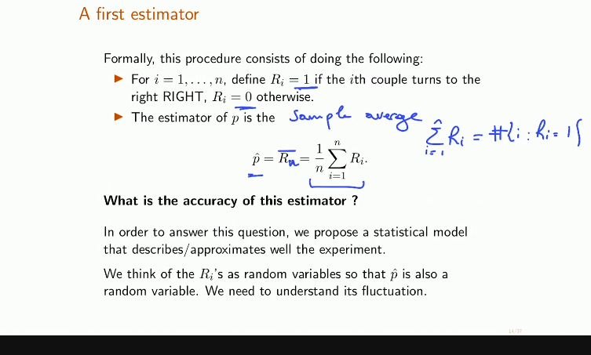

- *Statistics: A Concise Course in Statistical Inference*, by Larry Wasserman.
- 
- 
- 
- 
- [[Probability Redux]]
- [[Fundamentals of statistics/ Foundation of inference]]
- [[Fundamentals of statistics/ Parametric Estimation and Confidence Intervals]]
-
-
-