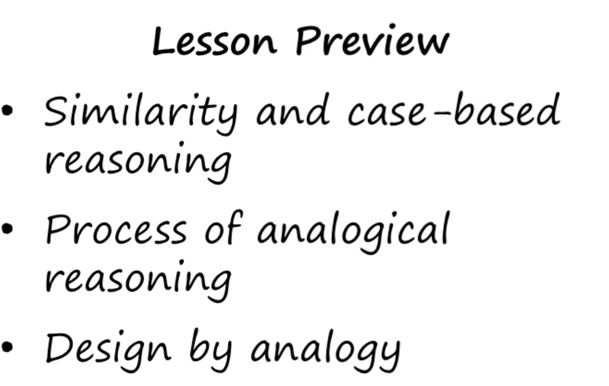
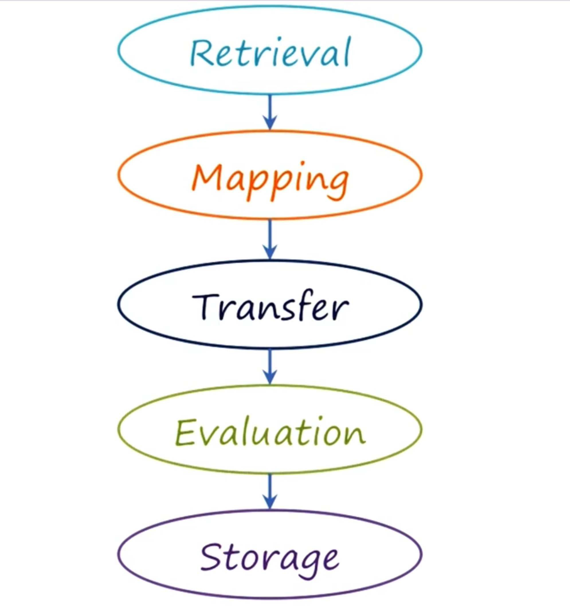

- 
- cross domain analogy
	- same relation different agent and object
- 
- 
- 
- 
- 
- Compositional analogy
	- 
	-
- 
- v 
- 
- 
- 
- Lesson 18 - Analogical Reasoning
- Analogical reasoning involves understanding and drawing connections between different concepts based on their underlying similarities. This lesson emphasizes how deep understanding and structural similarities are critical in making accurate analogies.
- Analogical Mapping Exercise
- To illustrate analogical mapping, consider the solar system and atomic structure. When mapping these, one can see that both involve a central object with smaller objects revolving around it. The sun in the solar system corresponds to the nucleus in the atomic structure, and the planets correspond to electrons. This mapping requires a deep understanding of both systems' relationships and structures to align them accurately.
- Analogical Transfer
- Analogical transfer involves applying the solution from a known problem (source case) to a new, similar problem (target problem). For instance, a solution where a rebel army divides to capture a fort can be transferred to a medical problem where a laser beam is divided to treat a tumor. The correct transfer relies on accurate mapping of the elements between the source and target problems.
- Design by Analogy
- Analogical reasoning is significant in design, such as in biologically inspired design. The example of the Shinkansen train, inspired by the Kingfisher's beak, demonstrates how understanding the deep functional principles of a natural design can lead to innovative engineering solutions.
- Analogical Reasoning in Design
- When designing a robot to walk on water, we can draw from the basilisk lizard's ability to do so. Understanding the lizard's locomotion allows for the adaptation of its principles to the robot design. This requires a detailed structural and behavioral model of the lizard to transfer relevant features to the robot.
- Evaluation and Storage in Analogical Reasoning
- Evaluation is crucial in analogical reasoning to ensure the transferred solution works correctly. For instance, simulating the decomposed laser beams treating a tumor can validate the approach. Successful solutions are stored for future reuse, aiding in incremental learning.
- Advanced and Open Issues in Analogy
- Several open issues in analogical reasoning are being researched:
- Common Vocabulary: Ensuring terms are consistently used across domains.
    Problem Abstraction and Transformation: Adapting and transforming problems for better analogy retrieval.
    Compound and Compositional Analogies: Using multiple source cases and multiple levels of abstraction to solve complex problems.
    Visuospatial Analogies: Understanding analogies that involve spatial and visual reasoning without explicit causality.
    Conceptual Combination: Combining parts of familiar concepts to learn new ones, such as combining knowledge of the solar system and atomic structure.
- Assignment on Analogical Reasoning
- The lesson concludes with an assignment to design an agent that can use analogical reasoning, such as answering Raven’s Progressive Matrices, which test abstract reasoning through pattern recognition and analogy.