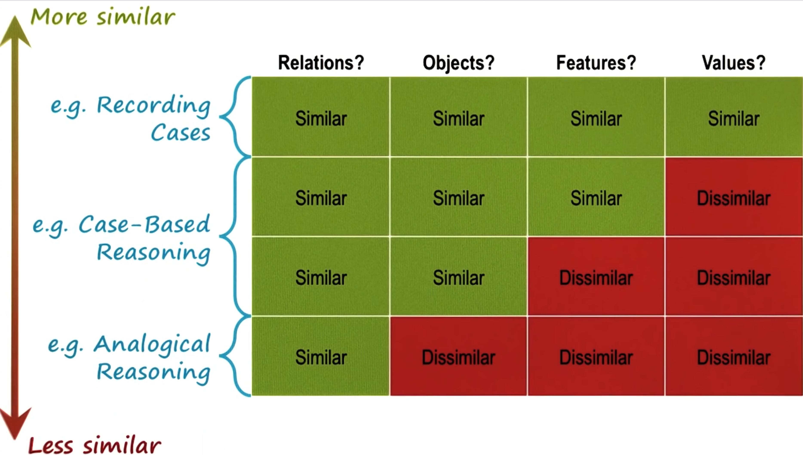
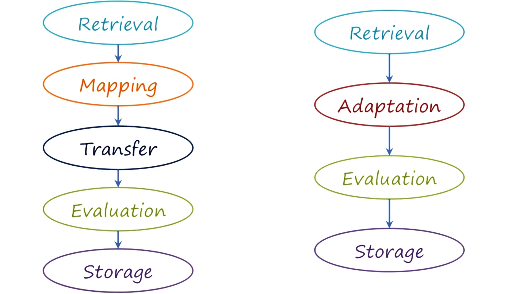
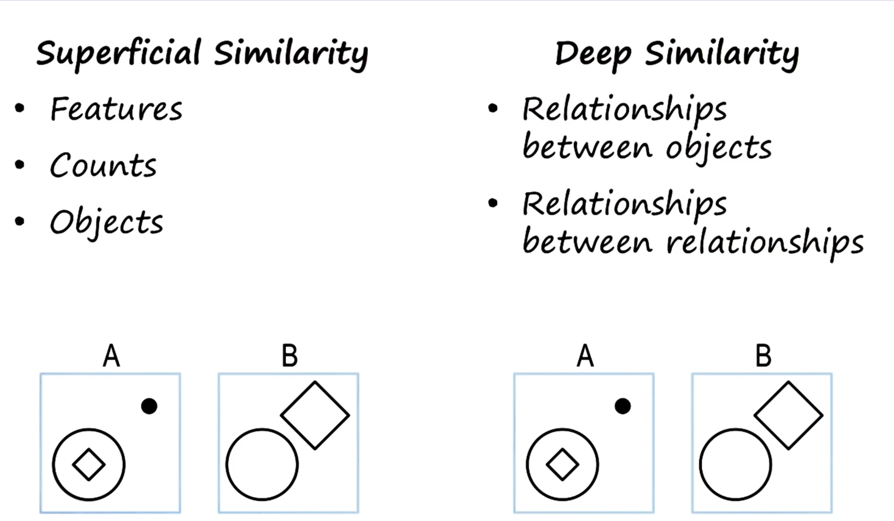
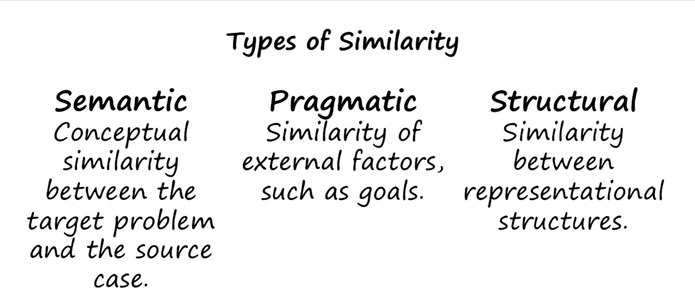
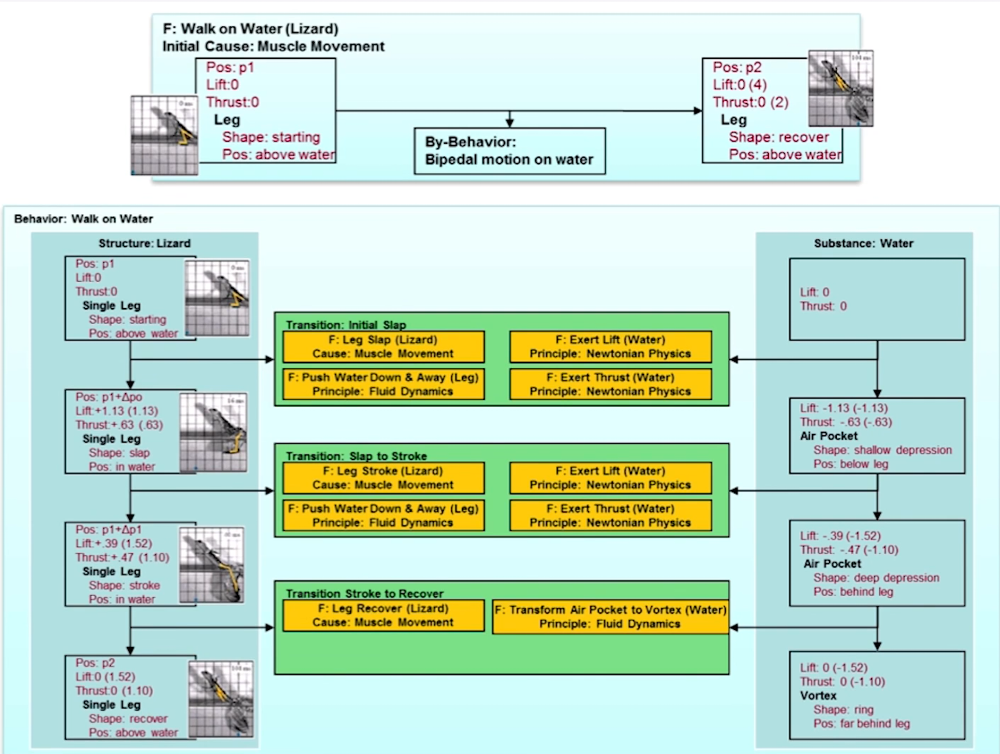
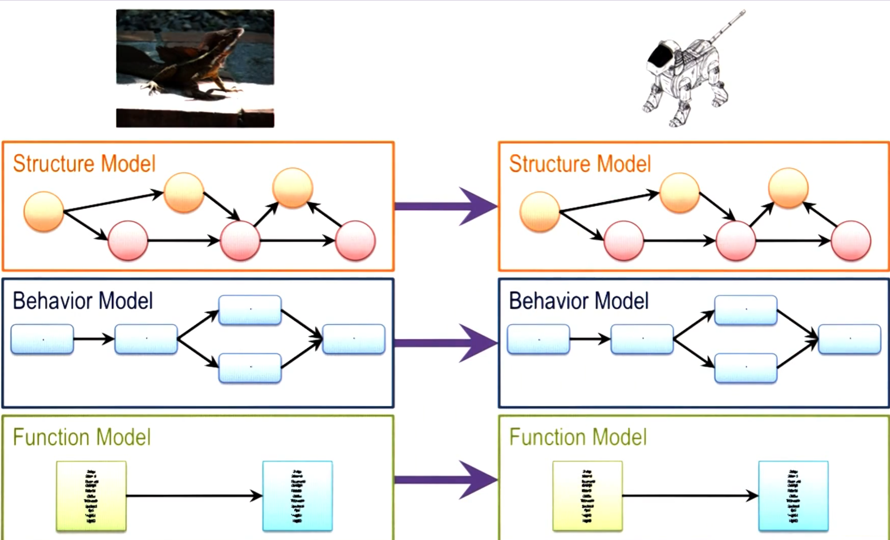
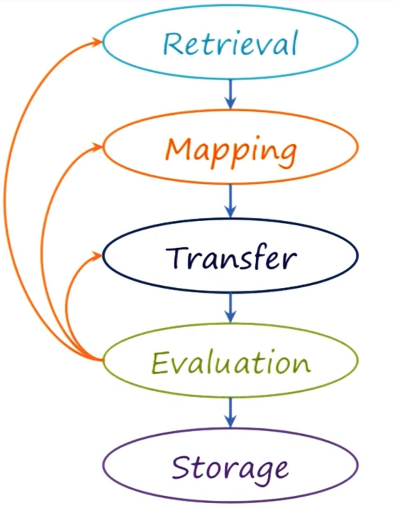
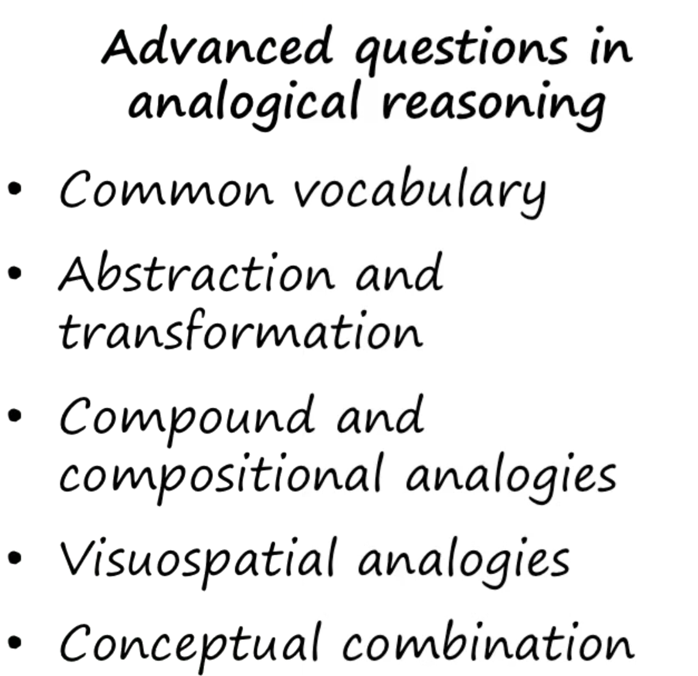
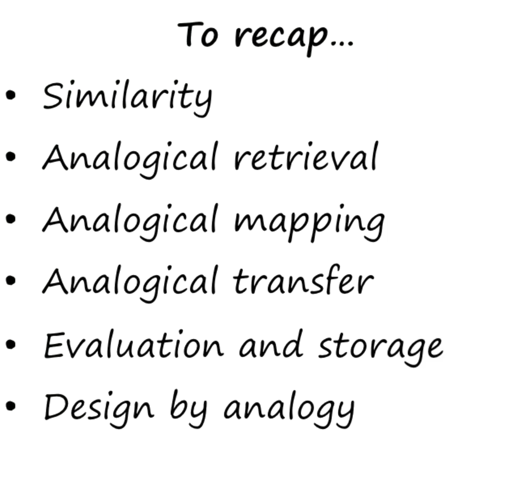

- 
- cross domain analogy
	- same relation different agent and object
- 
- 
	- abstract relationship before transfer
- 
-
- 
- 
- 
- Compositional analogy
	- 
	-
- 
- v 
- 
- 
- 
- ### Lecture 04 - Cases Revisited
  
  **Technical Information:**
  
  1. **Similarity in Case-Based Learning:**
	- Discussed the concept of similarity when learning by recording cases.
	- Nearest neighbor method for finding similarity between a new situation and familiar situations.
	- Different methods for organizing a case library:
		- Simple array of cases with tags.
		- Discrimination tree with leaf nodes representing cases and interior nodes representing decision points based on feature values.
	- Similarity measured by the tags in the array method or by traversing the discrimination tree.
	  
	  2. **Cross-Domain Analogies:**
	- Problem of applying similarity when new problems and source cases are from different domains.
	- Example: Woman climbing a ladder vs. ant walking up a wall, leading to cross-domain analogies.
	- Importance of finding similarity between the target problem and the source case across different domains.
	  
	  3. **Case Study - King and Rebel Army:**
	- Example of cross-domain analogy with the King and rebel army problem compared to a physician treating a tumor with a laser.
	- Both situations involved decomposing a resource into smaller units to achieve a goal without causing damage.
	  
	  4. **Spectrum of Similarity:**
	- Similarity spectrum ranges from identical target problem and source case to having nothing in common.
	- Evaluates similarity in terms of relationships, objects, features, and their values.
	- Recording cases and case-based reasoning are within-domain analogies, while cross-domain analogies involve different objects and relationships but similar patterns.
	  
	  5. **Process of Analogical Reasoning:**
	- Five phases: retrieval, mapping, transfer, evaluation, and storage.
	- Differences between within-domain case-based reasoning and cross-domain analogical reasoning.
	- Example: Duncker's radiation problem illustrating the transfer of relationships after mapping conceptual similarities.
	  
	  6. **Analogical Retrieval:**
	- Methods for analogical retrieval include nearest neighbor, array method, and discrimination tree method.
	- Criteria for similarity in different domains involve distinguishing between superficial similarity (features, objects) and deep similarity (relationships).
	  
	  7. **Types of Similarity:**
	- **Semantic Similarity:** Conceptual similarity, e.g., woman climbing a ladder vs. woman climbing a step ladder.
	- **Pragmatic Similarity:** External factors, such as goals, e.g., killing a tumor vs. capturing a fort.
	- **Structural Similarity:** Similarity between the representational structures, e.g., the solar system vs. atomic structure.
	  
	  8. **Analogical Mapping:**
	- Correspondence problem: Aligning target problem and source case by identifying corresponding elements.
	- Focus on higher-order relationships for deep similarity.
	- Example: Solar system and atomic structure, mapping sun to nucleus and planet to electron based on symmetrical relationships.
	  
	  **Exercises:**
	  
	  1. **Exercise Analogical Retrieval I:**
	- Identify deep and superficial similarities between given situations.
	- Example: Woman climbing a ladder vs. woman climbing a set of stairs, plane taking off, etc.
	  
	  2. **Exercise Analogical Mapping:**
	- Map elements from the solar system to atomic structure based on the relationships in their representations.
	- Example: Sun maps to nucleus, planet maps to electron based on revolving relationships.
	  
	  These concepts and exercises help in understanding the application of analogical reasoning across different domains, emphasizing the importance of identifying deep similarities and mapping relationships for effective problem-solving.
- ### Lecture Transcription
  
  **22 - Design by Analogy Retrieval**
  
  *Click here to watch the video*
  
  Building faster trains posed a significant challenge for engineers, especially when these trains needed to travel through tunnels. The passage through tunnels created shock waves due to the different air pressures inside and outside the tunnel, which resulted in a lot of noise and disturbance for nearby residents. The engineers found inspiration by observing how the Kingfisher bird transitions from air to water with minimal splash, thanks to its beak's shape. This principle was applied to the design of the Shinkansen 500 bullet train's nose, significantly reducing noise and increasing speed. 
  
  Another notable example of biomimicry is the Mercedes Benz box car, which was inspired by the shape of the Boxfish. Biological-inspired design involves analogical reasoning where a problem is identified, a natural solution is found, and cross-domain analogical transfer is applied.
  
  **23 - Design by Analogy Mapping Transfer**
  
  *Click here to watch the video*
  
  To illustrate analogical reasoning in design, let's consider the problem of designing a robot that can walk on water. Nature provides examples, such as the basilisk lizard, which can walk on water and catch prey. Analogical design requires a deep understanding of both the source (the basilisk lizard) and the target problem (the robot). 
  
  By modeling the basilisk lizard's behavior and function, engineers can design a robot that mimics its water-walking ability. This process involves creating a structural model and then mapping and transferring specific features from the lizard to the robot.
  
  Similarly, if we need to design a microbot that moves underwater stealthily, we can draw inspiration from the copepod, which moves with minimal wake at slow speeds. For high-speed stealth movement, the squid's jet propulsion mechanism can be studied and adapted. This process of using multiple sources is known as compound analogy, which involves problem evolution and transformation.
  
  **24 - Design by Analogy Evaluation Storage**
  
  *Click here to watch the video*
  
  Evaluation plays a crucial role in the analogical reasoning process. Once a design is created, it can be evaluated through simulations or prototypes. If the design succeeds, it can be stored in case memory for future reference. If it fails, the process may involve revisiting the transfer, mapping, or retrieval stages to adjust and improve the design. For instance, if a robot designed to walk on water is too heavy, the evaluation might lead to finding a lighter organism for inspiration.
  
  **25 - Advanced Open Issues in Analogy**
  
  *Click here to watch the video*
  
  Several advanced issues in analogical reasoning are subjects of ongoing research:
  
  1. **Common Vocabulary Across Domains**: Cross-domain transfer might require a common vocabulary. For example, using "revolve" for electrons and "rotate" for planets raises alignment challenges. Should a common vocabulary be used, or are there alternatives?
   
  2. **Problem Abstraction and Transformation**: Often, problems need to be abstracted and transformed to retrieve relevant source cases effectively.
  
  3. **Compound and Compositional Analogies**: Designing a car might involve borrowing elements from multiple vehicles, which is compound analogy. Compositional analogy involves multi-level abstraction, such as aligning people, processes, and whole organizations.
  
  4. **Visuospatial Analogies**: These analogies do not always rely on causal knowledge but are essential for understanding spatial and visual relationships.
  
  5. **Conceptual Combination**: Learning new concepts by combining familiar ones, such as integrating knowledge of the solar system with atomic structure to understand atoms better.
  
  These issues present challenges and opportunities for further research in analogical reasoning and its applications in AI and design.
-
-
-
-
- Lesson 18 - Analogical Reasoning
- Analogical reasoning involves understanding and drawing connections between different concepts based on their underlying similarities. This lesson emphasizes how deep understanding and structural similarities are critical in making accurate analogies.
- Analogical Mapping Exercise
- To illustrate analogical mapping, consider the solar system and atomic structure. When mapping these, one can see that both involve a central object with smaller objects revolving around it. The sun in the solar system corresponds to the nucleus in the atomic structure, and the planets correspond to electrons. This mapping requires a deep understanding of both systems' relationships and structures to align them accurately.
- Analogical Transfer
- Analogical transfer involves applying the solution from a known problem (source case) to a new, similar problem (target problem). For instance, a solution where a rebel army divides to capture a fort can be transferred to a medical problem where a laser beam is divided to treat a tumor. The correct transfer relies on accurate mapping of the elements between the source and target problems.
- Design by Analogy
- Analogical reasoning is significant in design, such as in biologically inspired design. The example of the Shinkansen train, inspired by the Kingfisher's beak, demonstrates how understanding the deep functional principles of a natural design can lead to innovative engineering solutions.
- Analogical Reasoning in Design
- When designing a robot to walk on water, we can draw from the basilisk lizard's ability to do so. Understanding the lizard's locomotion allows for the adaptation of its principles to the robot design. This requires a detailed structural and behavioral model of the lizard to transfer relevant features to the robot.
- Evaluation and Storage in Analogical Reasoning
- Evaluation is crucial in analogical reasoning to ensure the transferred solution works correctly. For instance, simulating the decomposed laser beams treating a tumor can validate the approach. Successful solutions are stored for future reuse, aiding in incremental learning.
- Advanced and Open Issues in Analogy
- Several open issues in analogical reasoning are being researched:
- Common Vocabulary: Ensuring terms are consistently used across domains.
    Problem Abstraction and Transformation: Adapting and transforming problems for better analogy retrieval.
    Compound and Compositional Analogies: Using multiple source cases and multiple levels of abstraction to solve complex problems.
    Visuospatial Analogies: Understanding analogies that involve spatial and visual reasoning without explicit causality.
    Conceptual Combination: Combining parts of familiar concepts to learn new ones, such as combining knowledge of the solar system and atomic structure.
- Assignment on Analogical Reasoning
- The lesson concludes with an assignment to design an agent that can use analogical reasoning, such as answering Raven’s Progressive Matrices, which test abstract reasoning through pattern recognition and analogy.