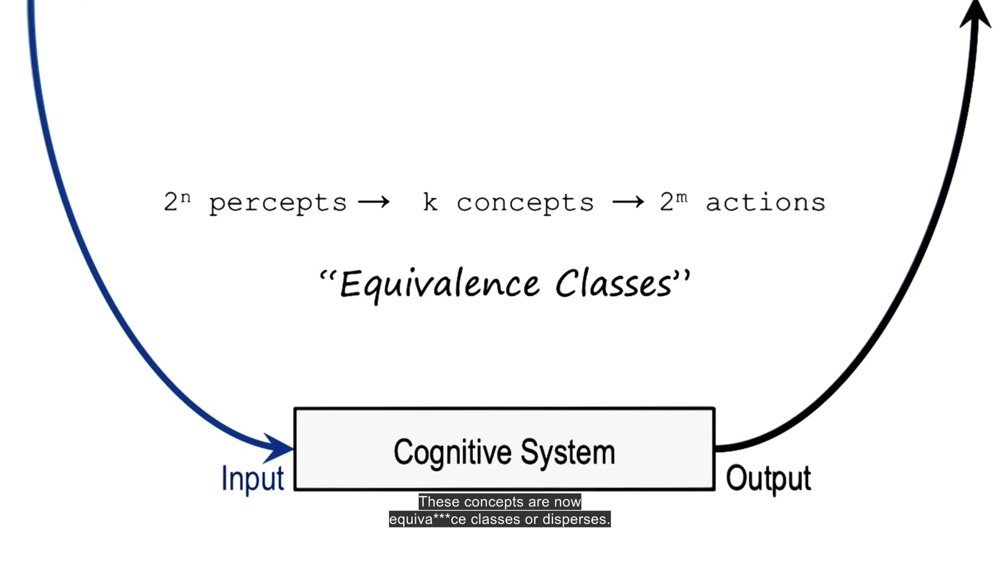

- 
- use of criteria and condition to restrict classification
- 
- 
- 
- large amount of mappings possible.
- 
- how then select right action in complex enviroment
- 
- index actions on concepts instead disease and medicine and symptoms. error and mis initialization.
- classification using knowledge breaks a laarrgee table to a much smaller one
- Concept Hierarchy:
	- top down establish refine approach. a property can help down the hierarchy for specifity/ refinement. works with formal concepts only. clear and distinctive.
	- 
	- there are more as well
	- humans follow axiomatic concepts since they re well defined
	- prototype harder
	- exemplar like beauty and freedom is much harder.
	- 
	- 
	- 
	- Exemplar concepts:
		- 
		- hard to define or come up with rules or criteria for
	- qualia:
		- know but hard to communicate.
	- 
	- Holiday for one cannot be abstracted into a concept.
- bottom up method:
-
- 
-