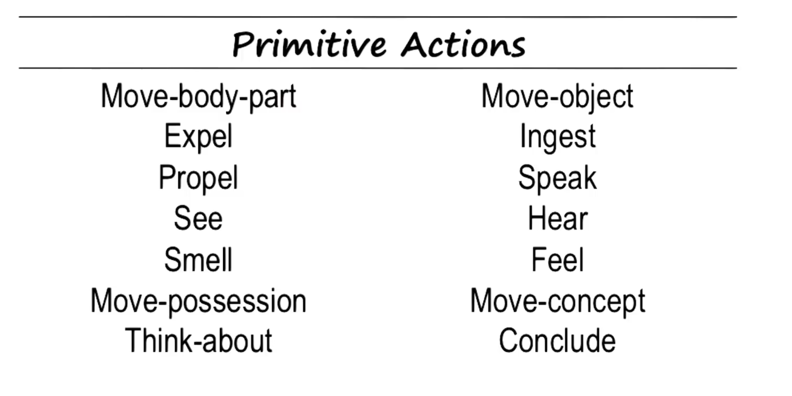
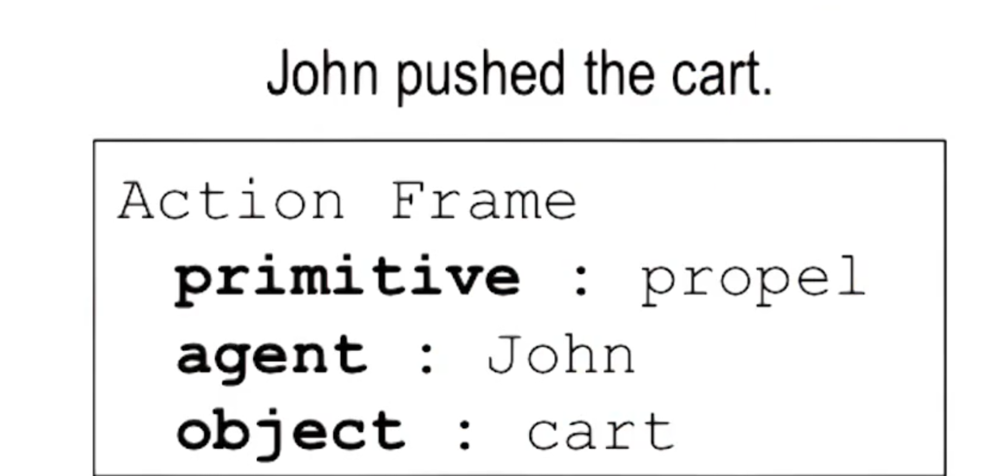
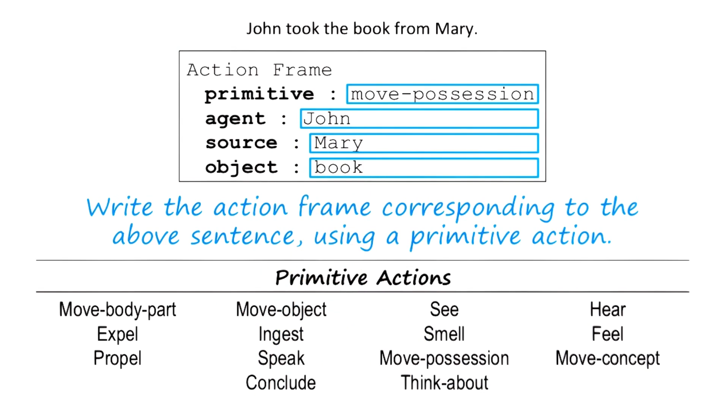
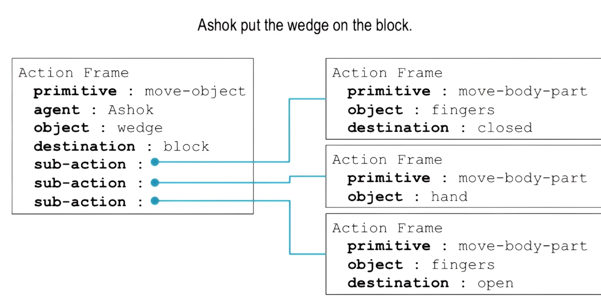

- 
- 
-
- ontology is a realization if the world
- i moved across the room, subject and object are the same.
- 
- lexical is an atom representation a molecule presentation is the needed.
- 
- 
- ## Lecture Summary: Common Sense Reasoning
- ### Introduction to Common Sense Reasoning
  Common sense reasoning involves making natural, obvious inferences about the world. While humans excel at this, enabling AI agents to make similar inferences is challenging. For instance, if a robot is asked to find the weather outside, it shouldn’t jump out of the window to check if it’s raining. Understanding why such an action is unreasonable requires common sense.
- ### Frame Representation and Primitive Actions
  To impart common sense to AI, we use a frame representation. We'll discuss a set of 14 primitive actions that organize extensive knowledge and can be arranged into hierarchies of sub-actions. These actions can result in state changes, enabling a robot to infer outcomes of actions (e.g., not jumping out of the window to avoid injury).
- ### Example: Ashok Ate a Frog
  Consider simple stories like "Ashok ate a frog." AI can interpret such sentences using various forms of the verb "eat":
- "Ashok ate out at a restaurant."
- "Something was eating him."
- "The manager would rather eat the losses."
- "The river ate away at the riverbank."
  
  Each use of "eat" requires understanding its different meanings based on context and structure. This involves disambiguation through structural analysis and background knowledge.
- ### Multiple Verbs with Similar Meaning
  Another challenge is different verbs with similar meanings in context. For example:
- "Ashok devoured a frog."
- "Ashok consumed a frog."
- "Ashok ingested a frog."
  
  Despite different verbs, the underlying meaning is the same. The AI needs to understand that the actions described (e.g., ingesting the frog) are identical in their outcome.
- ### Context and Structure in AI Understanding
  Context plays a crucial role in understanding the meaning of words in sentences. For example:
- "Bob shot Bill" vs. "Bob killed Bill with a gun."
  
  Both sentences have different structures but the same meaning. The AI must recognize this similarity despite structural differences.
- ### Primitive Actions and Frames
  Instead of numerous frames for each verb, we use primitive actions for internal representation. For instance, "ate," "devoured," "consumed" can all map to a primitive action like "ingest." Each primitive action has a frame with slots like agent, object, and beneficiary, filled based on rules derived from sentence structure and context.
- ### Exercise: Identifying Primitive Actions
  Consider sentences:
- "John pushed the cart."
- "John took the book from Mary."
- "John ate ice cream with a spoon."
- "John decided to go to the store."
  
  For each verb, identify the primitive action that best captures its meaning.
- ### Processing Primitive Actions
  For "John pushed the cart," the AI starts with "John" and then processes "pushed" to pull out a frame for "propel." Rules within the frame help fill slots (e.g., "John" as the agent, "cart" as the object).
- ### Structural Knowledge Representation
  Frames represent structured knowledge, unlike simple predicate logic. They allow the AI to derive meanings and make inferences, combining bottom-up data processing with top-down knowledge application.
- ### Dealing with Complex Sentences
  Complex sentences might require selecting different frames or adjusting interpretations if initial frames don’t fit well. This process is iterative and adaptive.
- ### Understanding Humorous and Ambiguous Sentences
  Sentences like "I was wondering why the ball was becoming bigger. Then it hit me." use words with dual meanings (e.g., "hit"). Understanding such humor involves recognizing these dual interpretations.
- ### Exercise: Disambiguating Verbs
  For "John took the book from Mary," identify the primitive action and fill the frame slots. This involves lexical, syntactic, and semantic analysis, integrating all levels to understand the sentence fully.
- ### Implied Actions
  Sentences like "John fertilized the field" imply actions not explicitly stated. AI must infer these implied actions (e.g., "John put fertilizer on the field") and map them to primitive actions for accurate interpretation.
- ### Conclusion
  Understanding and implementing common sense reasoning in AI involves sophisticated frame representations, primitive actions, and context analysis. This enables AI to make sensible inferences and understand complex, varied human language.