- 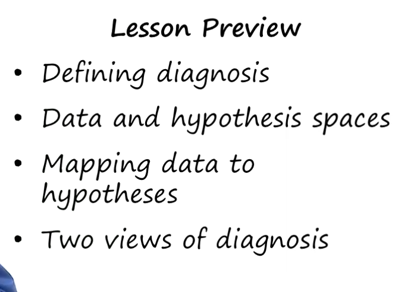
- 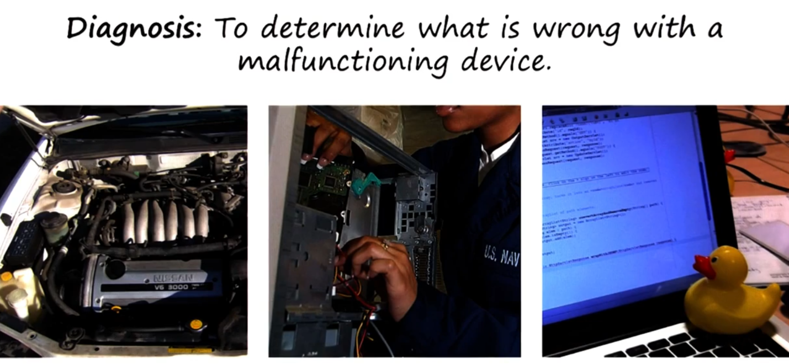
- 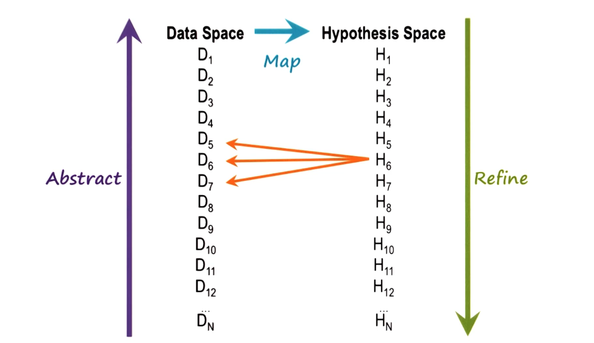
- 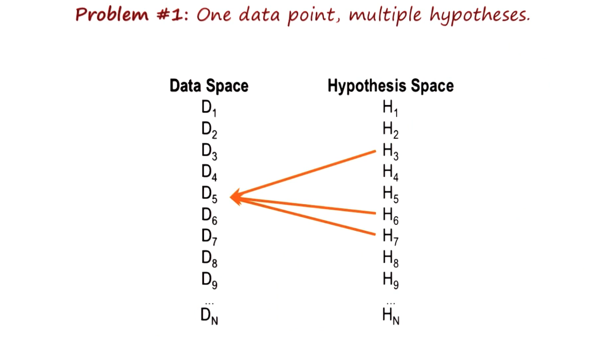
- 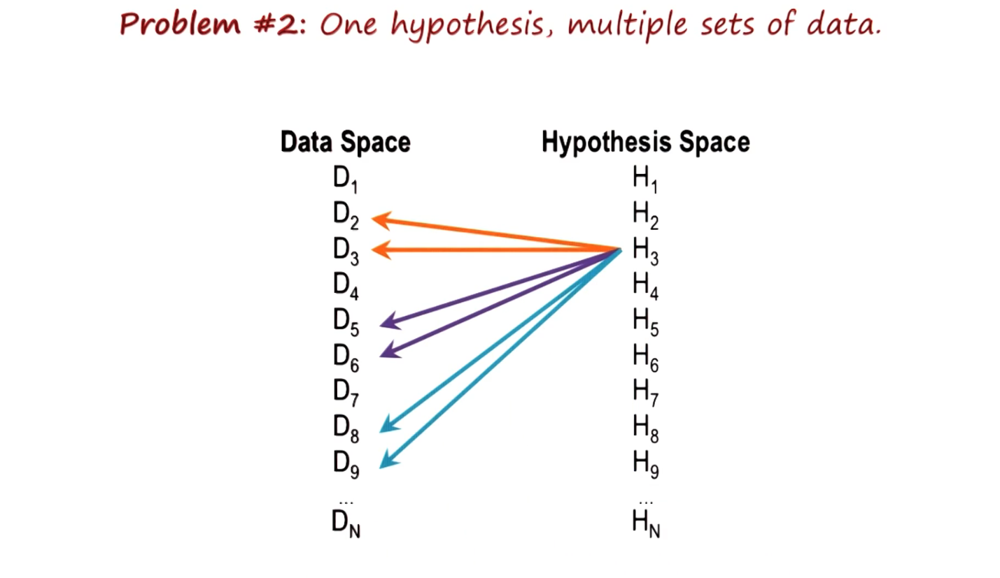
-
- 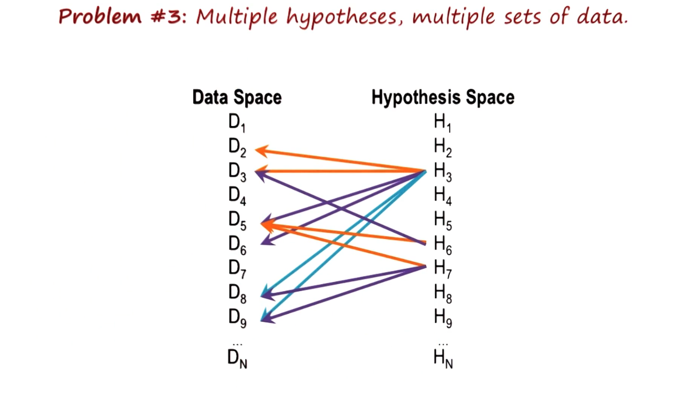
- 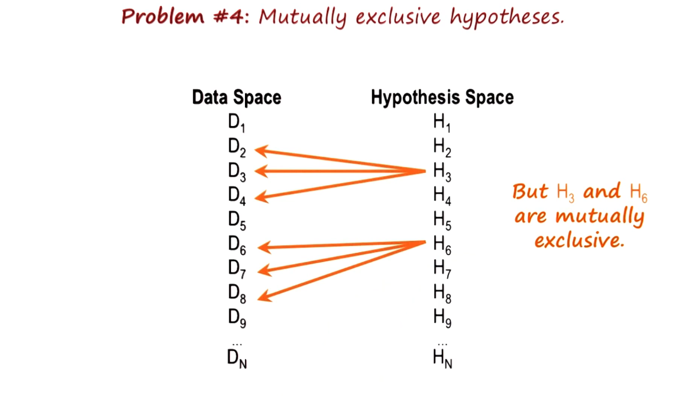{:height 459, :width 780}
- 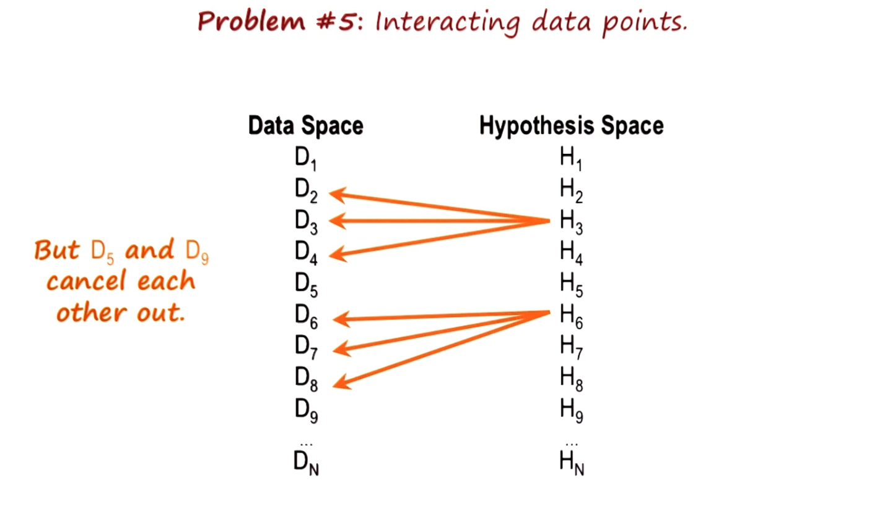
-
- 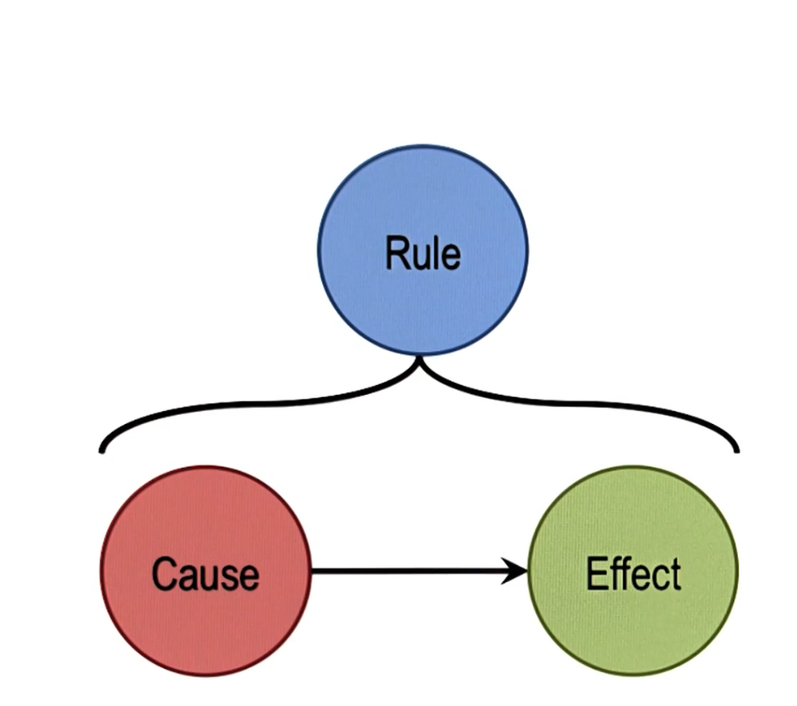
- Types of inference
- 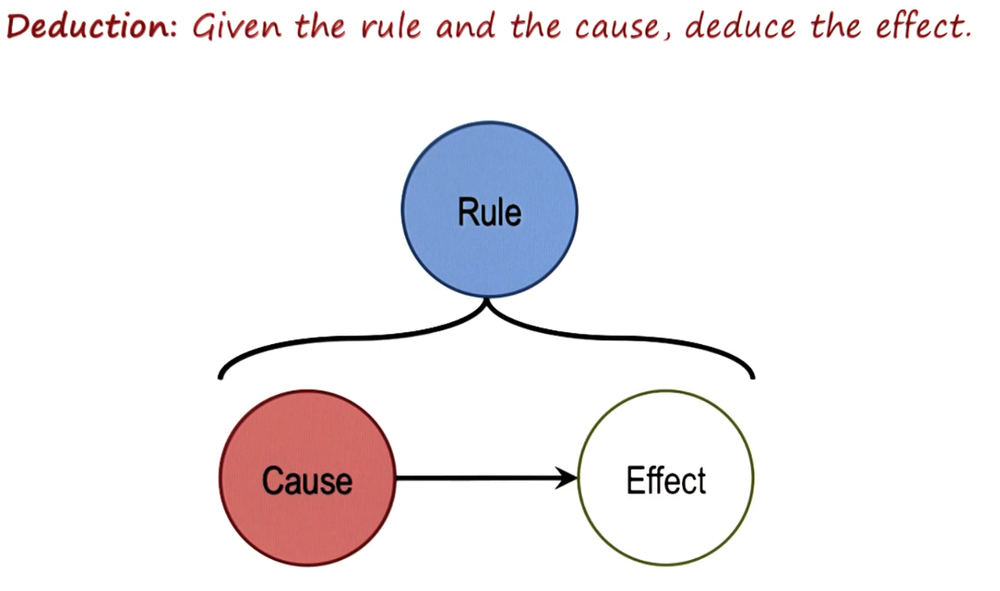
- 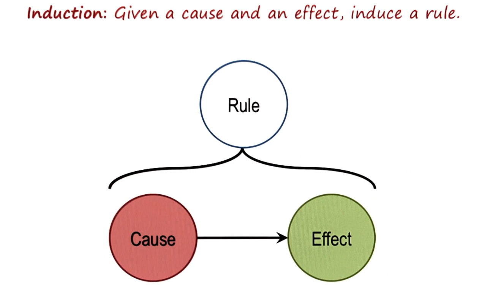
- 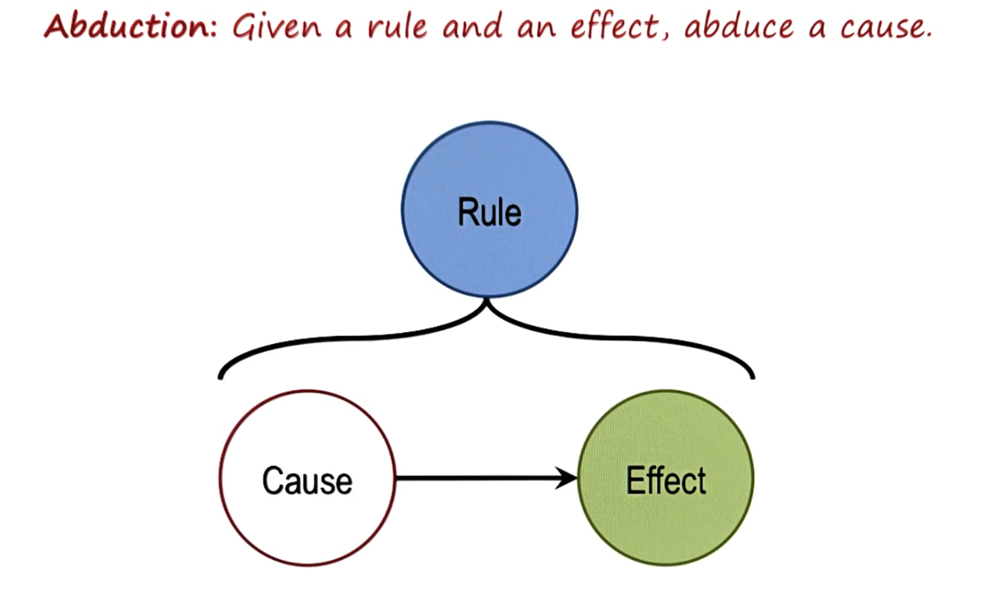
- 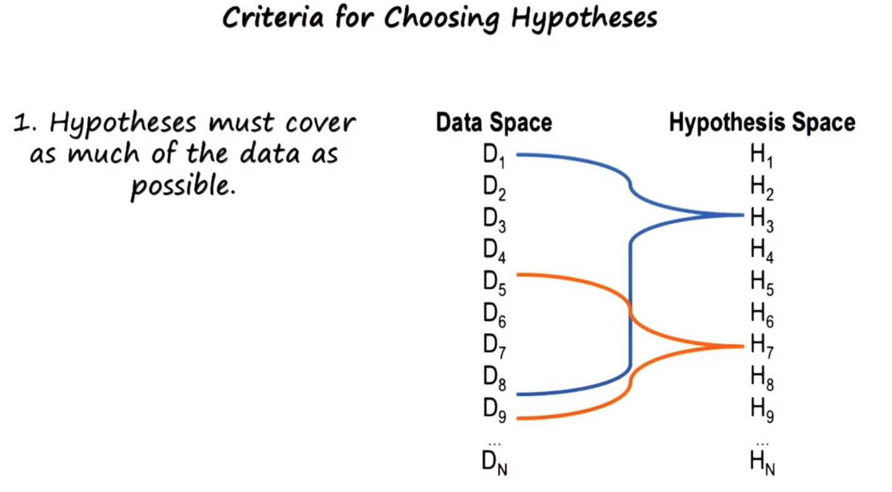
- 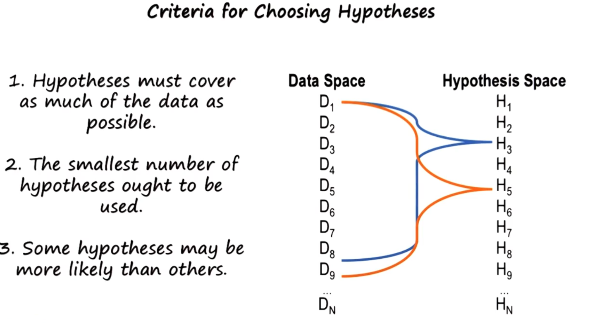
- 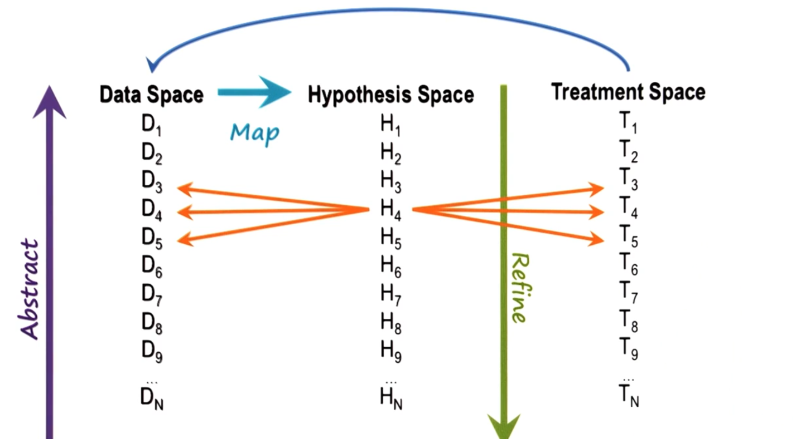
- 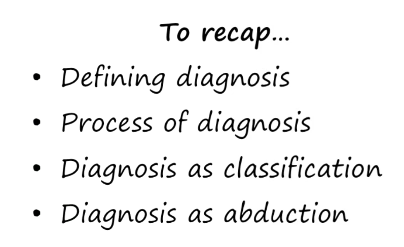
- ## Lesson 22 - Diagnosis
- ### Data Space and Hypothesis Space
  
  Diagnosis can be understood as a mapping from a data space to a hypothesis space. In medical diagnosis, data refers to the signs and symptoms a patient presents with, which can range from specific details, like a temperature of 104°F, to more abstract concepts, like running a fever. The hypothesis space encompasses all potential hypotheses that could explain parts of the observed data. For example, in medicine, hypotheses might refer to various diseases. 
  
  For instance, a doctor might hypothesize that a patient has the flu to explain their high fever. Similarly, in car repairs, the hypothesis could be that the carburetor is faulty. In software, it might be a specific method not functioning correctly. This mapping from data space to hypothesis space can be complex due to the size of both spaces and the interactions between hypotheses. For example, the presence of one hypothesis might exclude another, or the presence of one might guarantee the presence of another. 
  
  To simplify, instead of dealing with all raw data, we often use abstractions. For instance, instead of saying a patient has a fever of 104°F, we might say they have a high fever. This abstract data can then be mapped into abstract hypotheses, which can be further refined into more specific diagnoses.
- ### Problems with Diagnosis as Classification
  
  Several factors complicate the classification process in diagnosis:
  1. **Multiple Hypotheses for One Data Point**: A single data point, like a high fever, could be explained by multiple hypotheses, making it hard to determine which one is correct.
  2. **One Hypothesis Explaining Multiple Data Points**: A hypothesis might explain several symptoms. For example, the hypothesis that someone has the flu could explain fever, fatigue, and shivering.
  3. **M to M Mapping**: Multiple hypotheses might explain multiple sets of data, adding to the complexity.
  4. **Interaction Between Hypotheses**: Hypotheses can interact, such as mutual exclusion where the presence of one hypothesis excludes another. 
  5. **Cancellation**: Different hypotheses might have cancelling effects on data. For instance, having the flu might increase temperature, while another condition might lower it, resulting in a normal temperature despite the presence of both conditions.
  
  To address these complexities, shifting from viewing diagnostics solely as classification to viewing it as abduction is useful.
- ### Deduction, Induction, Abduction
  
  Understanding abduction alongside deduction and induction helps in diagnosis:
- **Deduction**: Given a rule and a cause, deduce the effect. (e.g., If it’s cloudy (cause) and there is a rule that clouds cause rain, then it rains (effect)).
- **Induction**: Given a cause and an effect, induce the rule. (e.g., Observing that clouds usually bring rain, we induce the rule that if it’s cloudy, it rains).
- **Abduction**: Given a rule and an effect, abduce the cause. (e.g., Knowing that if it’s cloudy then it rains, and observing that it’s raining, we might infer it’s cloudy).
  
  Diagnosis is an instance of abduction. It is not truth-preserving like deduction; abduction involves making the best guess based on available data and rules, knowing that multiple causes might explain the same effect.
- ### Criteria for Choosing a Hypothesis
  
  When choosing between competing hypotheses, consider:
  1. **Explanatory Coverage**: Choose the hypothesis that explains the most data points.
  2. **Parsimony**: Prefer the simplest explanation that covers the data.
  3. **Confidence**: Choose hypotheses in which you have more confidence based on their likelihood.
- ### Completing the Process
  
  Diagnosis starts with mapping from the data space to the hypothesis space. Hypotheses then guide the collection of additional data. These hypotheses also serve as indices into treatment plans. For instance, in medical diagnosis, the hypothesis of a disease leads to a corresponding set of treatments. The effectiveness of these treatments provides further data, which may refine or alter the hypotheses.
- ### Exercise: Diagnosis as Abduction
  
  To practice diagnosis as abduction, consider a set of diseases and determine which subset best explains the available data. Balancing explanatory coverage, parsimony, and confidence is key in arriving at the best hypothesis.
- ### Wrap Up
  
  In diagnosis, understanding the mapping from data space to hypothesis space, managing the complexity of this mapping, and employing principles of abduction are crucial. This approach can also be applied to other domains, such as intelligence analysis and auto mechanics.