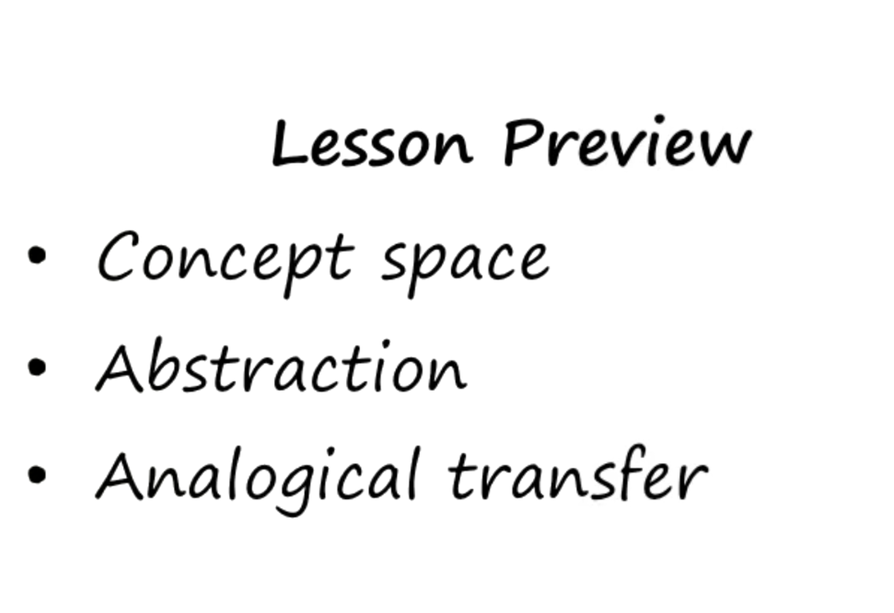
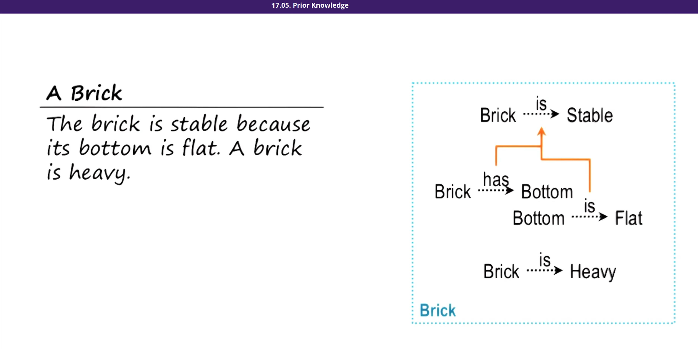
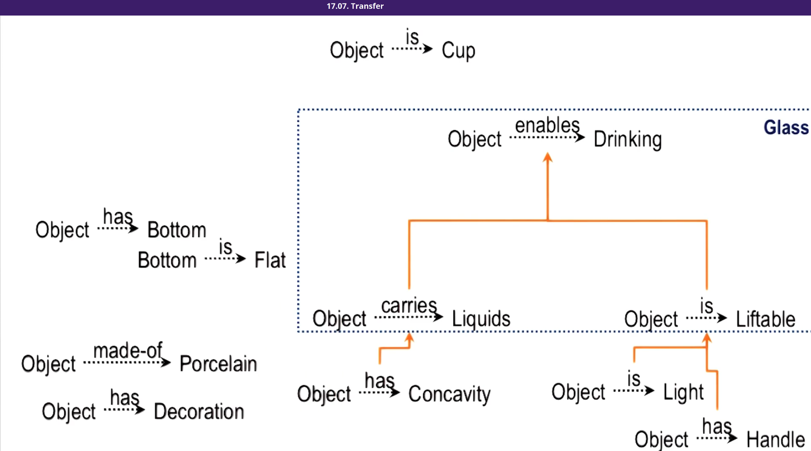
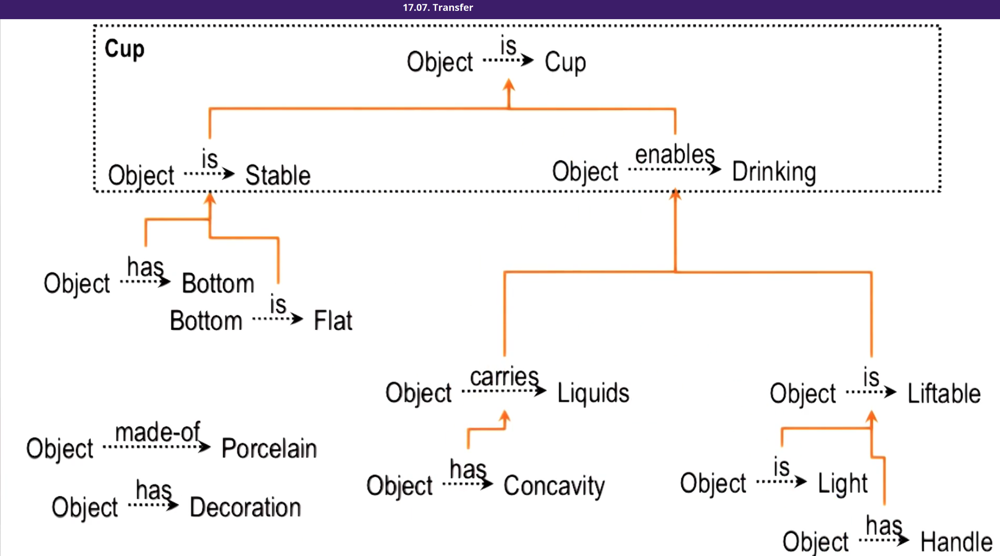
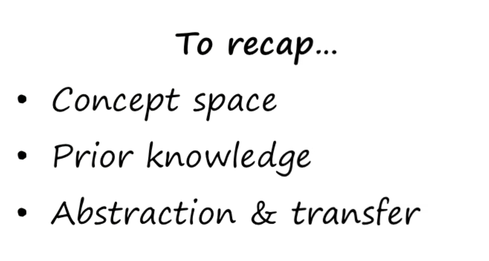

- learns about connections about existing concepts.
- 
- shares some similarity with incremental concept learning.
- related to creativity
- 
-
- 
- 
- 
- ### LESSON 17 - EXPLANATION-BASED LEARNING
- #### 05 - Concept Space
  
  An AI agent builds an explanation to prove that an object is a cup using its prior knowledge. The agent knows facts about the object, such as it having a flat bottom and being made of porcelain.
- #### 06 - Prior Knowledge
  
  The AI agent has prior knowledge of four concepts: brick, glass, bowl, and briefcase. Each concept has a detailed characterization involving stability, heaviness, liftability, and usefulness, with causal relationships linking these features. For example, a brick is stable because it has a flat bottom.
- #### 07 - Abstraction
  
  The AI agent abstracts knowledge from examples, focusing on causally related features. For instance, from the bowl, it abstracts that an object carries liquid because it is concave. This abstraction is crucial for constructing causal explanations.
- #### 08 - Transfer
  
  The AI agent builds an explanation that the object is a cup by using abstractions from different concepts. For example, the glass abstraction (enables drinking because it carries liquids and is liftable) connects with the bowl and briefcase abstractions. The agent works backwards from the definition of a cup, proving stability and enabling drinking by referencing relevant prior examples like the brick and the glass.
- #### 09 - Exercise Explanation-Based Learning I
  
  In an exercise, the task is to prove an object is a mug. A mug must be stable, enable drinking, and protect against heat. The object has features like being light, made of clay, concave, having a handle, and thick sides. The agent knows about examples like the pot, which limits heat transfer due to thick sides and being made of clay. However, proving the object protects against heat is challenging without additional causal knowledge linking heat transfer to protection.
- #### 11 - Exercise Explanation-Based Learning II
  
  The task is to determine which concept helps complete the proof that the object is a mug. The agent seeks the minimal necessary knowledge to prove that the object protects against heat. Depending on the background knowledge, the agent builds causal proofs opportunistically, using examples like a wooden spoon or an oven mitt if relevant.
- #### 13 - Explanation-Based Learning in the World
  
  Explanation-based learning is common in everyday life, where we use existing concepts in new ways. For example, using a chair to prop open a door or a coffee mug as a paperweight. This type of learning connects existing concepts creatively and is essential for dealing with novel situations.
- #### 14 - Assignment Explanation-Based Learning
  
  To implement an agent solving Raven's progressive matrices using explanation-based learning, the agent must explain either the answer or the transformations between figures. The agent learns new connections by building explanations for transformations and applying prior knowledge to new problems involving rotations or reflections.
- #### 15 - Wrap Up
  
  Explanation-based learning involves learning new connections between existing concepts, using prior knowledge to reason and abstract transferable elements. This type of learning is foundational for understanding and solving new problems. The next lesson will discuss analogical reasoning, another form of transfer-based learning.
- #### 16 - The Cognitive Connection
  
  Explanation-based learning is central to Knowledge-Based AI and cognitive science, helping build human-like intelligence. Although humans can generate explanations, we struggle with some processes, and explanations can interfere with reasoning. Nonetheless, explanations lead to deeper understanding and are essential for trust in AI systems, such as medical diagnostics, which must explain their answers and processes.