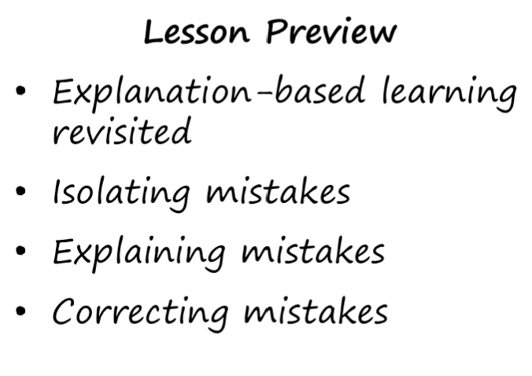
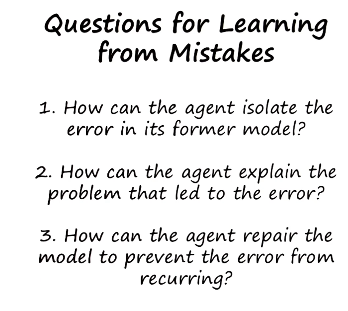
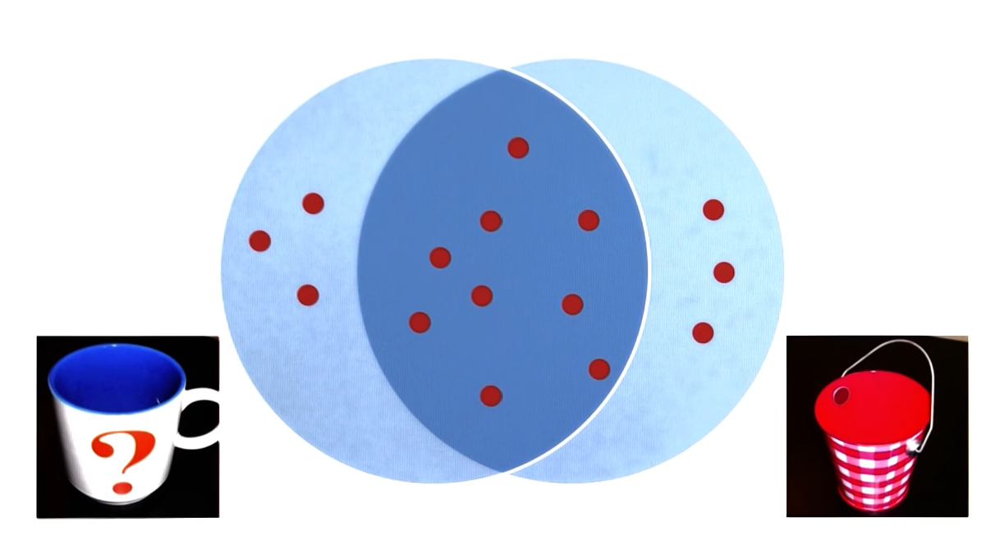
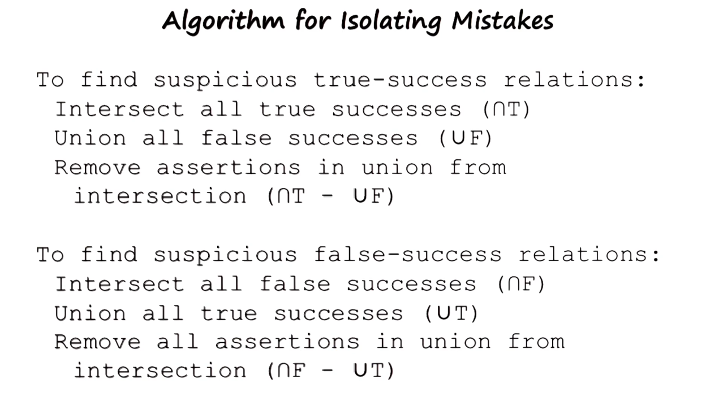
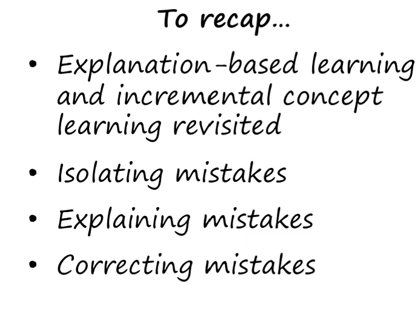

- 
- 
- Credit assignment/Blame assignment: more criteria not considered found by checking rejected example, error in ones knowledge
- self diagnosing/ self repairing.
- false suspicious identify only negative experiences.
- 
-
- 
- 
-
-