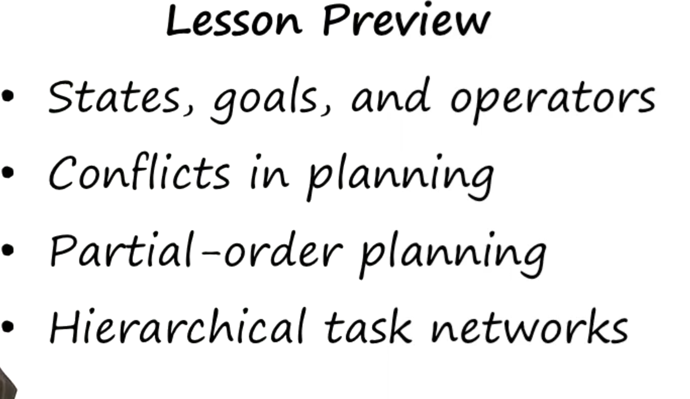
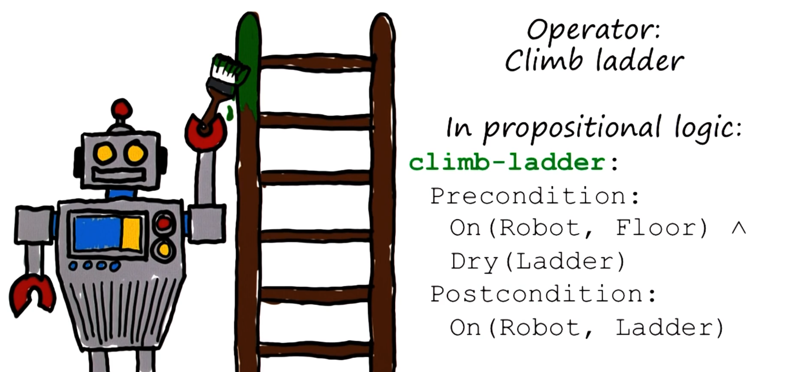
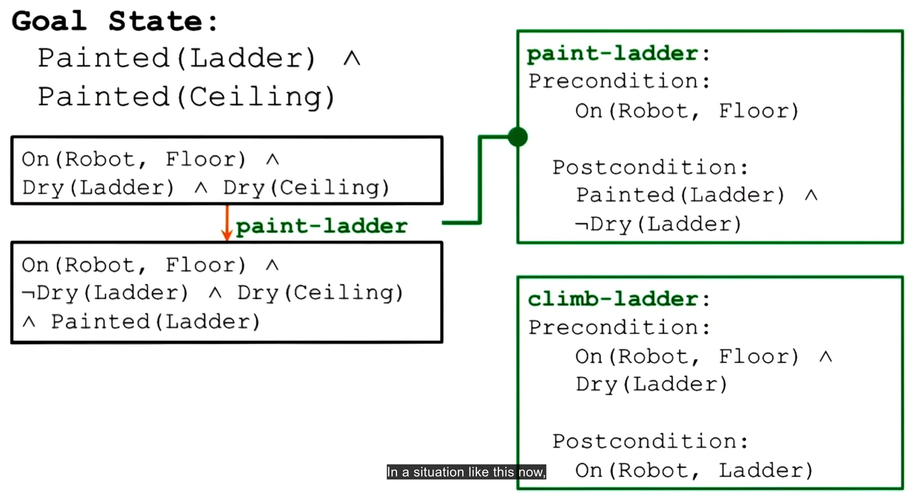
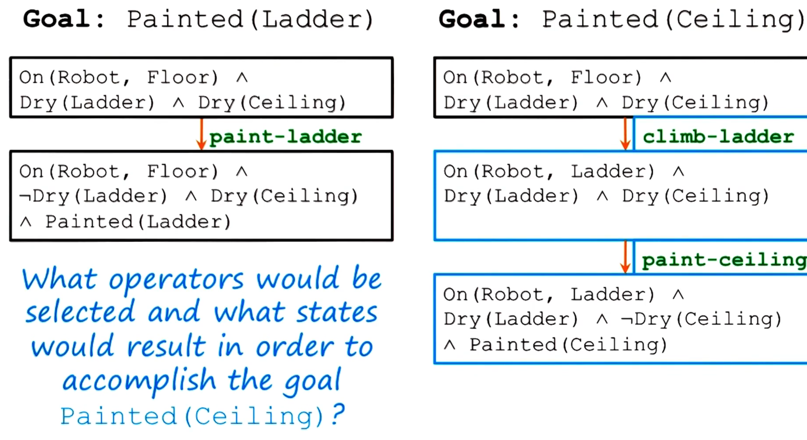
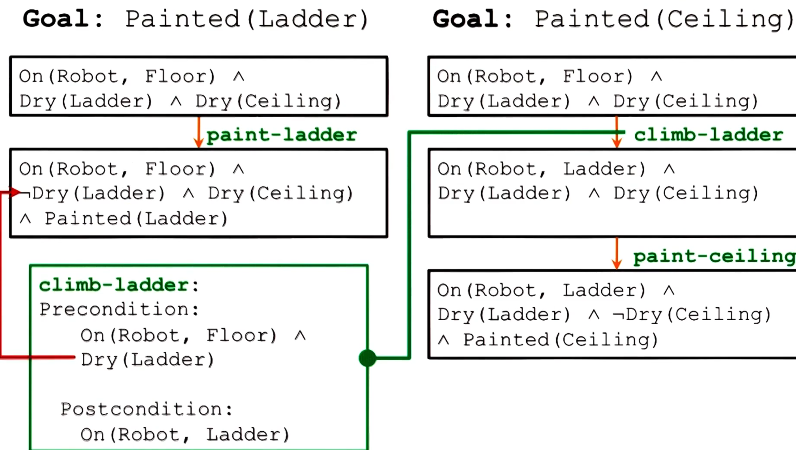
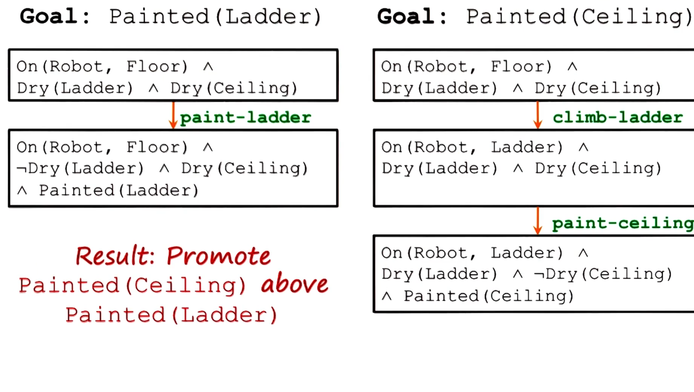
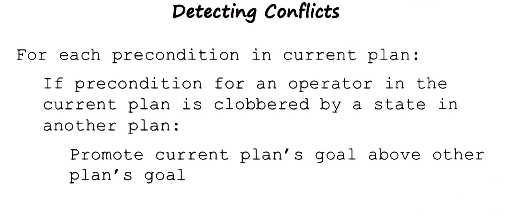
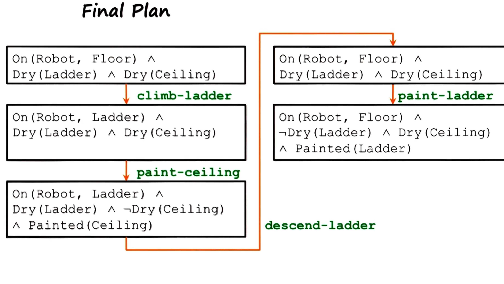
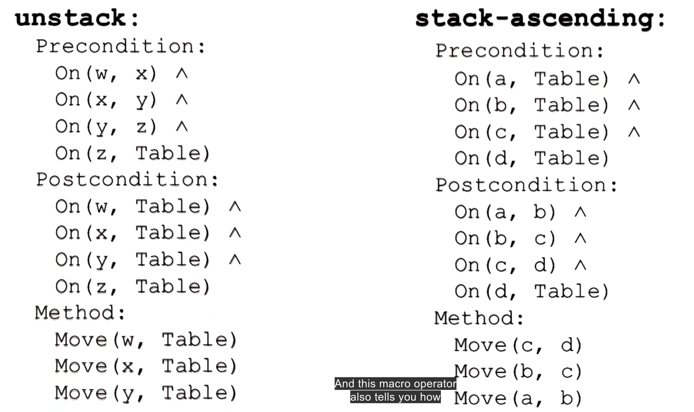
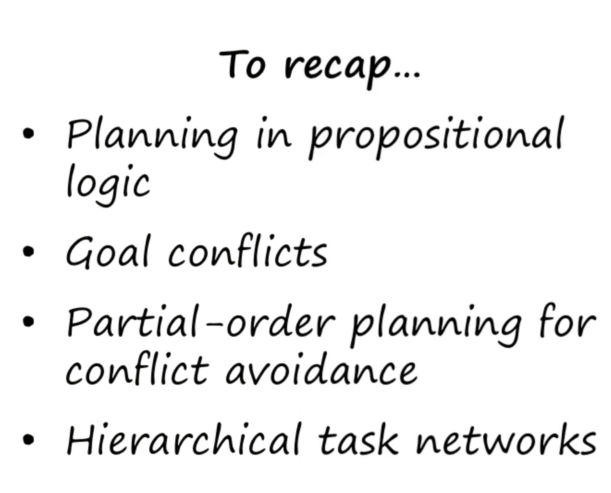

- 
- vv 
- all operations are positive and remain true after being applied for precondition
- post condition can have negative propositions
- map history into action selection
- 
- heuristic approach : means end analysis would pick the final higher cost transition blind to consequence. creates a condition that obstructs other goals.
- goal clobbering
-
-
- partial order planning:
	- also called non linear planning
	- 
	- work backwards and select action operators that has a matching precondition and post
	- 
	- 
	- OPen condition problem:
		- 
		-
		- use operator that matches precondition:
		- 
- Consider several postulates about AI:
	- first knowledge is not just about the world but control knowledge to select operators
	- goals provide control knowledge
	-
	-
- Different agents were required for each operations:
	- Agent for generating plans for each goal
	- another for detecting conflicts
	- another for resolving them
- partial order planning:
	- emerging out of interaction between agents 3
-
-
- Hierarchical task network planning
	- Hierarchical decomposition
	- 
	-
-
- 
- ### Lesson 13: Planning - Key Points and Summary
- #### Simple Planner and Partial Planning
  1. **Initial and Goal States**:
	- Transition from the initial state to goal state involves state propagation.
	- Example: Painting a ceiling requires climbing a ladder first.
	  
	  2. **Operator Selection**:
	- Operators are selected based on goal post-conditions.
	- Example: To paint the ceiling, the "paint-ceiling" operator is chosen as it has the desired post-condition.
	  
	  3. **Backward Planning**:
	- Goals are used as control knowledge to work backwards.
	- Example: To paint the ceiling, the robot must first be on the ladder. Thus, the "climb-ladder" operator is selected first.
	  
	  4. **Sub-goals and Problem Reduction**:
	- Larger goals are broken into sub-goals.
	- Example: Climbing the ladder is a sub-goal for painting the ceiling.
- #### Detecting Conflicts
  1. **Partial Order Planner**:
	- Detects conflicts between plans by examining preconditions.
	- Example: If "climb-ladder" requires a dry ladder and another operator makes it wet, there is a conflict.
	  
	  2. **Resolving Conflicts**:
	- Conflicts are resolved by adjusting the order of operations.
	- Example: Ensuring "paint-ladder" is done before the ladder is climbed.
- #### Open Preconditions
  1. **Identifying Open Conditions**:
	- When an operator's preconditions are not met, the planner selects an appropriate operator to satisfy those conditions.
	- Example: If "paint-ladder" requires the robot to be on the floor but it is on the ladder, the "descend-ladder" operator is selected.
- #### Partial Order Planning Exercises
  1. **Block World Example**:
	- Moving blocks in a specific order to reach a goal state.
	- Example: Moving D to the table, then B, then arranging A on B, B on C, etc.
	  
	  2. **Conflict Detection and Resolution**:
	- Each plan clobbers the next goal, requiring reordering.
	- Example: Moving blocks in an order that avoids conflicts in preconditions.
- #### Hierarchical Task Network Planning (HTN)
  1. **Hierarchical Planning**:
	- Abstracts operations into higher-level macro operations.
	- Example: Instead of individual move operations, use "unstack" and "stack-ascending".
	  
	  2. **Multiple Levels of Abstraction**:
	- Simplifies problem space by thinking at higher abstraction levels.
	- Example: From move operations to macro operations like sorting.
- #### Cognitive Insights
  1. **Control Knowledge**:
	- Knowledge helps select between operators.
	- Goals provide control knowledge for operator selection.
	  
	  2. **Micro-abilities Interaction**:
	- Partial order planning emerges from interactions of agents with small abilities.
	- Example: Agents for plan generation, conflict detection, and conflict resolution.
	  
	  3. **Explicit Processes in AI**:
	- AI makes human problem-solving processes explicit and precise.
	- Writing an AI program specifies each step clearly, revealing hypotheses about human reasoning.
- #### Planning Applications
  1. **Developing Agents**:
	- Using planning for agents to solve problems like Raven's Progressive Matrices.
	- Detecting and avoiding conflicts during problem-solving.
	  
	  2. **Cognitive Connection**:
	- Planning is essential for action selection and achieving multiple goals.
	- Cognitive agents detect and avoid conflicts, selecting appropriate actions for achieving goals.
	  
	  By understanding these key concepts and examples, the process of planning in AI becomes clearer, highlighting the intricacies involved in action selection and conflict resolution within a structured framework.