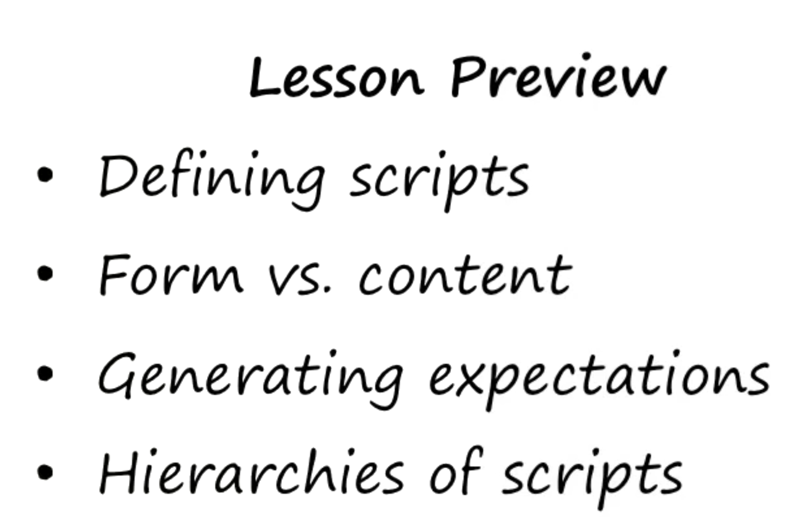
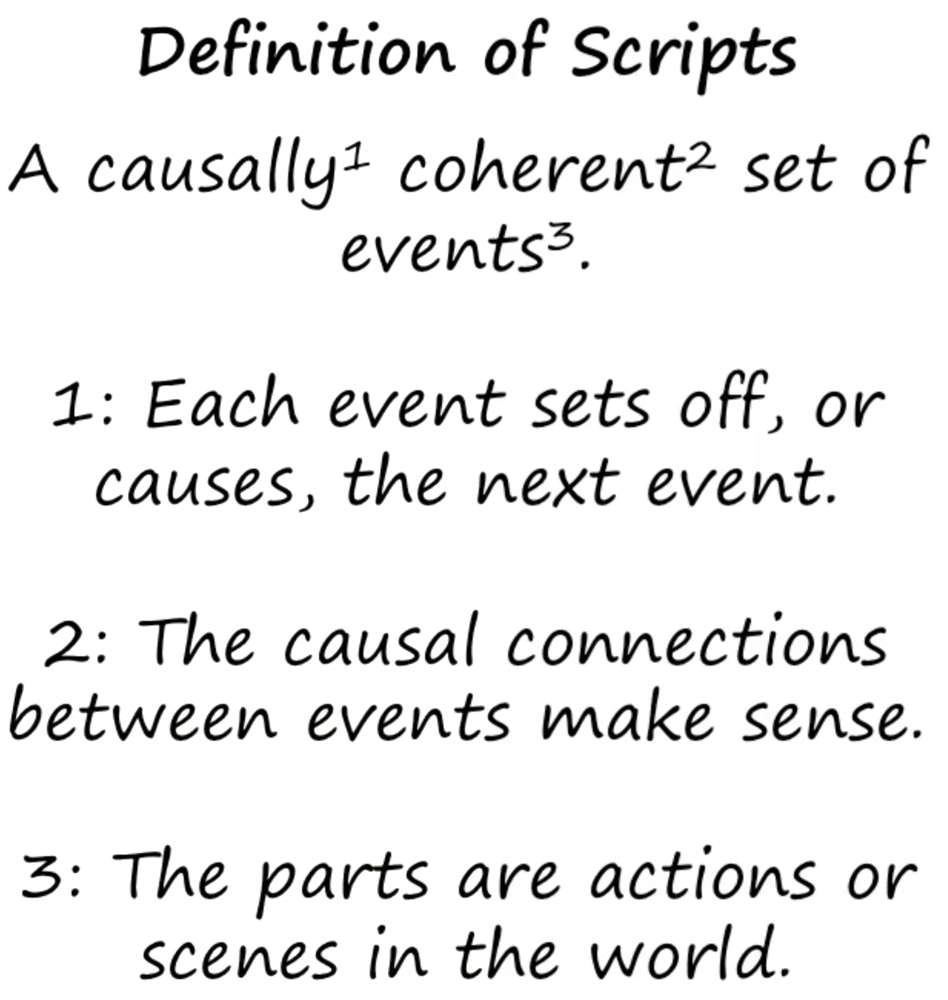
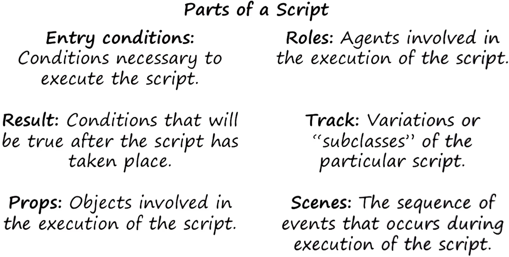
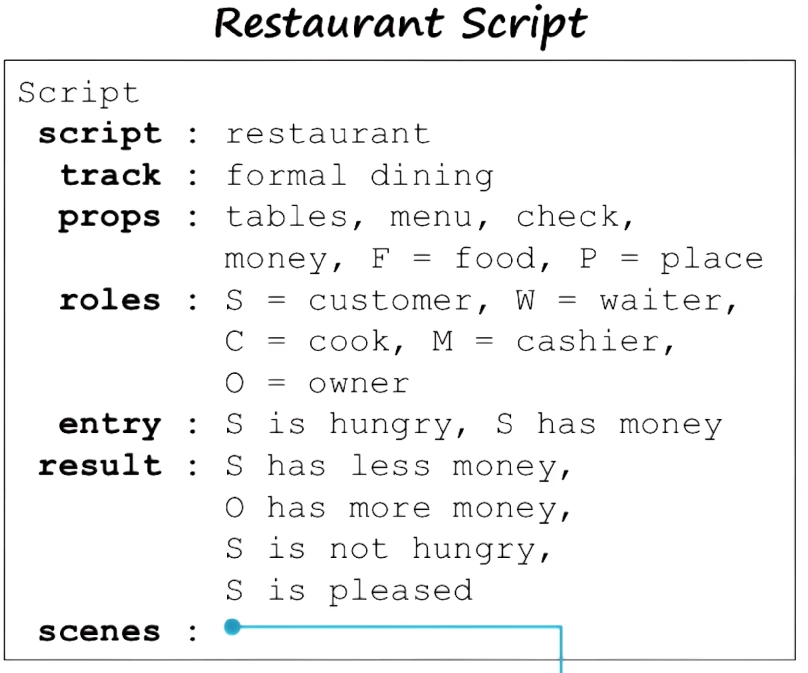
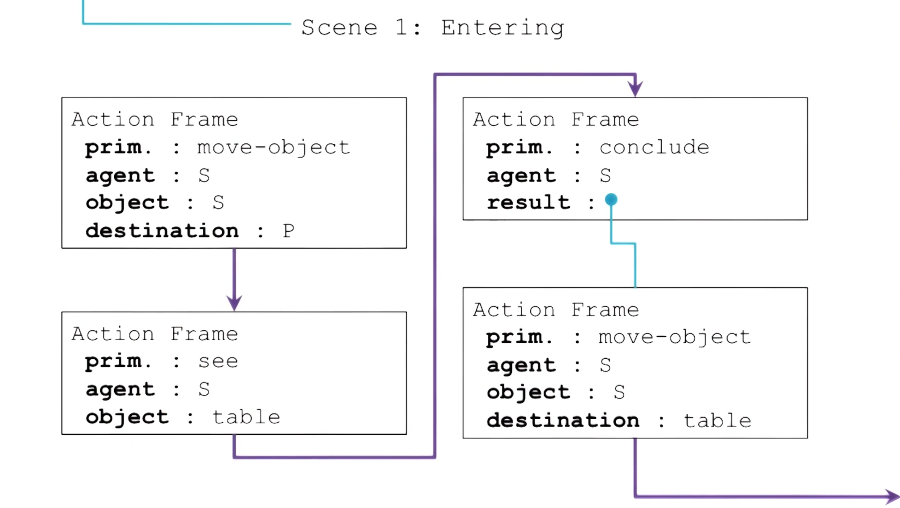
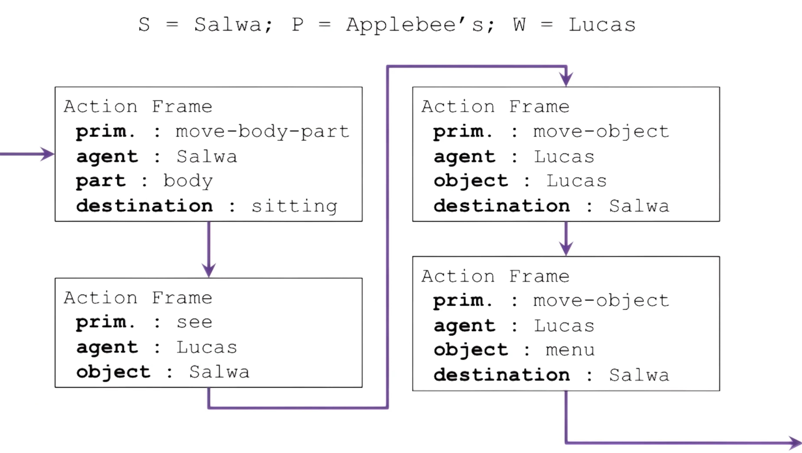
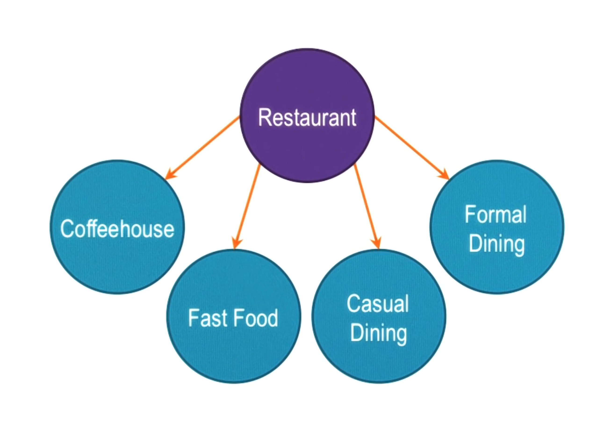
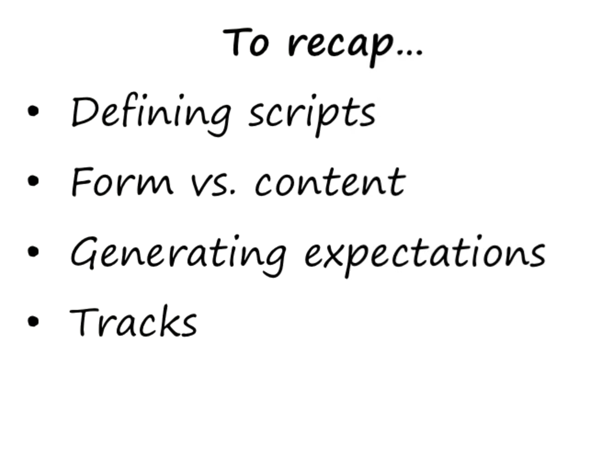

- 
- 
- all must be observable events/signs
- 
- big large molecule like concept
- 
- 
- 
- Tracks:
	- 
	- script would differ based on chosen track
- 
- Scripts are a way of understanding complex events by forming coherent series of actions that represent typical scenarios. They help us generate expectations and make sense of the world by providing prototypes for common situations.
  
  **Learning a Script:**
- **Semantic Networks and Frames**: These are representationally equivalent and useful for storing information needed to construct scripts. Scripts can be imagined as composed of semantic networks.
- **Incremental Concept Learning**: Helps an AI agent categorize experiences to develop different scripts, such as differentiating between fast food and fine dining.
- **Planning**: When an agent plans a route from an initial to a goal state, this plan can become a script for similar future situations.
- **Common Sense Reasoning**: Provides a foundational language for scripts, helping the agent understand and navigate new situations.
  
  **Not Applicable to Learning Scripts**:
- **Production Systems and Learning by Recording Cases**: These operate at a lower level of abstraction and are not as useful for the high-level abstraction needed in scripts.
  
  **Using a Script:**
- **Problem Reduction**: Breaks down scenes into smaller actions, helping identify where a script might fail.
- **Classification**: Identifies which script to use based on the situation.
- **Formal Logic**: Scripts can be written in terms of formal logic, asserting the state of the world at different points in the script's execution.
- **Understanding**: Helps disambiguate similar events based on context.
  
  **Not Applicable to Using Scripts**:
- **Generate & Test and Means-Ends Analysis**: These methods are used for problem-solving rather than executing a known solution.
- **Case-Based Reasoning**: Focuses on individual cases, whereas scripts abstract over multiple cases.
  
  **Scripts and Cognition**:
- **Mental Models**: Scripts are similar to mental models that people use to navigate various situations, including social and technical scenarios.
- **Cultural Specificity**: Scripts can vary significantly across cultures, reflecting different norms and expectations.
  
  **Practical Application**:
  Scripts can inform the design of AI agents, such as those solving Raven’s progressive matrices by using predefined scripts for different types of problems.
  
  **Conclusion**:
  Scripts integrate frames, understanding, and common-sense reasoning into a structured format that simplifies handling repeated events. They are powerful tools for both AI and human cognition, providing structured expectations and facilitating quick, efficient responses to familiar situations.