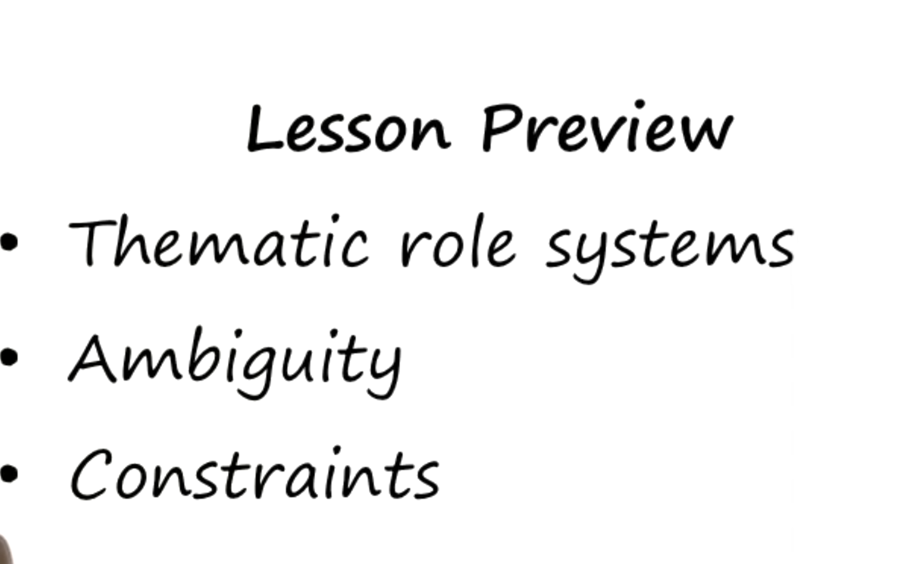
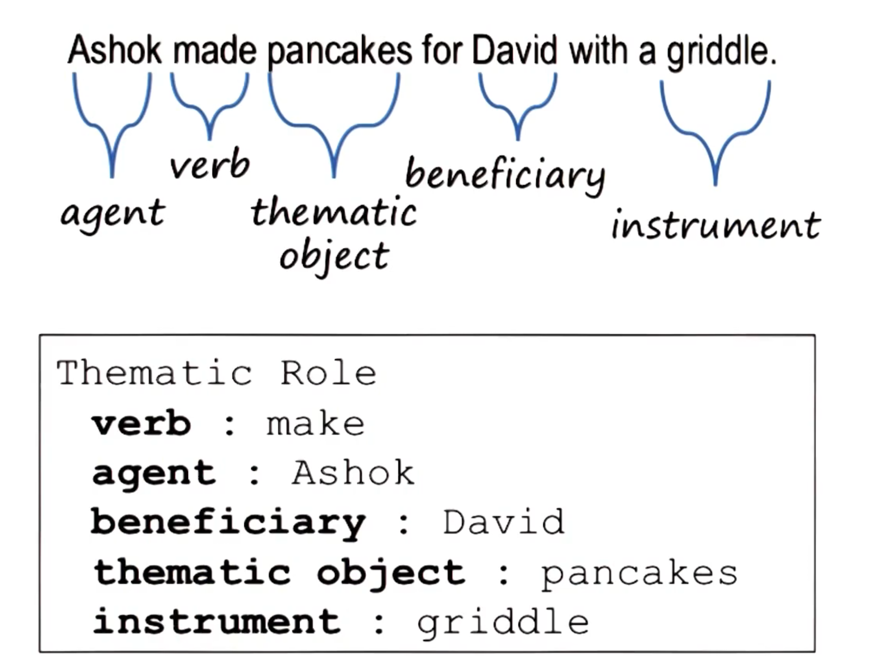
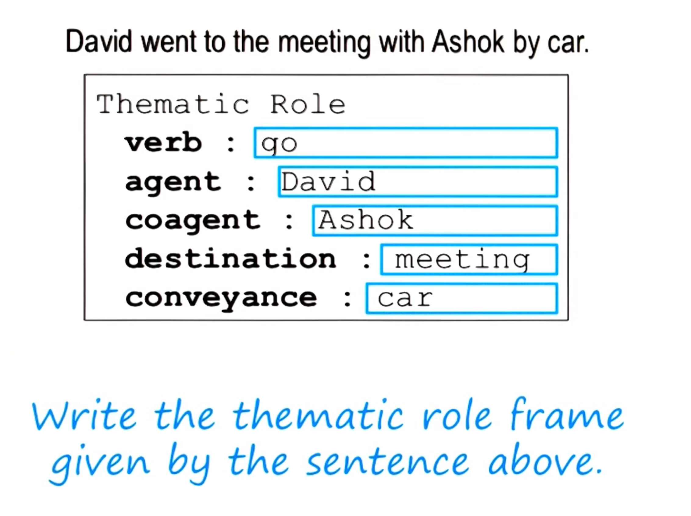
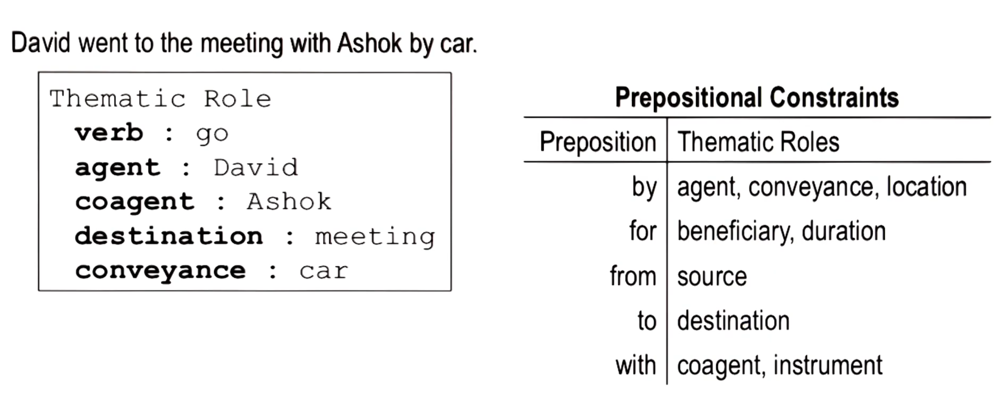
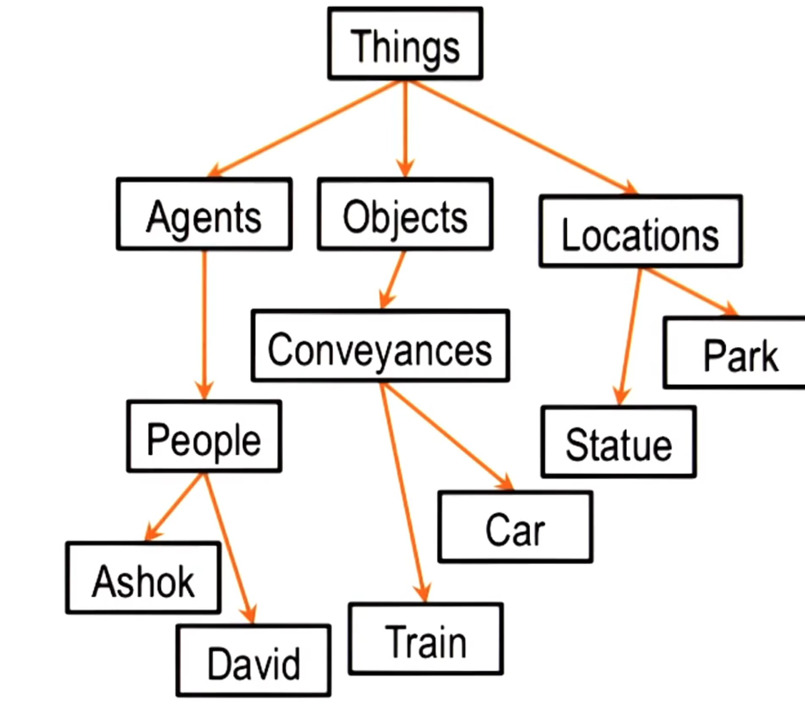
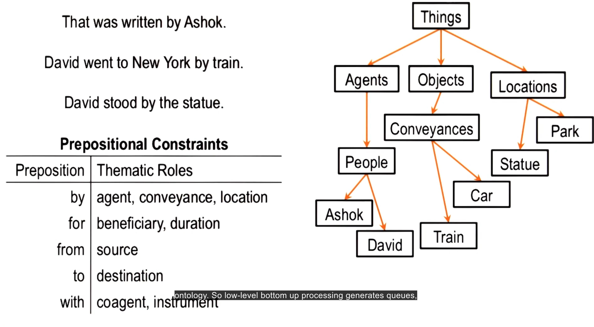
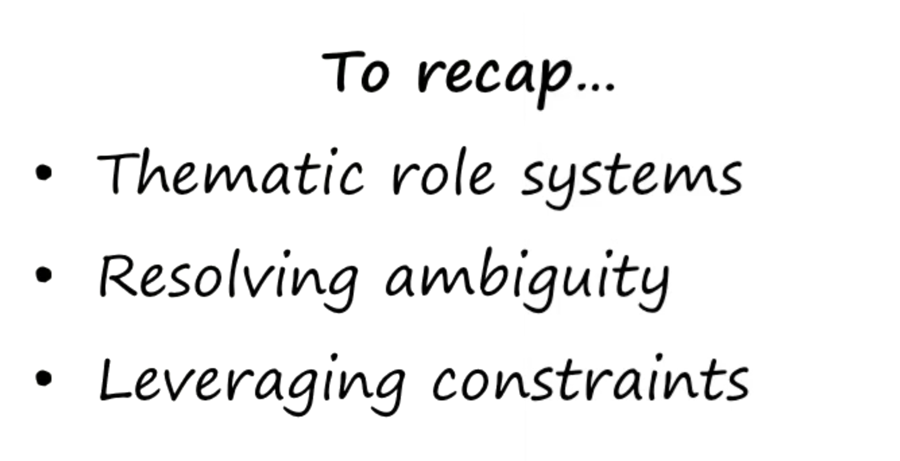

- 
-
- Sentence analysis:
	- Semantic analysis(agent action instrument ):
		- 
		- 
		- semantic categories :
			- 
		- Agent ontology:
			- 
		- lexical analysis types of word(noun , verd, etc)
			-
		- syntactic analysis (structure of senctence)
		- 
		-
- 
- **Lesson 14 - Understanding: Thematic Role Systems**
  
  ---
  
  **Title Slide:**
- **Quote:** “In mathematics, you don’t understand things. You just get used to them.” – John von Neumann.
- **Introduction:** This lesson will focus on thematic role systems, their use in resolving ambiguity, and how grammar and constraints guide our interpretation of the world.
  
  ---
  
  **01 - Preview:**
- **Introduction to Understanding:**
	- Understanding is a broad concept. In this lesson, we will focus on understanding stories and how frames play a crucial role in this process.
	- **Next Steps:** This will set the foundation for learning about common sense reasoning in the next lessons.
	  
	  ---
	  
	  **02 - The Earthquake Report:**
- **Stories and Understanding:**
	- We use stories to make sense of the world by providing structure to data.
	- **Example Stories:**
		- An earthquake causing damage in Lower Slabovia.
		- The President of Lower Slabovia killing proposals.
	- **Key Concept:** The meaning of the word "killing" varies greatly between these stories.
	- **Challenge:** How can a program differentiate between these meanings like humans do?
	  
	  ---
	  
	  **03 - Thematic Role Systems:**
- **Analyzing Sentences:**
	- **Example Sentence:** "Ashok made pancakes for David with a griddle."
	- **Levels of Analysis:**
		- Lexical: Categorizing words (nouns, verbs, etc.).
		- Syntactic: Sentence structure (noun phrases, verb phrases).
		- Semantic: Meaning derived from thematic roles (agent, action, object, beneficiary, instrument).
	- **Inference:** Understanding meaning involves drawing correct inferences.
	  
	  ---
	  
	  **04 - Thematic Role Systems Continued:**
- **Understanding Actions:**
	- **Example:** The verb "throw" implies expectations about the roles (agent, object, target, destination).
	- **Role of Thematic Frames:** Generate expectations and guide interpretation.
	  
	  ---
	  
	  **05 - Exercise Thematic Role Systems:**
- **Exercise:** Analyze the sentence "David went to the meeting with Ashok by car."
	- **Breakdown:**
		- Verb: Went (action).
		- Agent: David.
		- Coagent: Ashok.
		- Destination: Meeting.
		- Conveyance: Car.
		  
		  ---
		  
		  **06 - Exercise Thematic Role Systems Continued:**
- **Role of Prepositions:**
	- **Examples of Prepositions:** By, for, from, to, with.
	- **Constraints:** Prepositions help in assigning roles but require additional knowledge to resolve ambiguities.
	- **Ontology:** Categorizing entities (agents, conveyances, locations) aids in interpretation.
	  
	  ---
	  
	  **07 - Constraints:**
- **Semantic Categories:**
	- **Example Sentences:**
		- By Ashok (agent).
		- By train (conveyance).
		- By the statue (location).
	- **Role of Ontology:** Helps determine the correct interpretation.
	  
	  ---
	  
	  **08 - Resolving Ambiguity in Prepositions:**
- **Prepositions and Meaning:**
	- **Examples:**
		- With Ashok (coagent or instrument).
	- **Bottom-Up and Top-Down Processing:**
		- Initial lexical analysis transitions to using background knowledge for interpretation.
		  
		  ---
		  
		  **09 - Ambiguity in Verbs:**
- **Ambiguous Words:**
	- **Examples:** "Hit" and "take."
	- **Humor in Ambiguity:** Puns rely on multiple meanings of words.
	- **Goal:** To teach agents to resolve ambiguities, understanding context and constraints.
	  
	  ---
	  
	  **10 - Resolving Ambiguity in Verbs:**
- **Example Analysis:**
	- **Word "Take":**
		- Multiple meanings (medicate, measure, steal, etc.).
		- **Context:** Sentence context and background knowledge help determine the intended meaning.
		  
		  ---
		  
		  **11 - Exercise Resolving Ambiguity in Verbs:**
- **Exercise:** Determine the meaning of "take" in given sentences.
	- **Example Analysis:**
		- Take 1: To subtract.
		- Take 2: To carry.
		- Take 7: To cheat or swindle.
		  
		  ---
		  
		  **12 - Exercise Resolving Ambiguity in Verbs Continued:**
- **Universal Application:**
	- **Languages:** The analysis applies to all languages, not just English.
	- **Translation and Structure:** Understanding sentence structure aids in translating and disambiguating across languages.
	  
	  ---
	  
	  **Conclusion:**
- **Final Thoughts:**
	- Disambiguating words and understanding meaning requires combining lexical, syntactic, and semantic analyses.
	- **Future Lessons:** Will build on this foundation to explore more about common sense reasoning and story understanding.
	  
	  ---
	  
	  **Interactive Component:**
- **Discussion Prompt:** How might this kind of analysis work for translation between languages? Share thoughts on the forum, especially if you speak multiple languages.