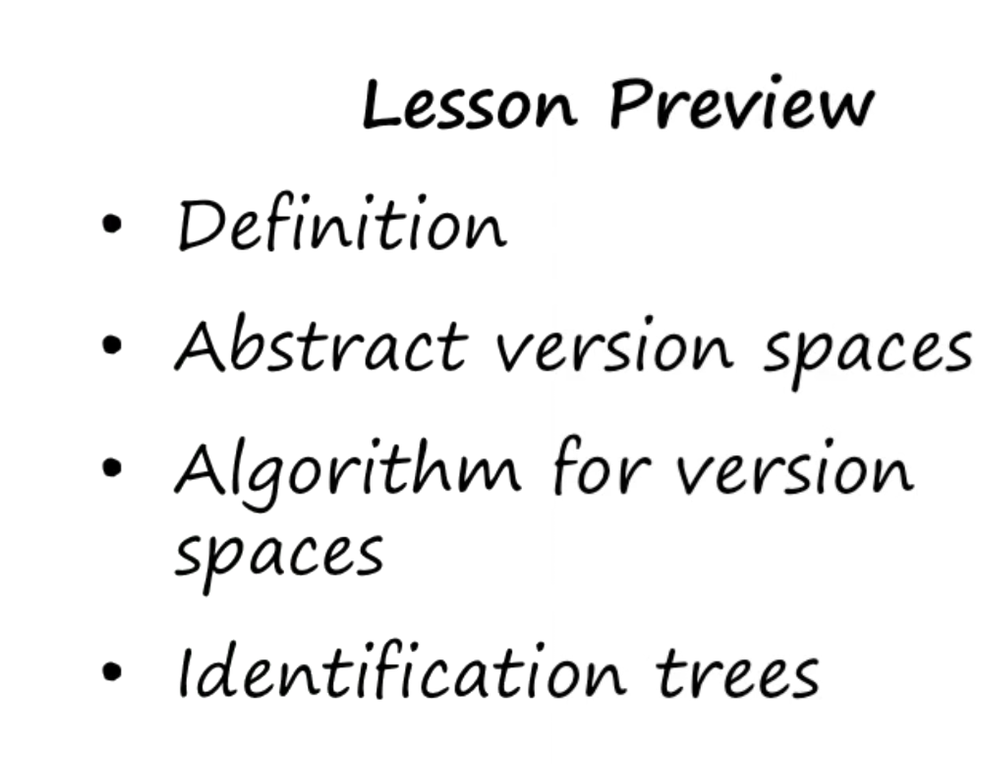
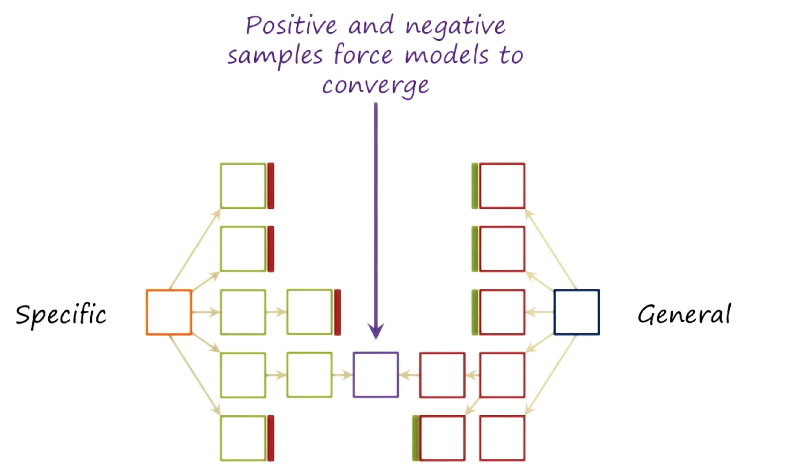
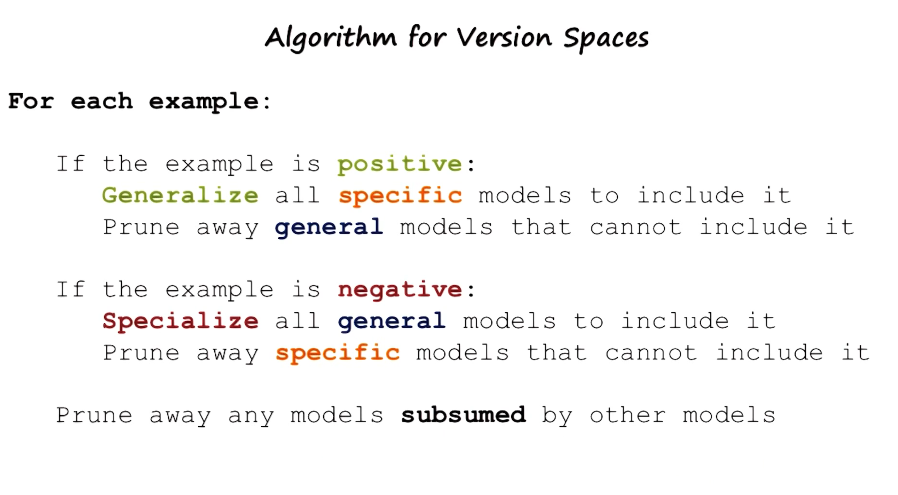
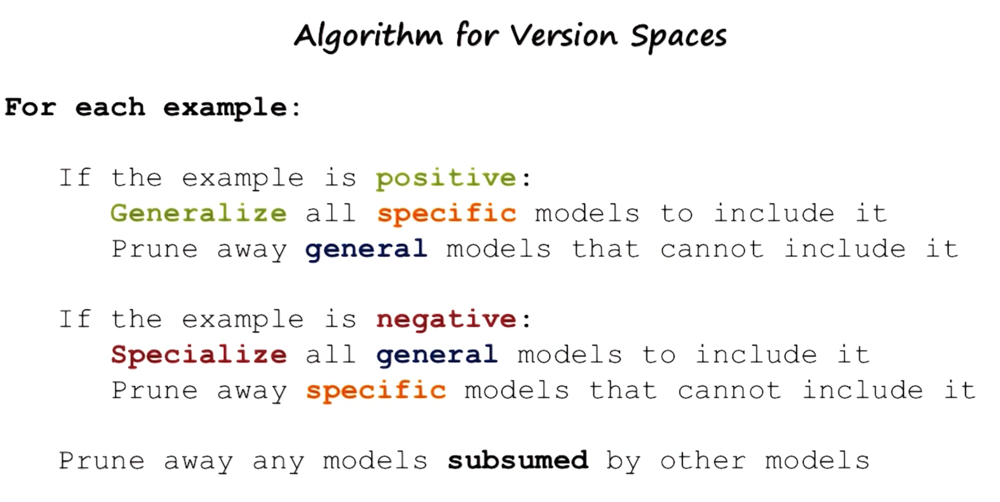
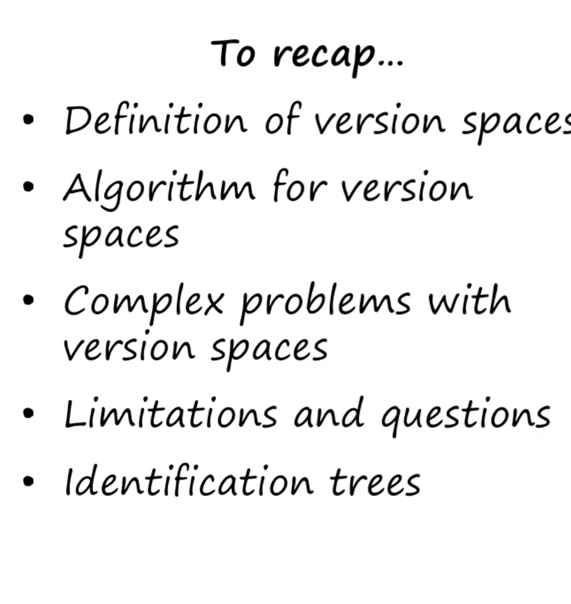

- 
- 
- 
- 
-
-
- 
- ### Lesson 19 - Version Spaces
  
  **Figures 697-699: Example Food Allergies IV**
  
  When processing the fourth example, indicated by a red outline, it is identified as a negative instance. To address this, we must specialize the general concept characterizations available. First, we check if the current general concept needs specialization. However, this general concept already excludes the negative example. For instance, the generalization that applies to "Sam’s" but has "Bob’s" within it already excludes the negative example. Therefore, further specialization is unnecessary.
  
  Next, we examine another general model to see if it requires specialization to exclude the negative example. At this stage, it includes the negative example because it generalizes to any element. Therefore, we must specialize this concept to exclude the negative example while ensuring consistency with the most specialized characterization.
  
  It's crucial to prune nodes in the pathway if one node is subsumed by another from the same general concept characterization. For instance, if I'm allergic to any meat at Sam’s, specifying an allergy to cheap meat at Sam’s becomes redundant. Thus, this particular pathway can be pruned, leaving the significant pathways intact. After processing, two possibilities remain: being allergic to everything at Sam’s or every cheap meal at Sam’s.
  
  **Figures 700-704: Example Food Allergies V**
  
  Upon encountering the fifth example, again a negative instance, we must specialize the general characterizations to exclude this example. The most specific generalization that excludes the negative instance but remains consistent is "Sam’s cheap." It excludes this example because the meal is cheap, ruling out the instance as it is expensive.
  
  This method guarantees convergence, ensuring the learning agent stabilizes on a concept characterization given enough examples. We did not use background knowledge or assume examples were presented in a specific order, highlighting the flexibility of version space learning.
  
  In incremental concept learning, each example differs by one feature from the current concept characterization. In version space learning, examples can differ by many features. The version space algorithm generalizes or specializes models based on positive or negative examples and prunes models subsumed by others, ensuring convergence.
  
  **Figures 705-717: Exercise Version Spaces**
  
  Exercises involve applying the version space algorithm to various examples. Starting with specific and general models, we refine these models based on positive or negative examples, either generalizing or specializing as necessary.
- **Exercise I:** With the first positive example, the most specific model is an allergy to any breakfast on Friday that’s cheap and non-vegan, while the most general model is an allergy to everything.
- **Exercise II:** Given a second positive example, we generalize the specific model to any meal at Kim’s on Friday that’s cheap and non-vegan.
- **Exercise III:** Write down the generalization of the specific model consistent with this positive example.
- **Exercise IV:** When a negative example appears, we specialize the general model. It’s clear not all instances cause an allergy, so we refine the general model.
- **Exercise V:** Specialize and prune based on the negative example, resulting in three potential general models: allergic to everything at Kim’s, all breakfasts, or eating on Friday. Models based on cost or vegan status are pruned.
- **Exercise VI:** Complete the exercise with given examples and features to decide the converged model.
  
  **Figures 718-724: Identification Trees**
  
  Decision trees are another method for processing data like version spaces but require all examples upfront. We discussed how decision trees are constructed, using features to split data into categories that classify examples efficiently. Decision tree learning provides optimal classification trees compared to discrimination tree learning, which is incremental but may be less optimal.
  
  **Figure 725: Assignment Version Spaces**
  
  Version spaces can be applied to solving Raven’s progressive matrices by defining what concept to learn and what increments to use, converging onto a correct answer or an adoptable algorithm for solving problems.
  
  **Figure 726: Wrap Up**
  
  Version spaces help converge on a concept understanding without prior knowledge or a specific order of examples. We refine general and specific models iteratively until convergence. The limitations and applications of version spaces, including their connection to identification trees and incremental learning, were discussed.
  
  **Figure 727: The Cognitive Connection**
  
  Cognitive agents must balance undergeneralization and overgeneralization. Version spaces allow convergence to an appropriate level of abstraction, demonstrating cognitive flexibility by maintaining multiple perspectives until convergence. An alternate approach involves generalizing, testing in the real world, and learning from mistakes, a topic revisited later in the class.
- ### Summary
  
  Version spaces offer a systematic approach to concept learning, ensuring convergence and stability in understanding. This method is robust against the order of examples and does not rely on background knowledge, making it versatile for various applications, including solving complex problems and understanding cognitive processes.