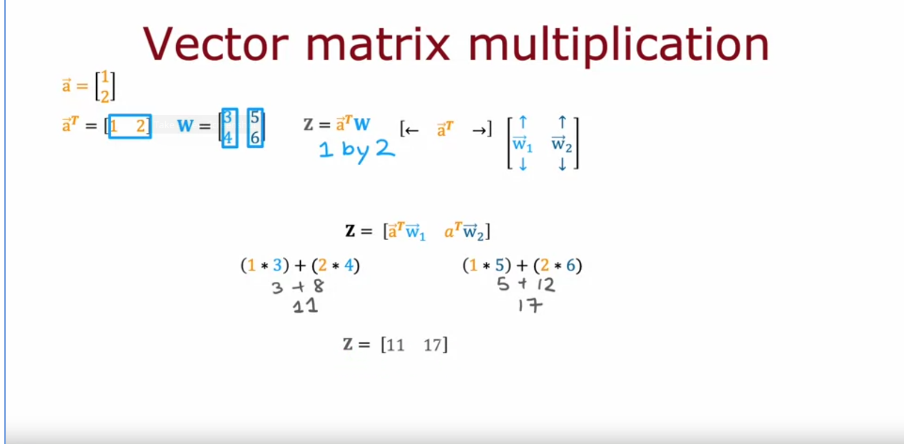
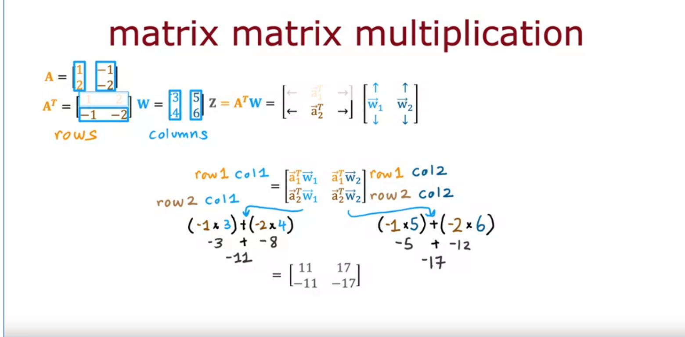
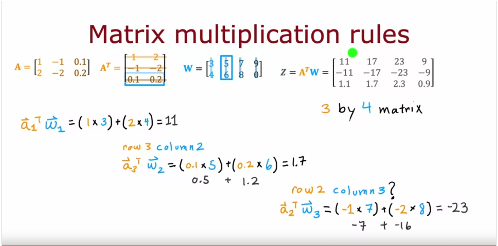
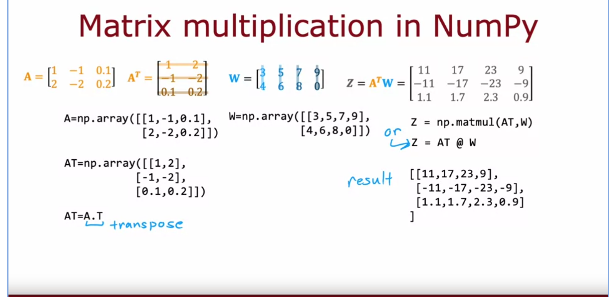

- Matrix multiplication
	- 
	- 
	- {:height 366, :width 727}
	- 
	- get first matrix transpose to have 3x2     2x4, column row same thus compatiable, result is row of first and column of second in dimension. each row of first is multiplied by each column of second. vectors need be same size for multiplication.
	- 
	-
	-