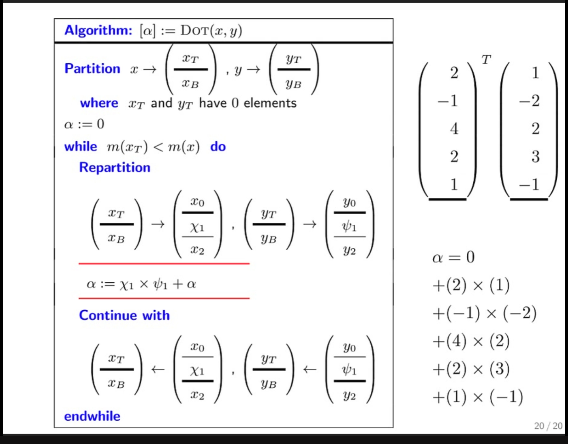
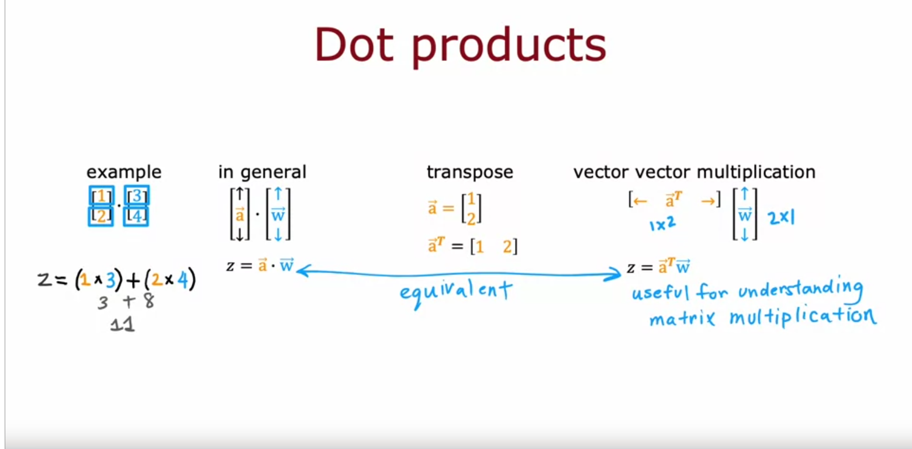
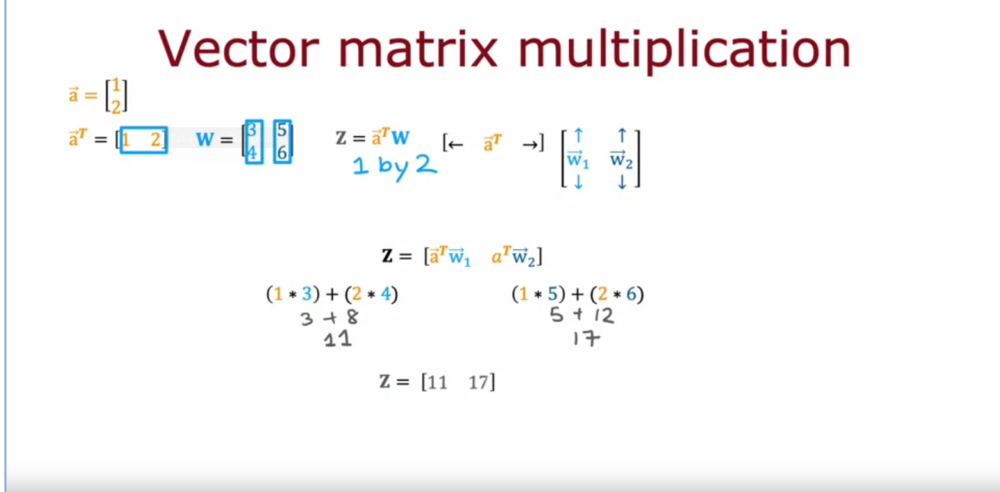
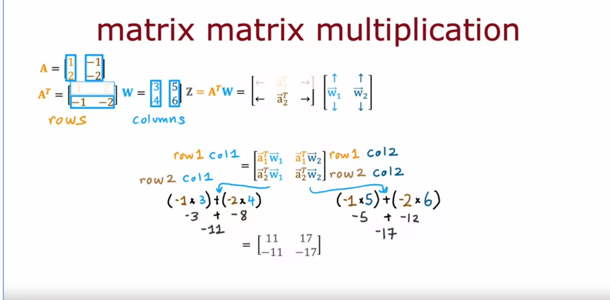
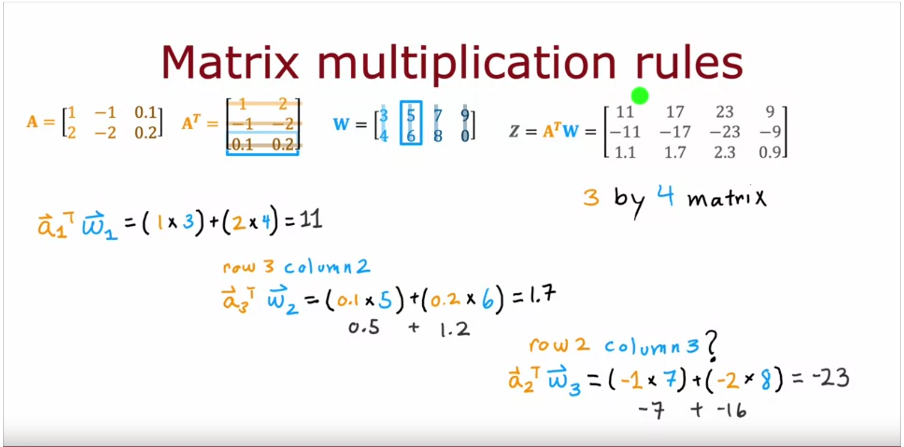

- [[Linear Algebra]]
-
- Vector is an ordered array
- each entry is a component.
- Components  are Indexed starting 0
- Belongs to real numbers
- Has direction and length starting from origin point.
- Length is euclidean
- Unit Basis Vectors(Standard basis vectors)
	- of size n of zeros except 1 component which is the indicated index one e.g: e of 3 , third is 1.
	- Generalizes notation to arbitrary length vectors.
- 2 vectors are equal only when all of their elements are equal
- Vectors dont have a spacial location. therefore heeling vectors is possible (heel to toe)
- black vector is heel to toe addition of 2 vectors. choice of which is heel and toe doesn't matter.
- scaling is same as stretching a vector.
- scaled vectors have same direction but different length.
- vector subtraction is the opposite diagonal to vector addition
- 
- AXPY(scaled vector addition) scalar Alpha time X plus Y  : ax+y
- vector memops for axpy, 1 memop for multiplier, 3 * n memops (2 read 1 write), 2*n floating ops.
- Linear combination of vectors scales the individual vectors then adds them
- Dot or inner product.
  multiply each element by it corresponding vector element and add each consecutive multiplication(summation of element multiplication)
- dot product is commutative.
- Euclidean length is root of sum of squares of components
  xT.x
- Law of cosines: 
  
- A vector function is  a math of one or more scalar and or vector whose output is a vector.
- slicing and dicing dot product: you can partition vectors to sub vectors while carrying out the dot product and then do a summation.
- 
- Cauchy-Schwarz inequality
- Matrix multiplication
	- 
	- 
	- {:height 366, :width 727}
	- 
	- get first matrix transpose to have 3x2     2x4, column row same thus compatiable, result is row of first and column of second in dimension. each row of first is multiplied by each column of second. vectors need be same size for multiplication
	-