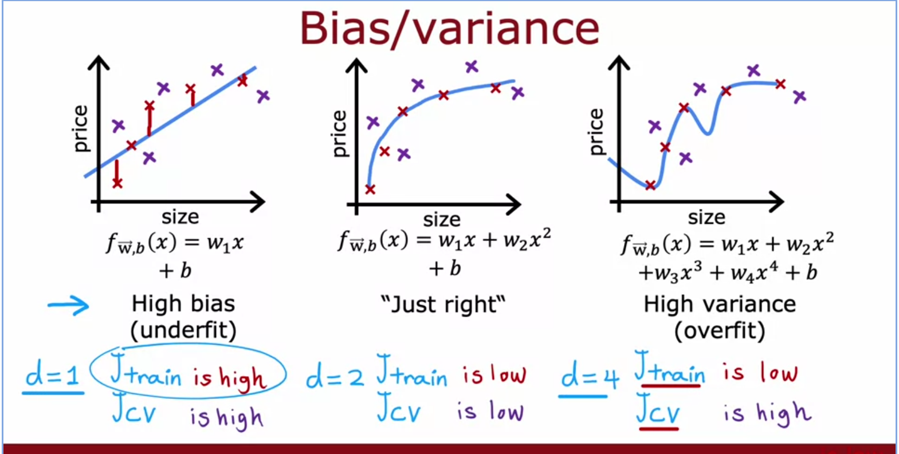
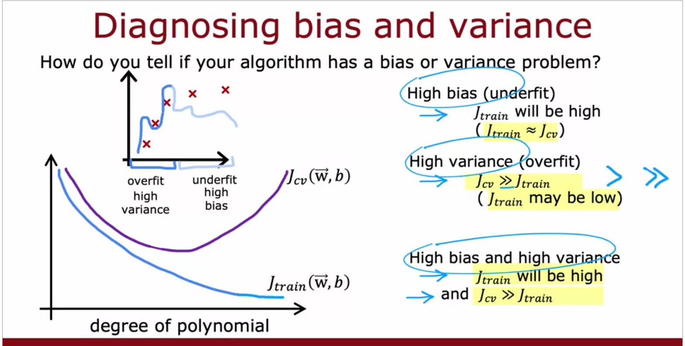
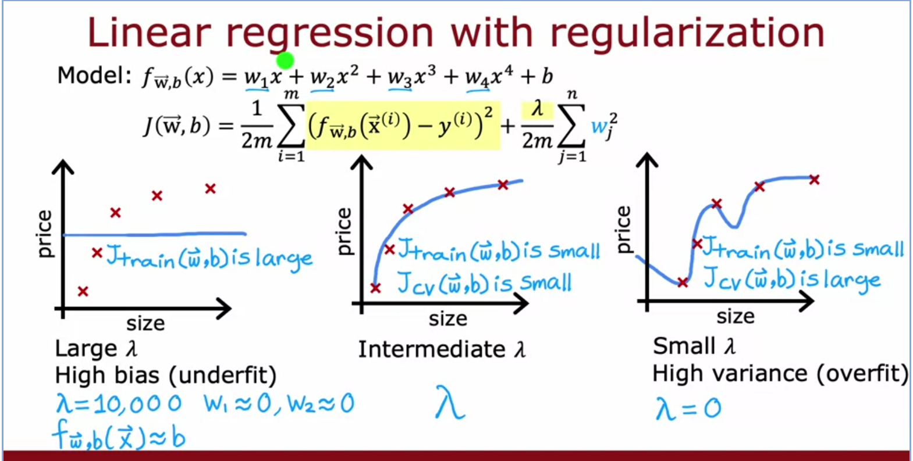
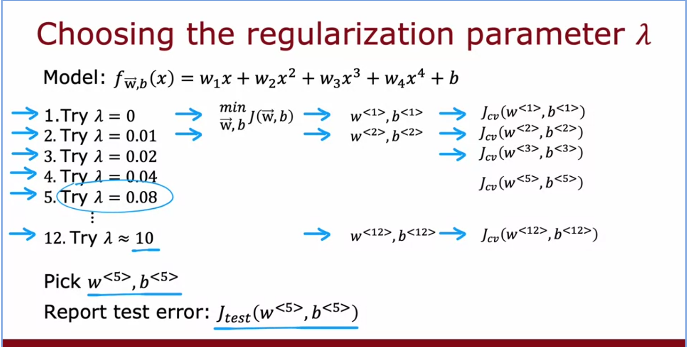
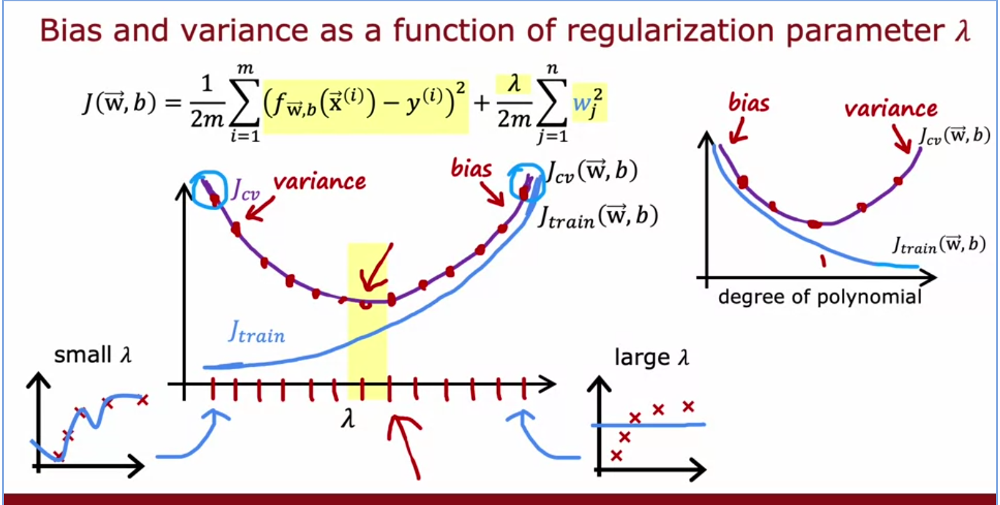
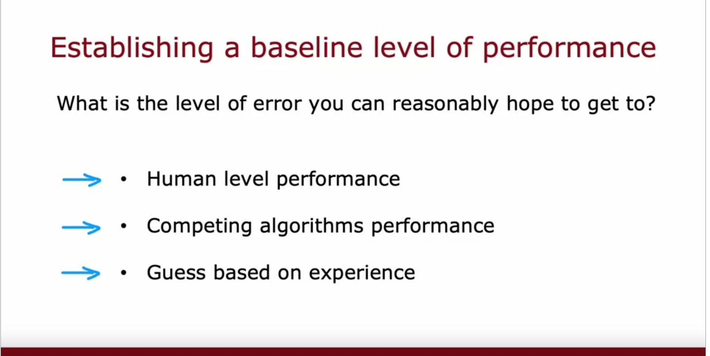
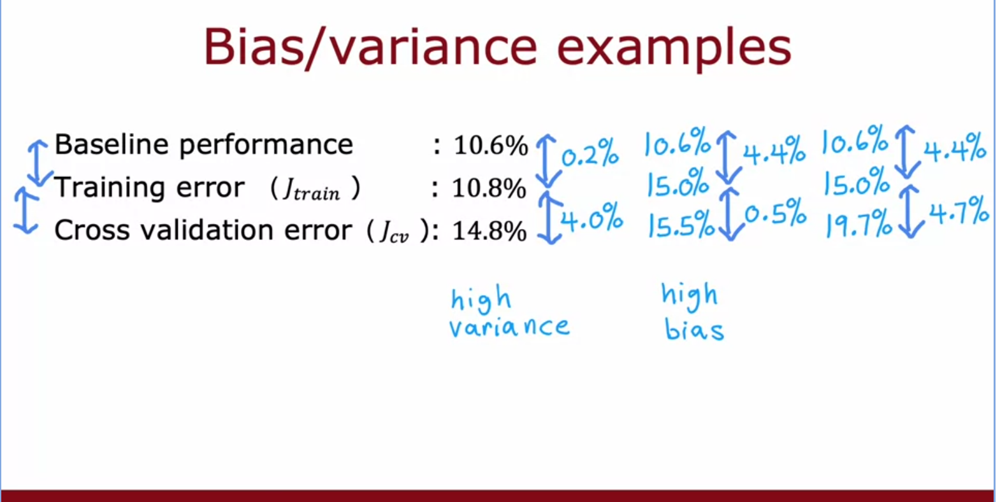
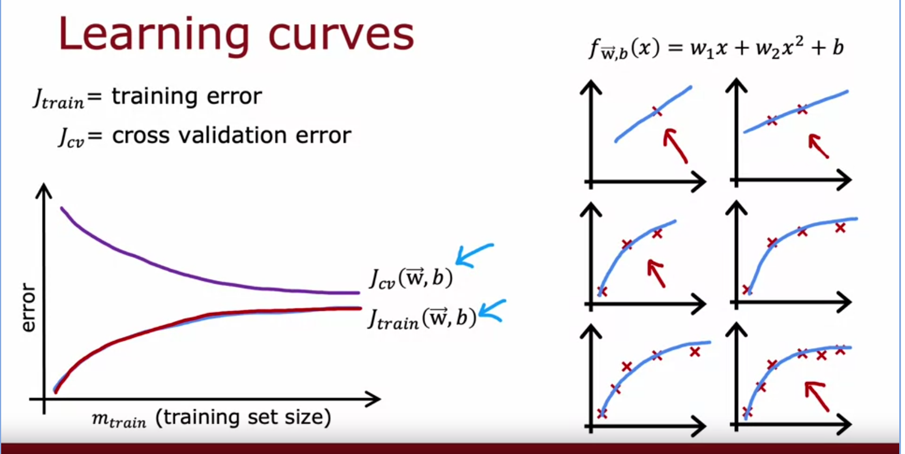
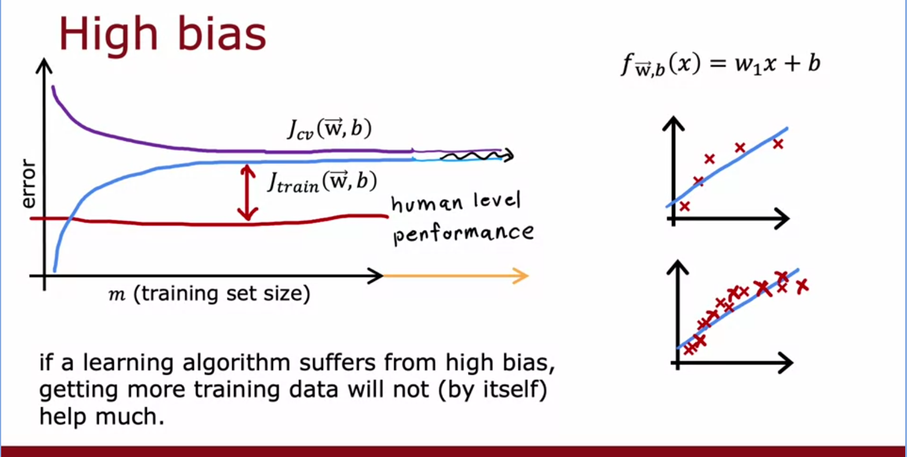
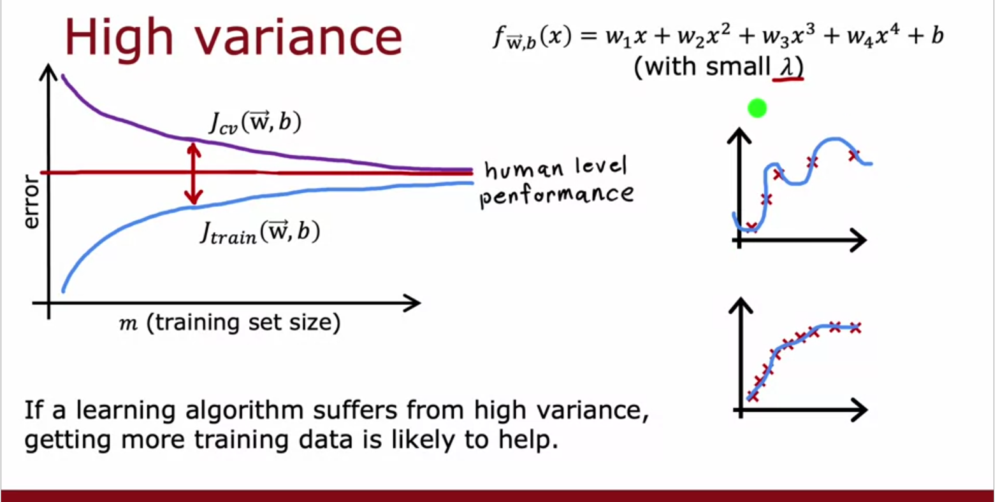

- Diagnosing bias and variance
	- 
	- 
	- 
	- over fitting happens due to training data or using very high order polynomial .
	- Regularization?:
		- 
		- {:height 360, :width 696}
		- 
- Performance baseline:
	- 
		-
	- 
	- 
	- 
- 
-