- categorical binary classification.
- ex:
	- 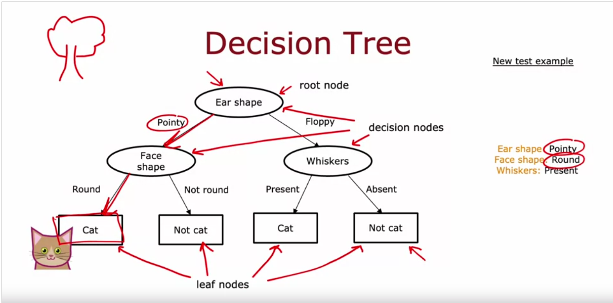
	- 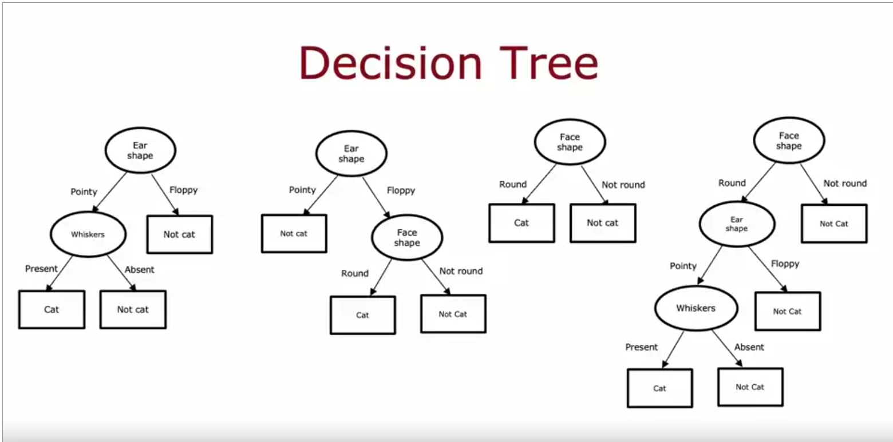
	- 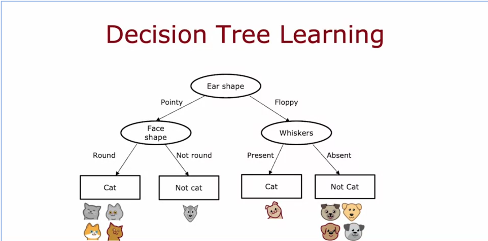
	-
- 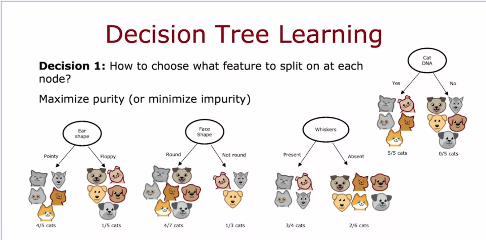
- 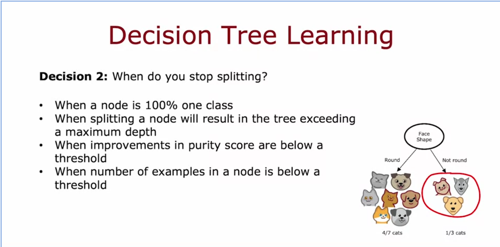
- 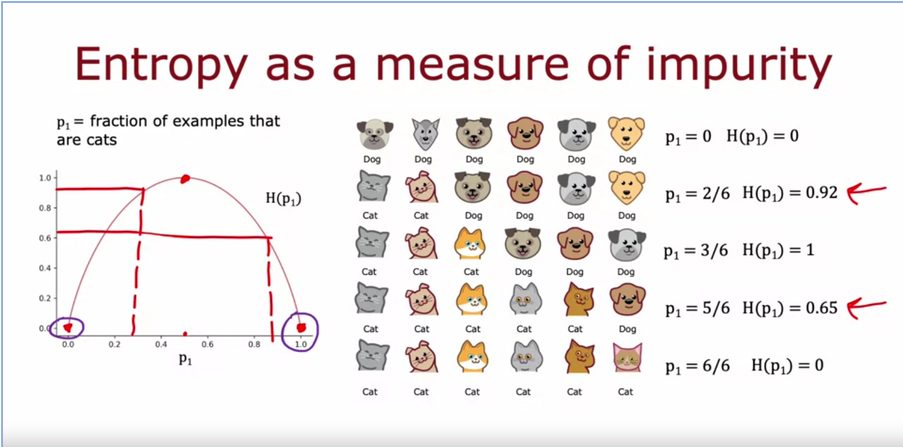
- 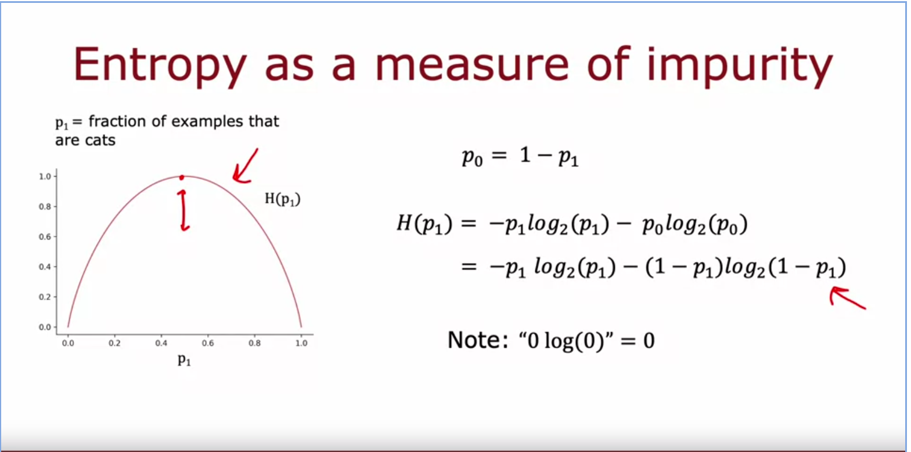
	-
- 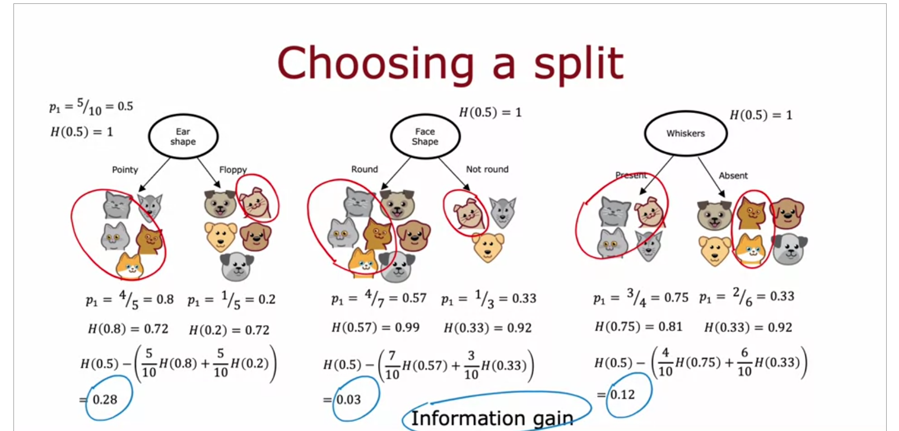
- 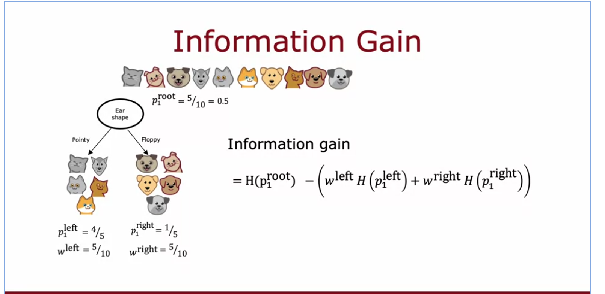
- 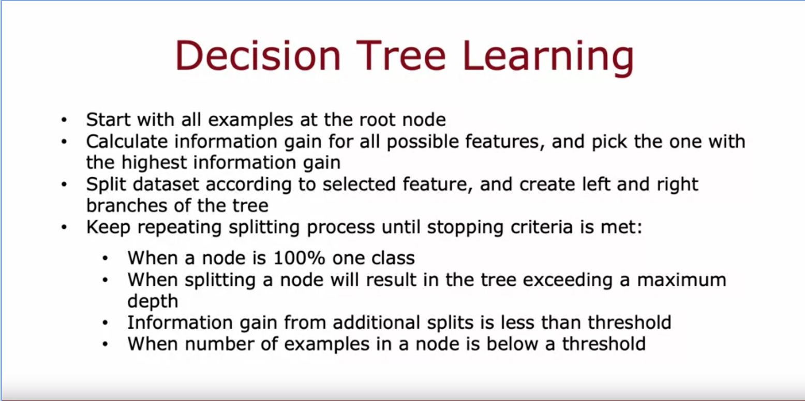
- 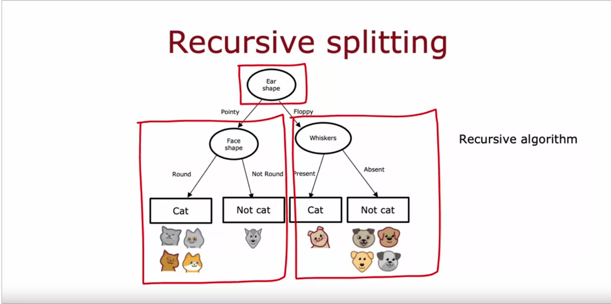
- 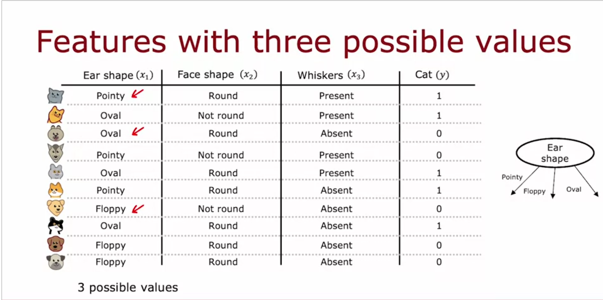
- split into multiple binary features(one hot encoding):
	- 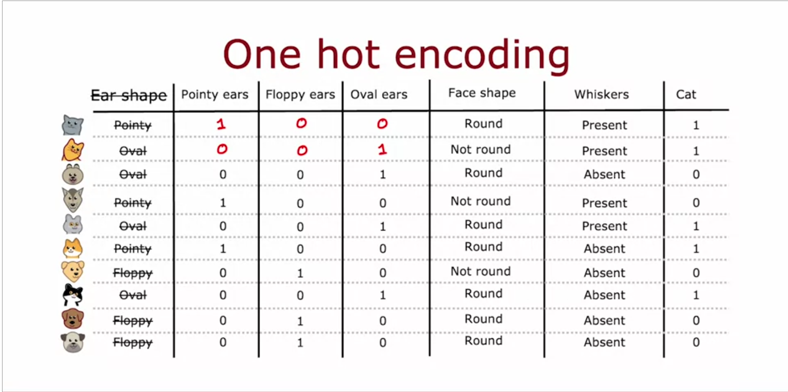
	- 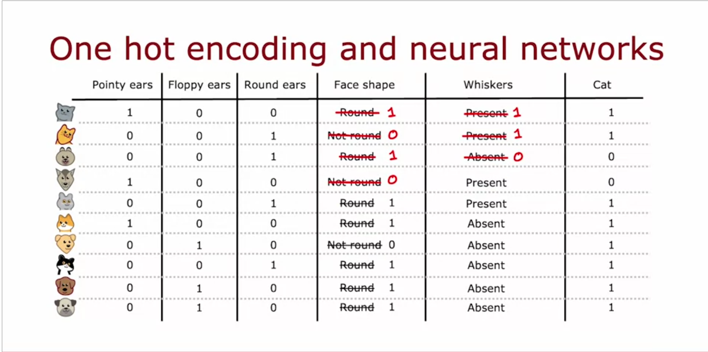
	- [[Machine Learning/ Neural Networks]]
	- [[MachineLearning/ Supervised Learning/ Regression/ Linear Regression]]
	- [[Machine Learning/ Supervised Learning/ Classification/ Logistic regression]]
- Continuous features:
	- 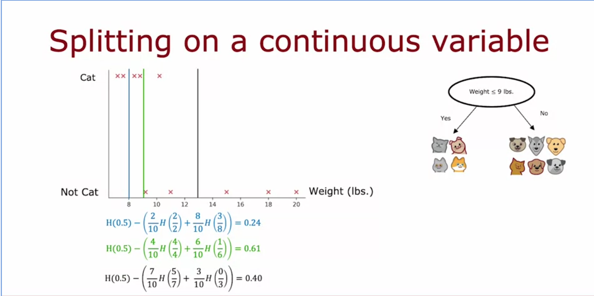
-
- when to use decision trees?
	- 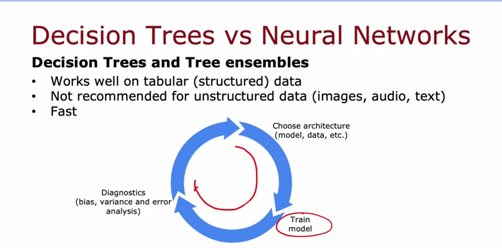
	- 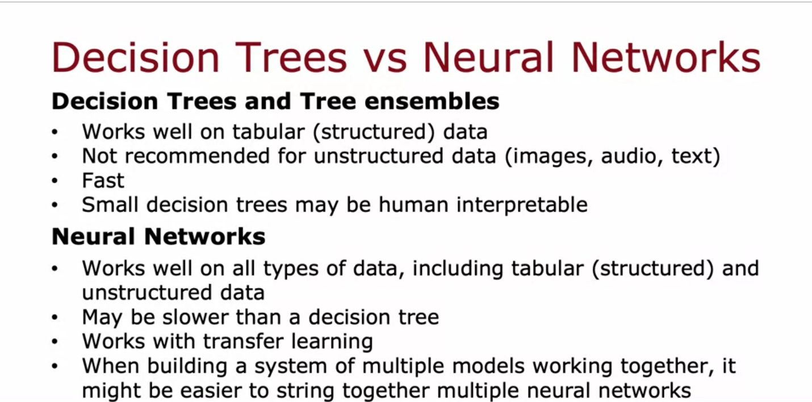
	- 
- Entropy vs Gini impurity
	- Intutively, for splits that class probabilities are between 0 and 0.5 Entropy penelizes splits more than Gini. Therefore, using Entropy instead of Gini, it is more likely to choose a feature that create a leaf node and an evenly distributed node.
	  Overall, I think trees with Entropy have more early leaf nodes and are deeper. On the other hand, trees with Gini are wider.
	- higher runtime for Entropy
	-
- [[Machine Learning/ Decision Trees/ Gini Impurity]]
- low bias high variance algorithm
- #RandomForest
-