- 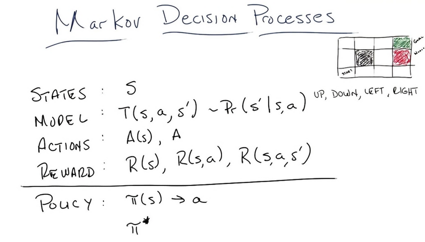
- The rules and physics of the world.
- transition models are probabilistic models
- world and rules are stationary
- 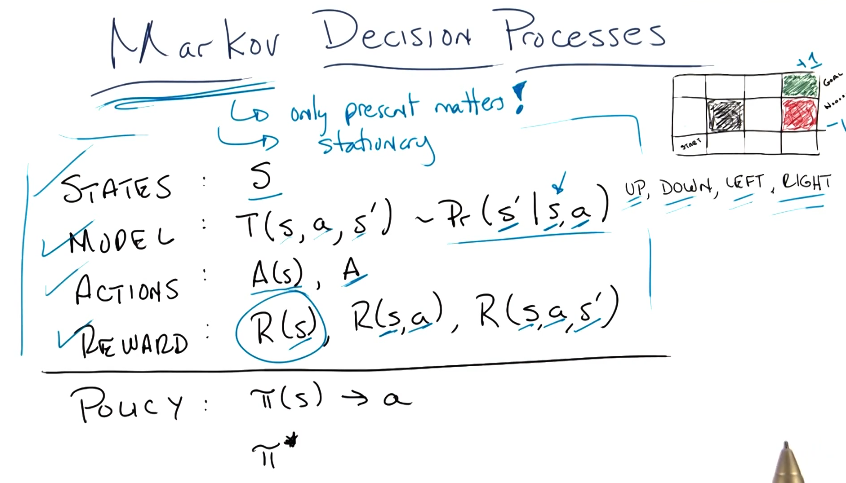
- policy is the problem's solution. it maps states to actions.
- 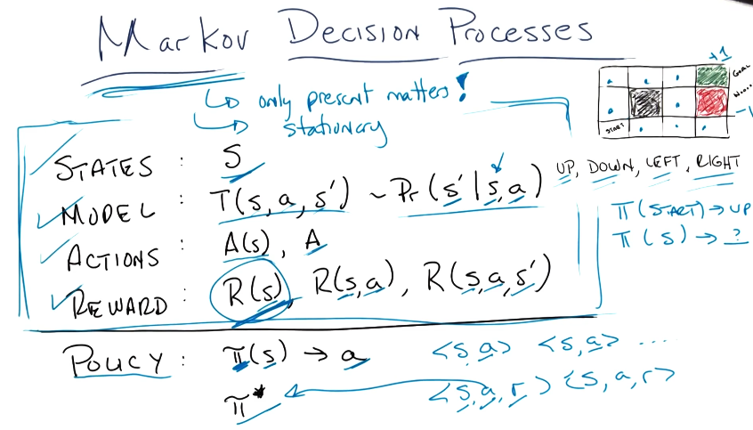
- 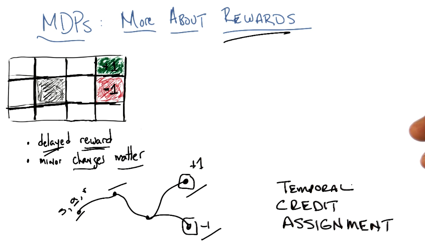
- 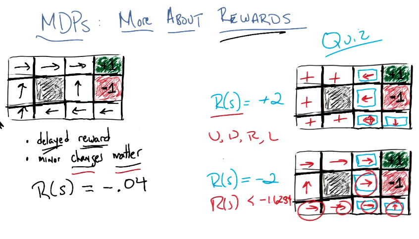
- 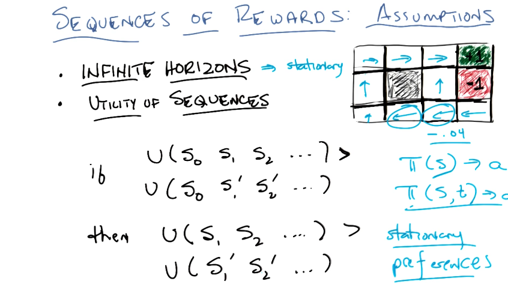
- only addition of rewards guarantees this property
- 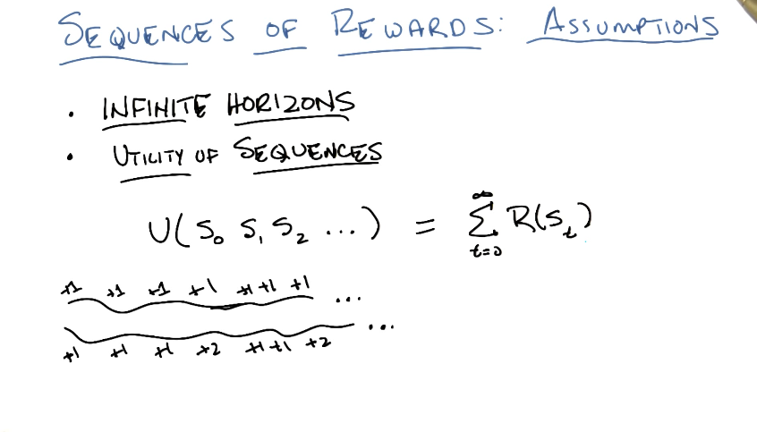
- 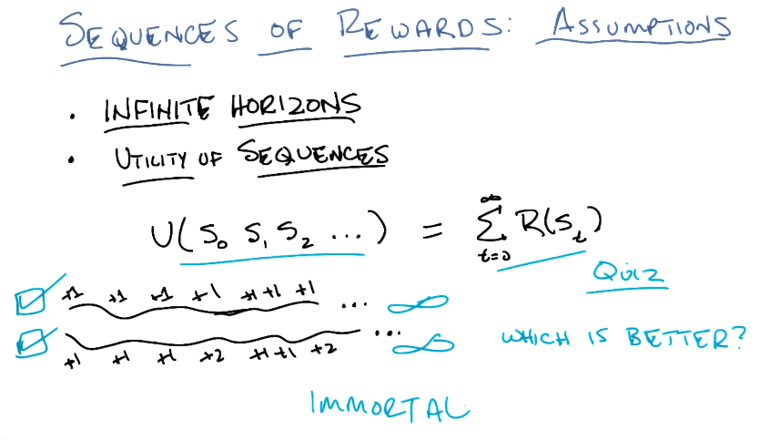
- discounted rewards: going infinite distance(geometric series)
- singularity: computation speed increasing itself turning into a geometric series
- 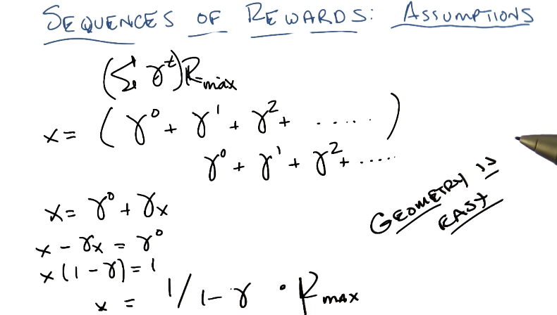
-
- 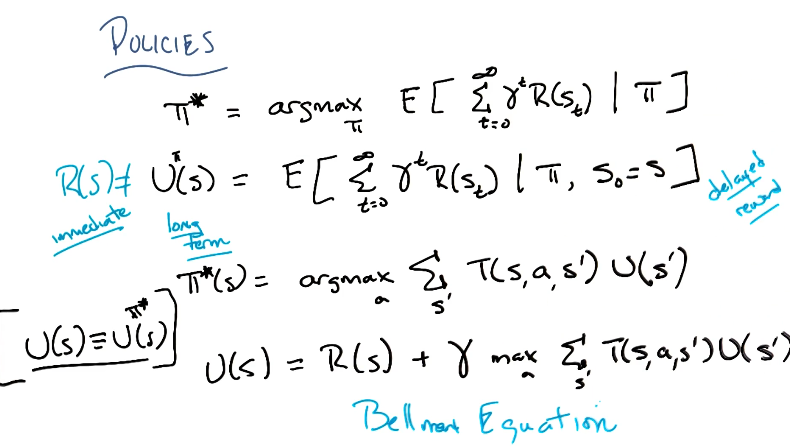
- 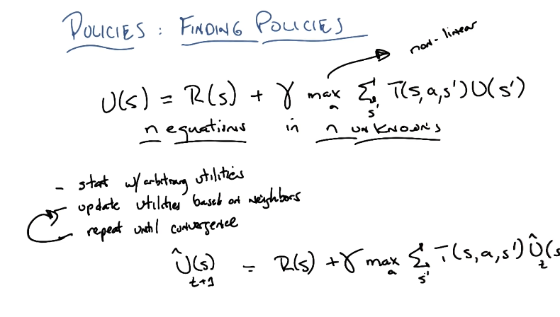
- 
- truth get more prominent overwhelming any faulty past, spreading also to neighboring states
- value iteration:
	- 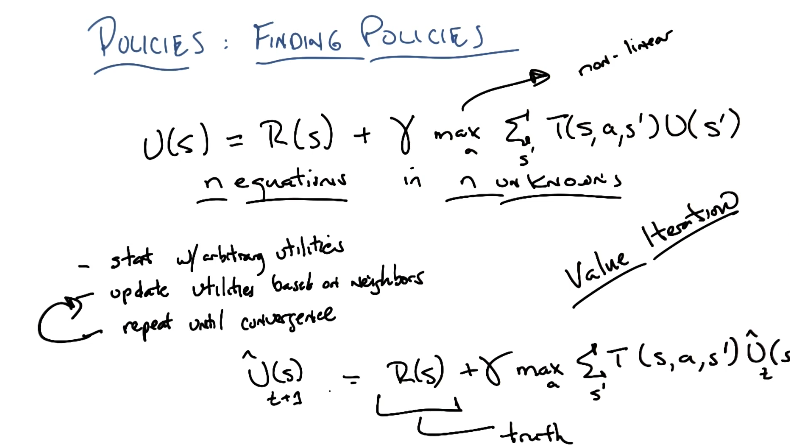
- 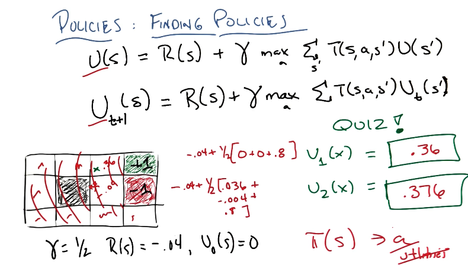
- to make it linear we can get rid of the max so its an easier computation:
	- 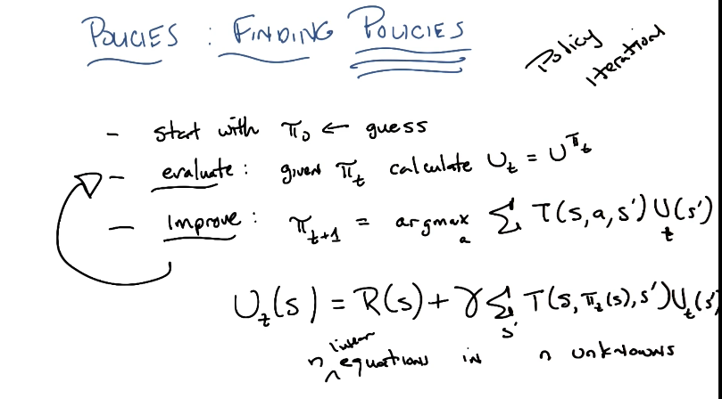
	  id:: 67fa622e-51f8-42a9-a99b-8b781594c840
	-
- 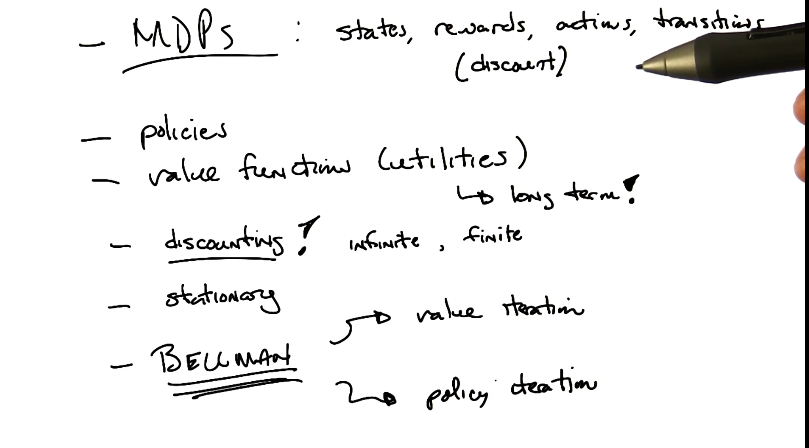
-