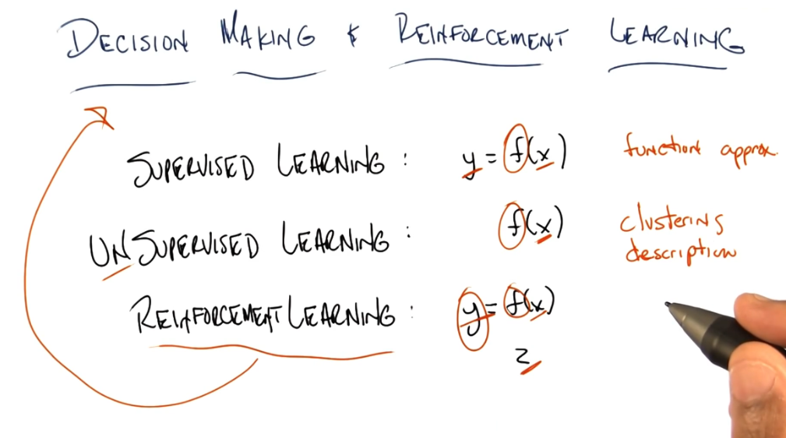
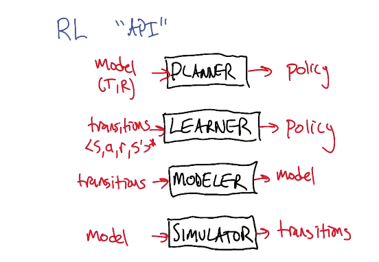
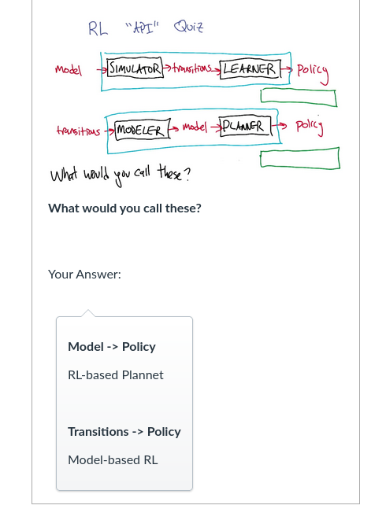
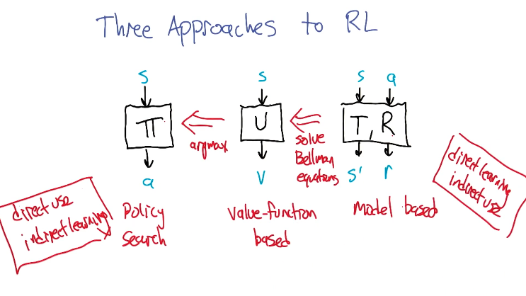
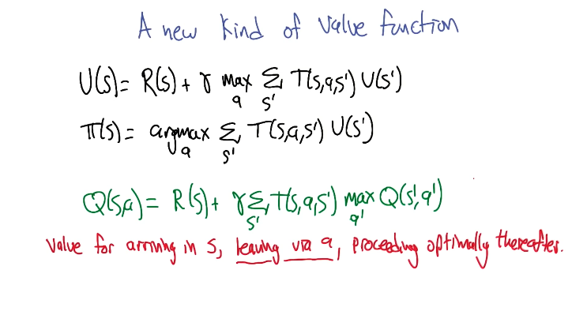
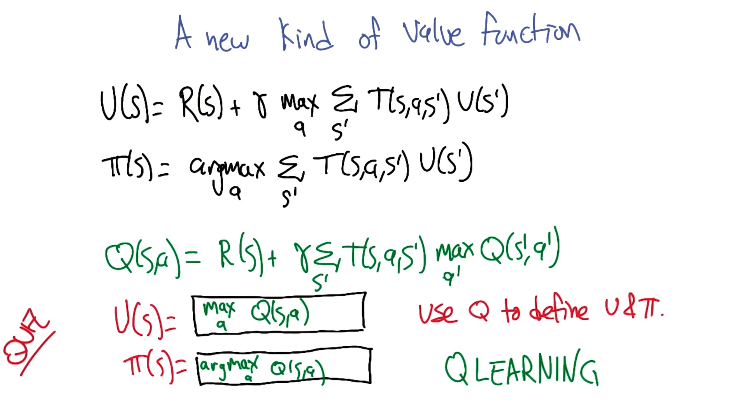

- {:height 443, :width 780}
- 
- [[Machine Learning/ Machine Learning CS 001/ Reinforcement  Learning/ Markov Decision processes]]
- 
- 
- 
- focus on the middle block : value based
	- 
	- {:height 426, :width 743}
- use value iteration to learn values
- [[Machine Learning/ Machine Learning CS 001/ Reinforcement  Learning/Qlearning ]]
-