- 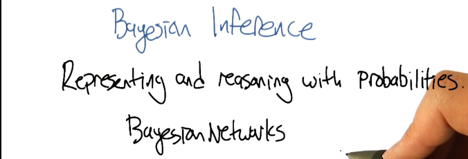
- 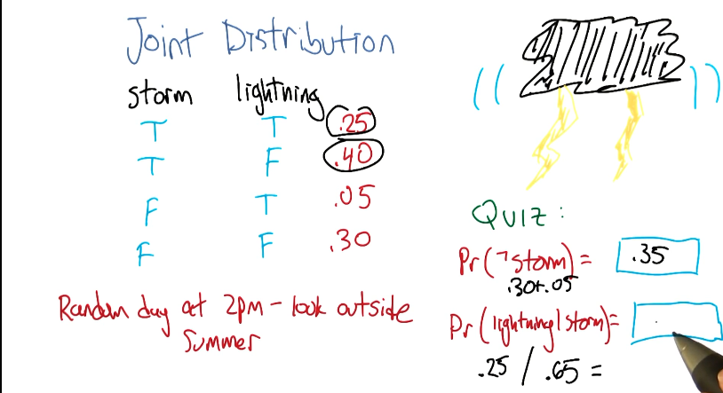
- 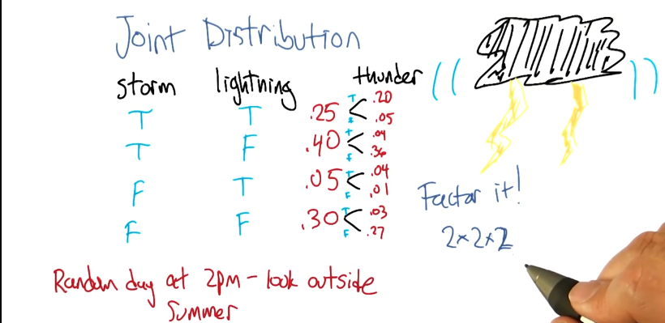
- 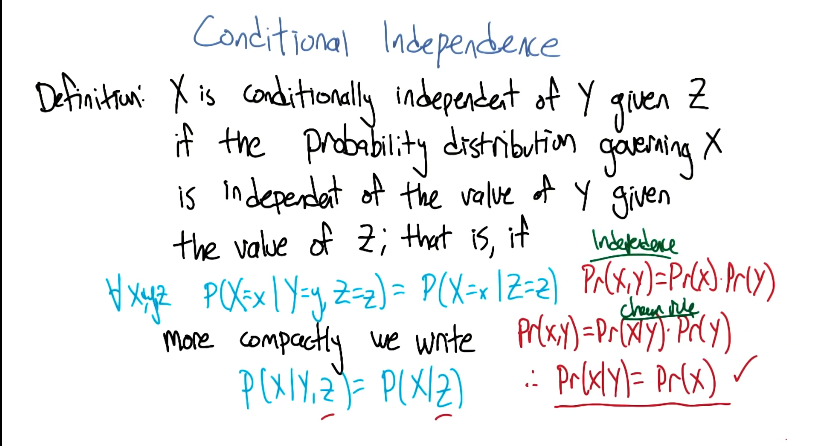
- chain rile
- 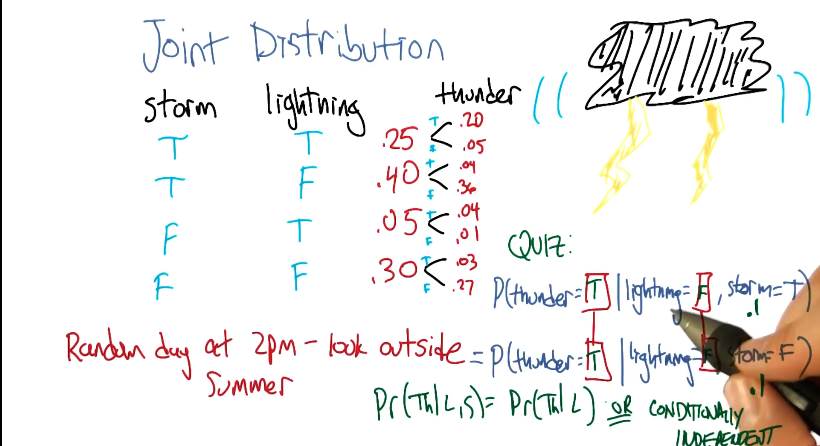
- 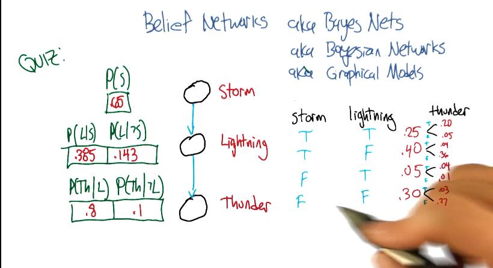
- if not independent:
	- 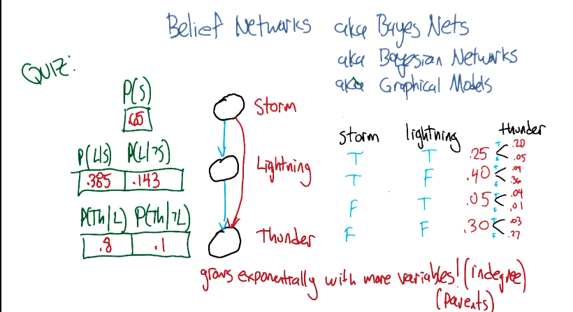
- must be a directed acyclic graph:
	- 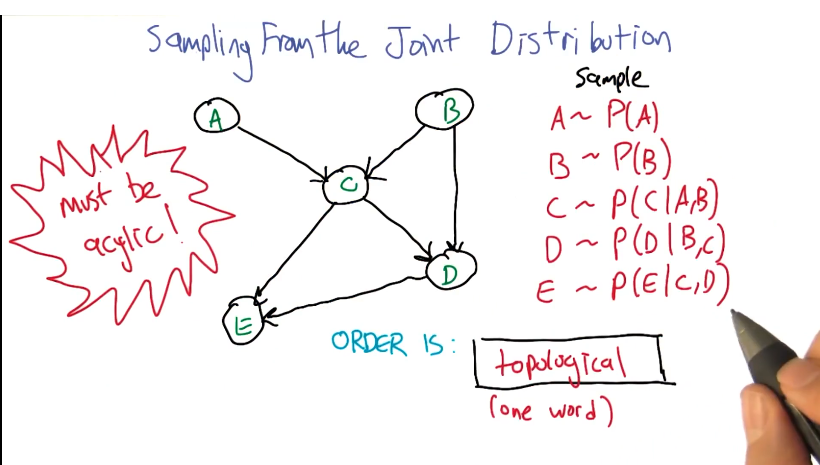
- 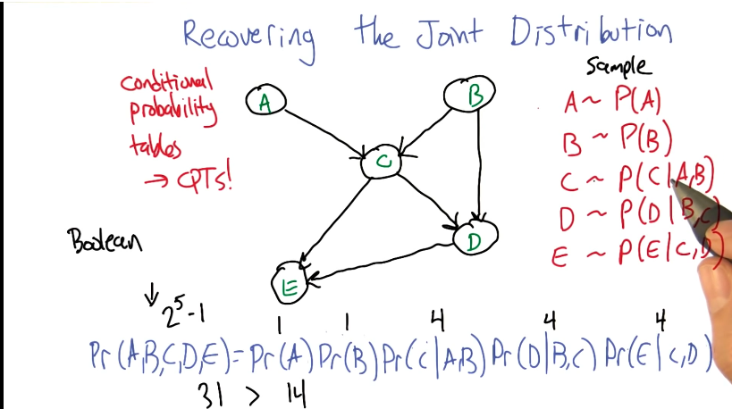
- the fewer parent relationships the more compact the distribution will be
- 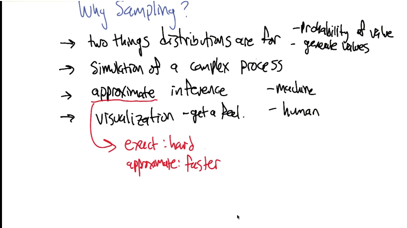
- 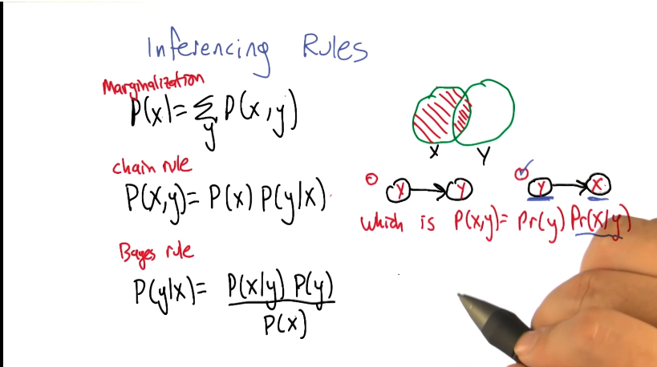
- 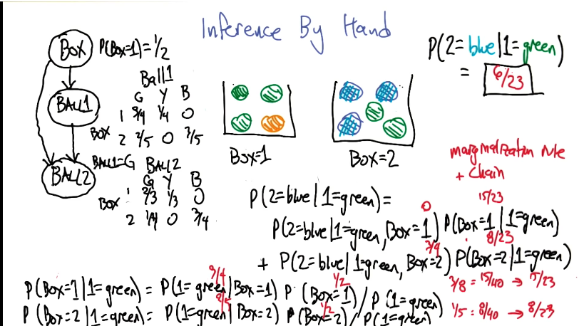
- 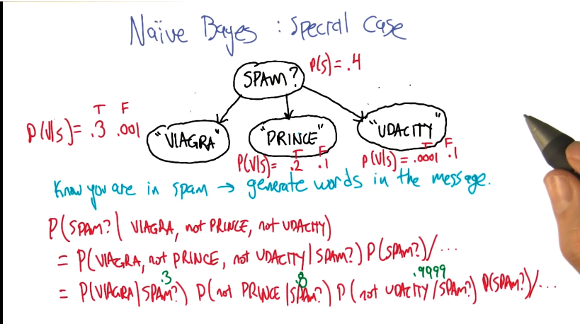
-
- 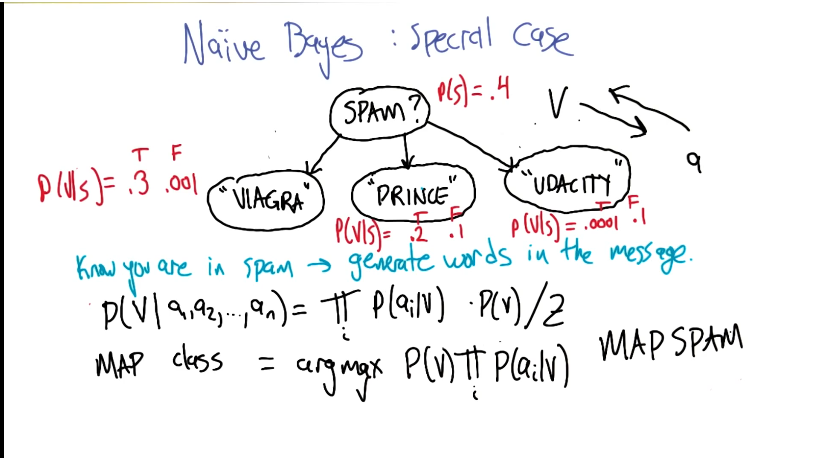
- 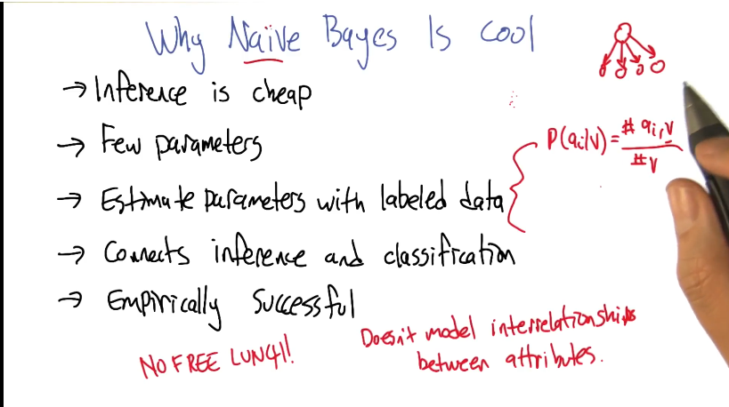
- 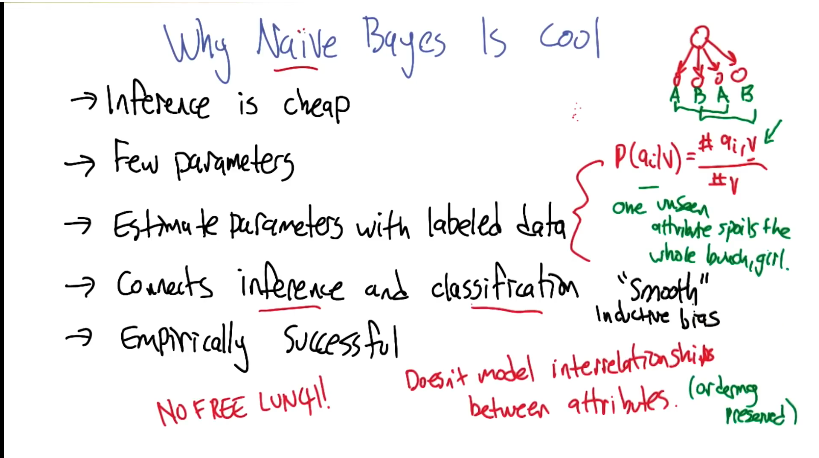{:height 444, :width 780}
- smooth so no probability is ever set as 0
- overfitting can occur by believing data too much and fixing it to be smooth
- believe that all events are mildly possible
- 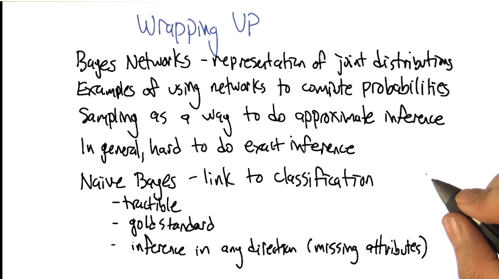
-