- 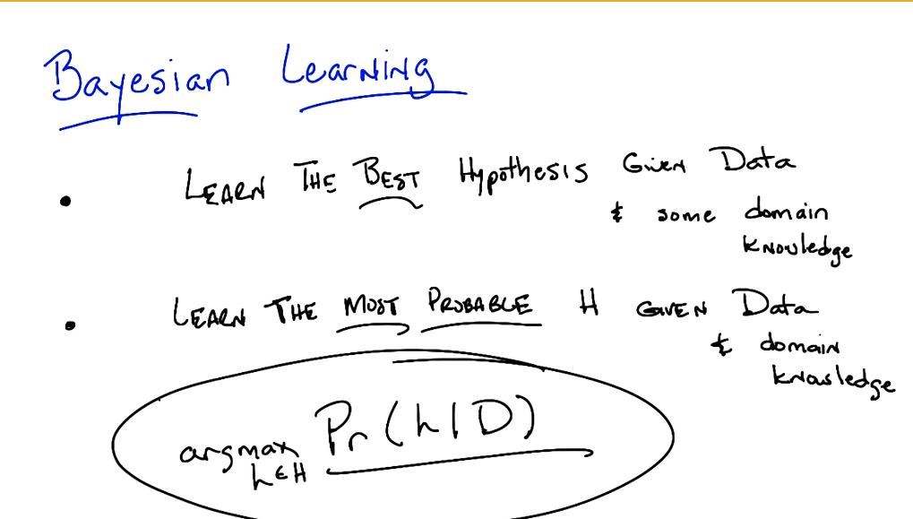{:height 451, :width 780}
- D == data
- 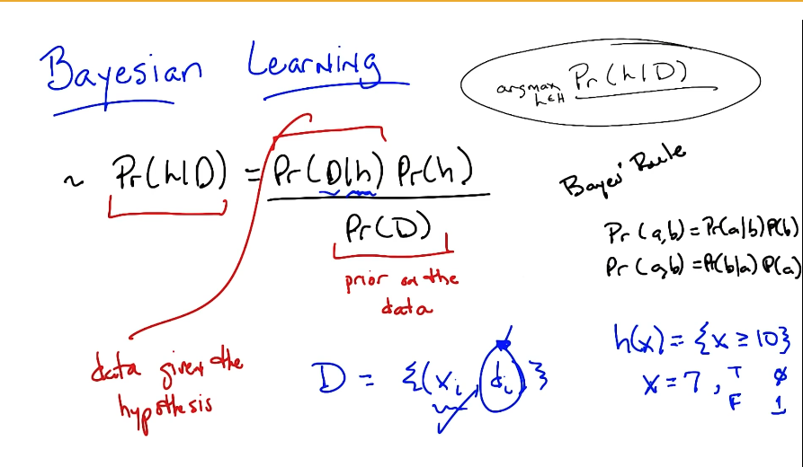
- 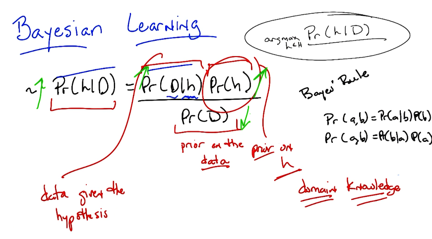
- data probability going down is not within or control in designing the hypothesis
- 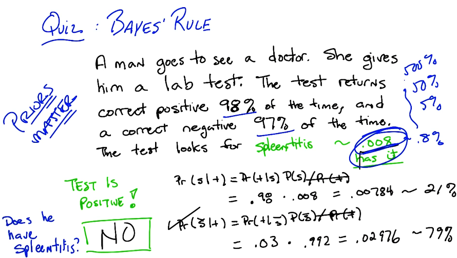
- 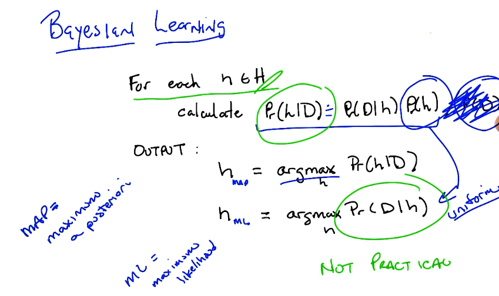
- all hypothesis are equally likely therefore we can ignore it(common factor)unlike data prior= P(data) which ignore.
- not practical except if number of hypothesis is low
- 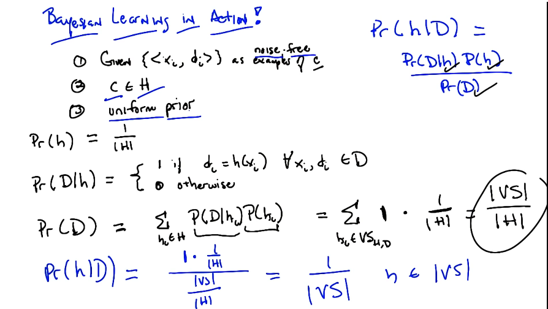
- no one better over the other from the version space , all hypothesises are equally as good
- 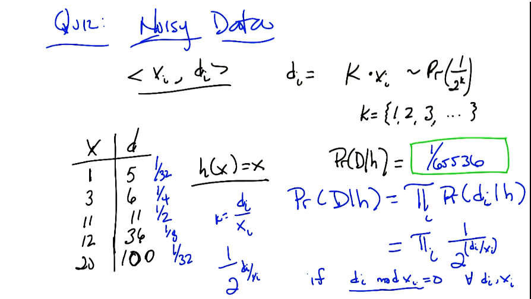v
- 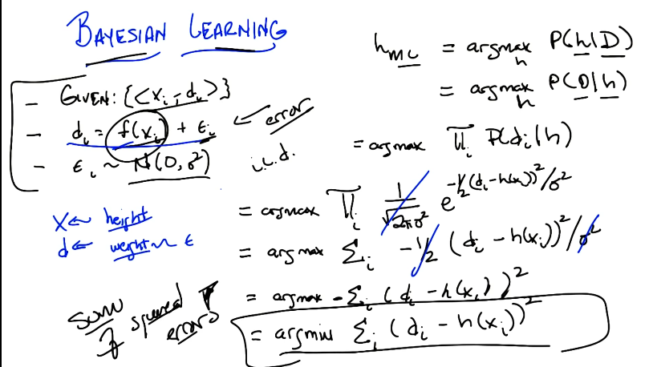
- 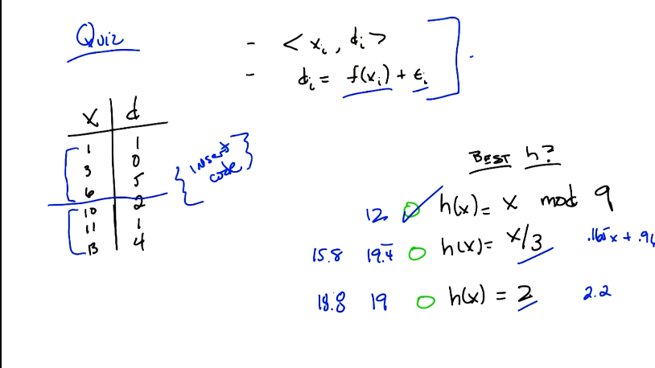
- 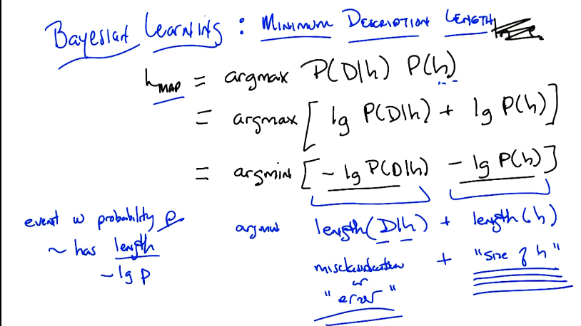
- 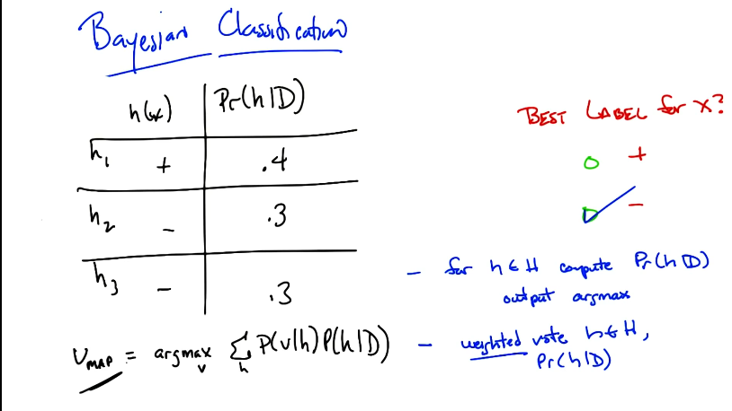
- 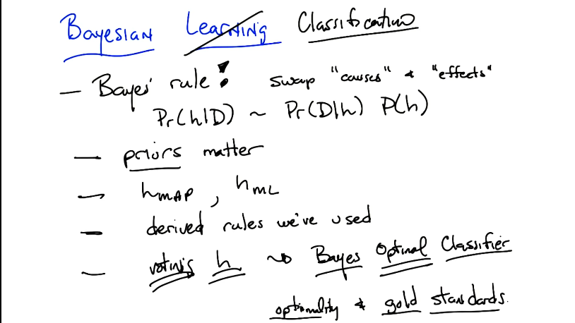
- Purpose of bayesian learning:
	- benchmark
	- conditional independence to make computations easy.
	-