- 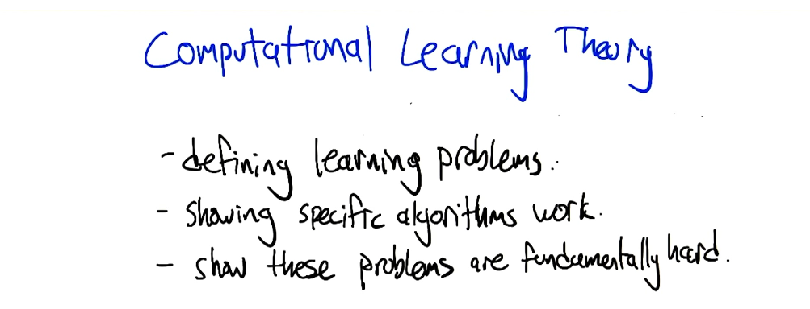
- 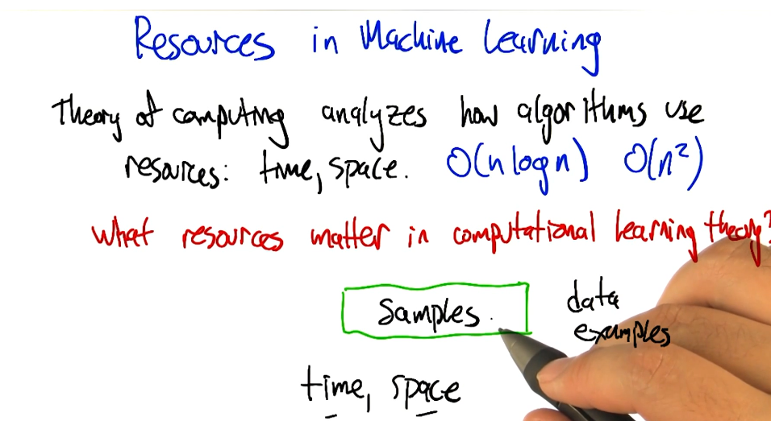
- Defining inductive learning:
	- 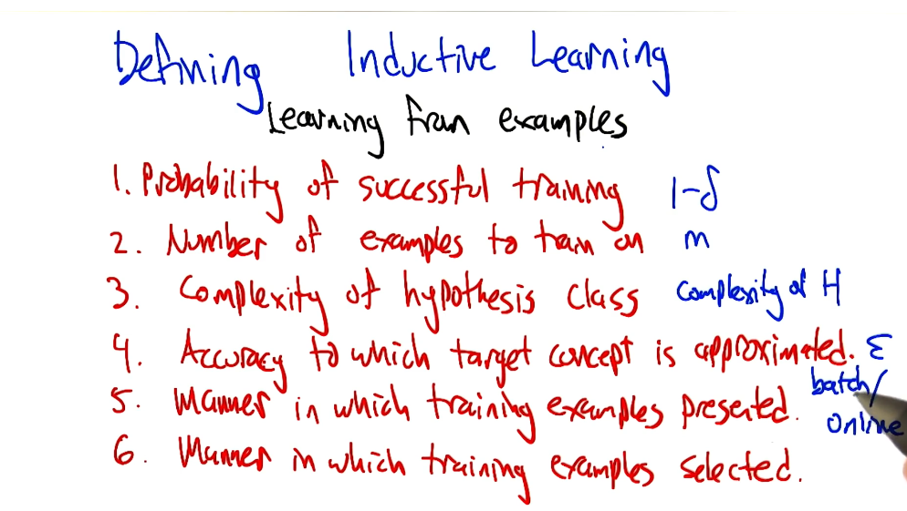
	- 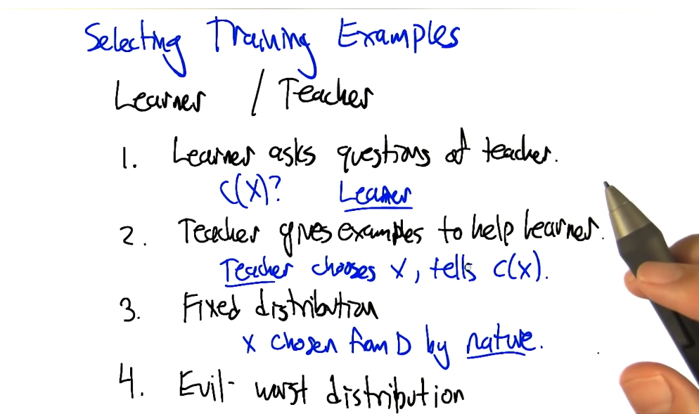
	- question scoring:
		- 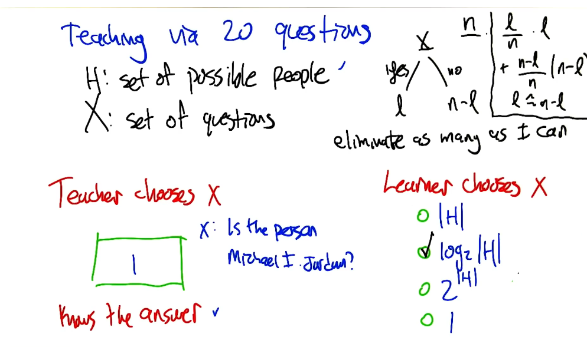
		-
	- 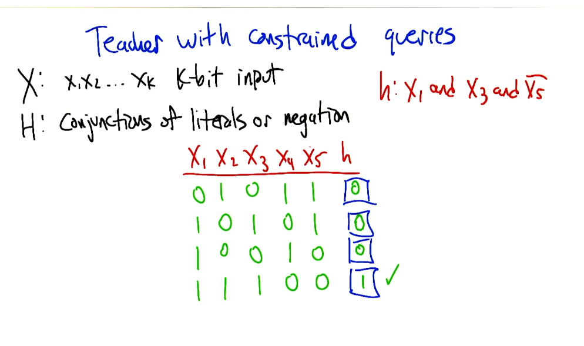
	- When taught by examples 3^k examples needed:
		- 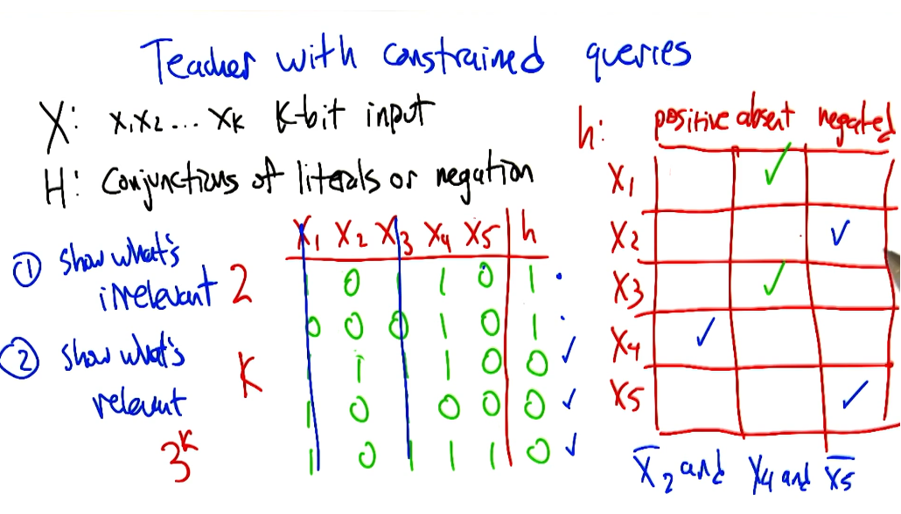
	- 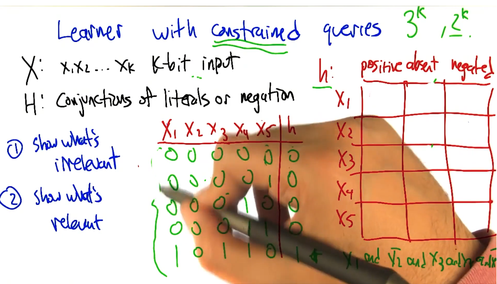
	- when all fails change the problem
	- 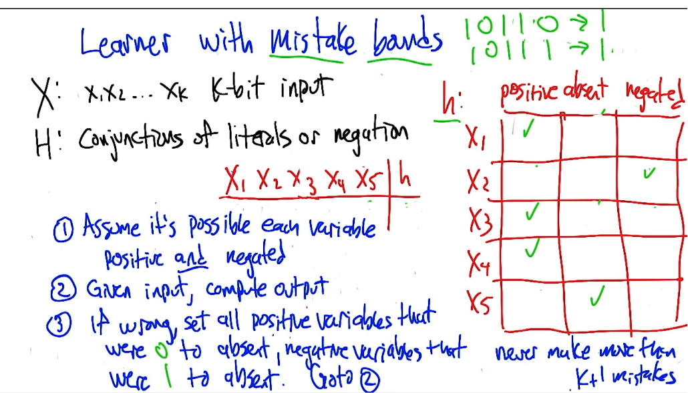
	- 
	- 
	- 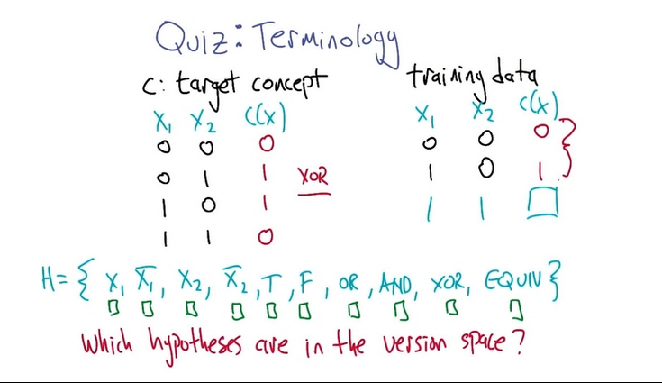
	-
	- 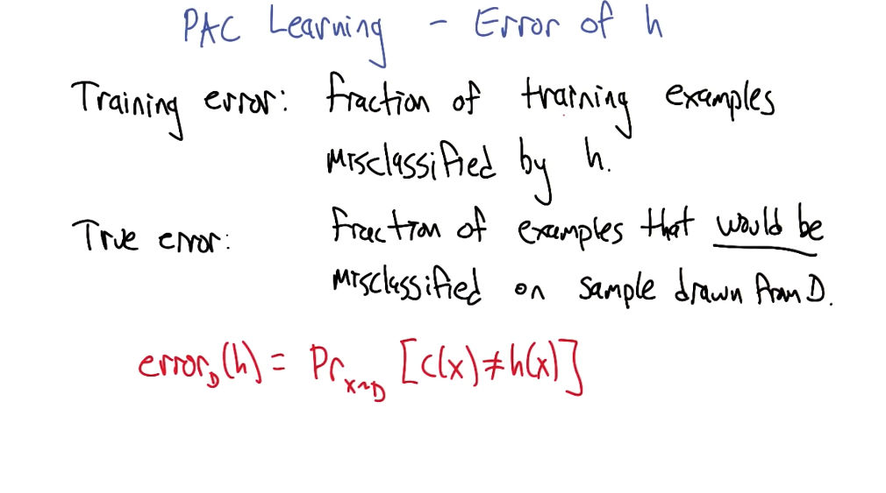
	- penalty is proportional to the probability of seeing the mismatch case
	-
	- probably approximately correct
	- 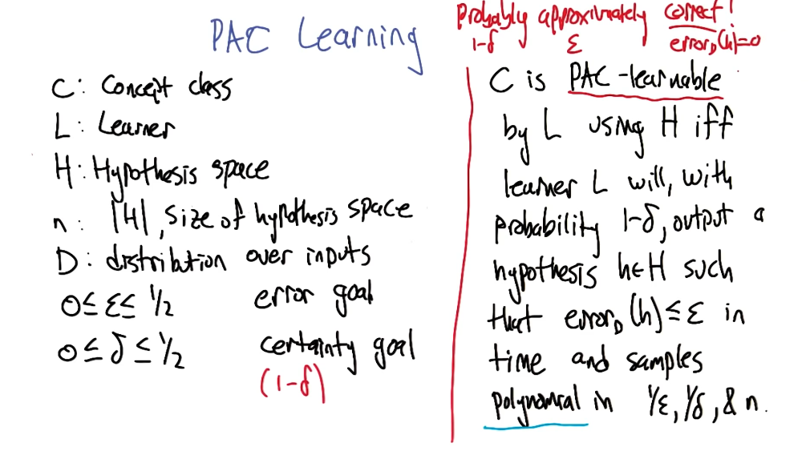
	- epsilon exhausted is when all hypothesis in a version space(from a sample) has lower error than epsilon otherwise it epsilon energized
	- 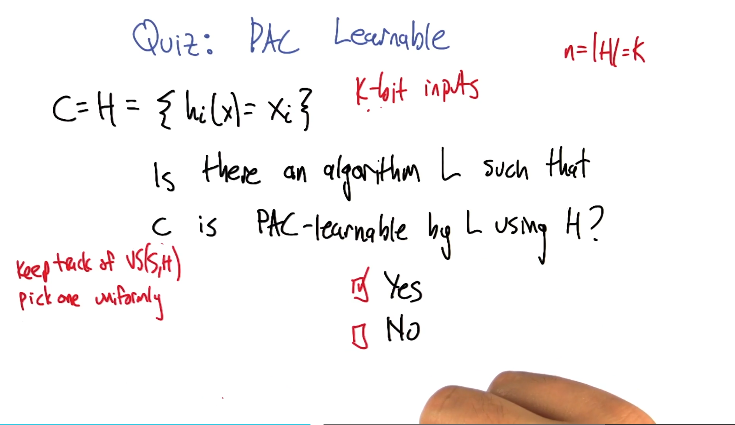
	- 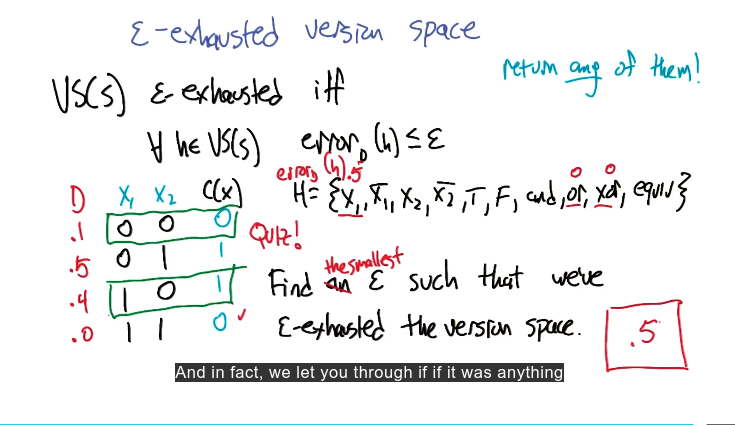
	- 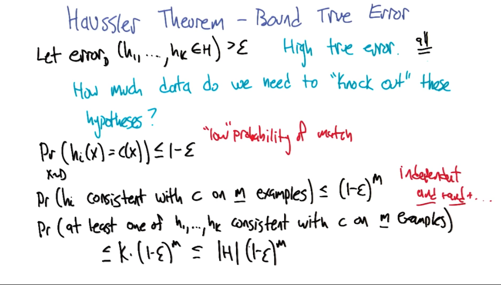
	- 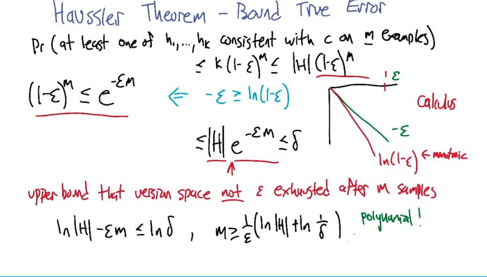
	- 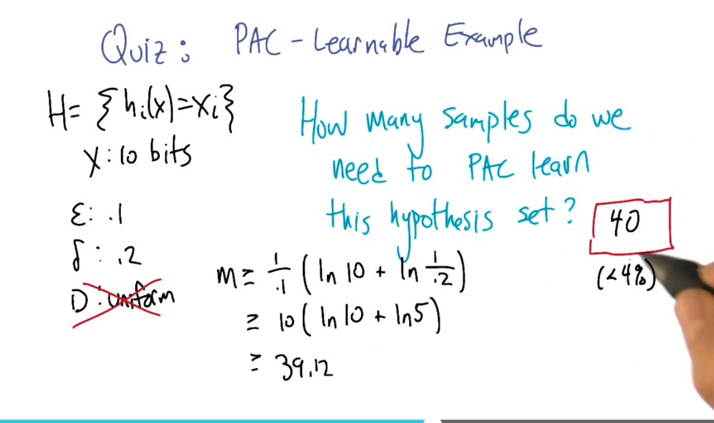
	- distribution agnostic
	- 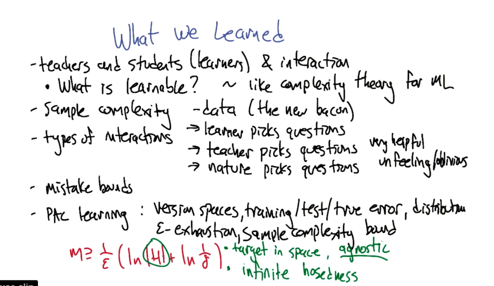
	-