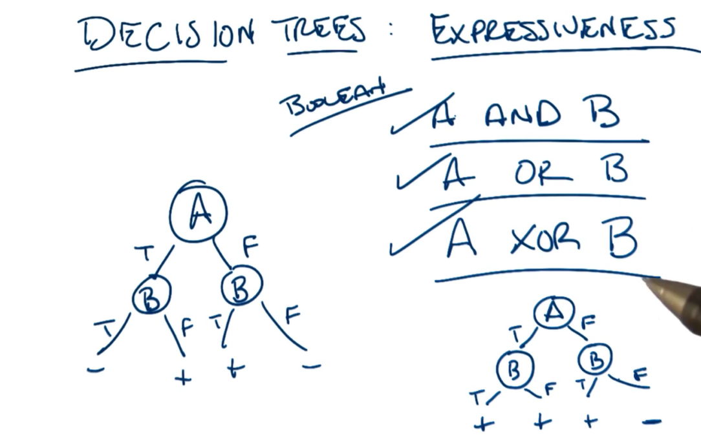
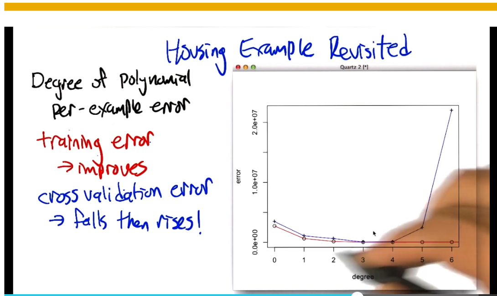

- A specific representation than an algorithm.
- 
-
- 
- Steps:
	- Pick best attribute, best data splits.
	- Asked question about the split
	- follow path of answer
	- repeat till answer
- 
- 
-
- 
- 
- 
- we look more for any representations than the parity representation above to reduce "questions"
- hardest part is coming up with the best representation. here like using the sum.
- cheating is solving the problem with a different representation :D  :
	- 
	-
- 
- 
	- 2^N number of rows
- 
- the hypothesis space is very expressive, therefore a need for a smart algorithm
- 
- 
- Entropy is a measure of randomness. A measure of information or likelihood of what we know we will get.
- 
- restriction bias:
	- hypothesis set that we care about. example : set that we can use in a decision tree.
- preference bias:
	- what subsets of the hypothesizes we prefer
	- example: prefer trees with better splits at the top, or correct ones over incorrect ones. also shorter trees than longer ones.
- other constraints:
	- Continous attributes:
		- use ranges.
		- decide range based on media or mean etc.
	- repeating an attribute:
		- for continuous attributes you can repeat for different ranges.
		- for discrete repetition doesnt make sense
	- when to stop?
		- all classified correctly?
		- No Overfitting: happens in DT when tree grows too big
		- breadth first expansion or pruning
		- 
		-
		-
- 
- measure error / information gain with variance?
- linear fit or variance/ voting.
- {:height 410, :width 721}
- {:height 270, :width 539}
-
- 
- overfitting will eventually increase error and underfitting wont perfom well
- how to encode dicrete values or labels to use in regression?
	- give numeric representation? use rgb for colors?
	- 
	- boolean vector?
	-
- 
- 
- 
- ID3 decision tree learning:
	- 
	- 
	-
	- 
	- 
	- 
	- lazy better for overfitting
- 
-
-
-
- Reading chapter 3:
	- Decision trees are best suited for:
		- Instances represented by attributes
		- target function has discrete outputs
		- disjunctive descriptions
		- the training data may contain errors/ robust to errors
		-