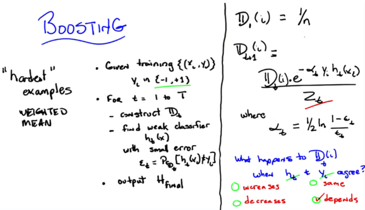

- 
- Testing on different combinations of rules or features to test most effective combination of small sets or best set for optimum learning results.
- 
- 
- 
- bootstrap aggregation = bagging
- 
- 
- 
- 
- 
- 
	- y * h will be positive if they agree and negative otherwise : will be a raised negative if correct or a raised positive if incorrect . alpha is always positive.
- 
	- should generally decrease, the wrong distribution should get more weight, correct answer get less weight. weak learner will always be able to get some of the wrong right thats the assumption.
	- logs are used to balance exponentials.
- 
	- the non linear output is due to the non linear behavior at the operator the sign. this is very similar to the locally weighted linear regression using KNN
- 
-
- Boosting will rerate the ones that dont do well.
	- take a weak learner(better than half error  )and improve it
- 
-