- 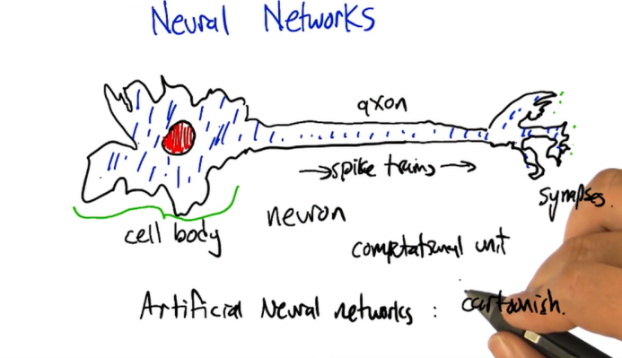
- 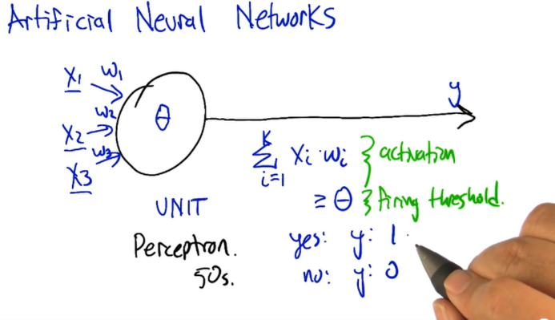
- perceptrons are linear functions that compute hyper planes
	- 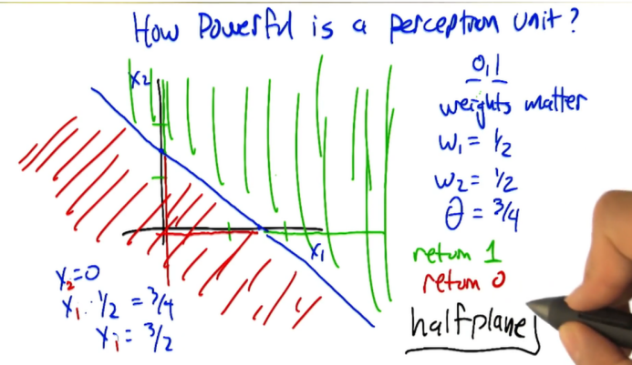
-
- 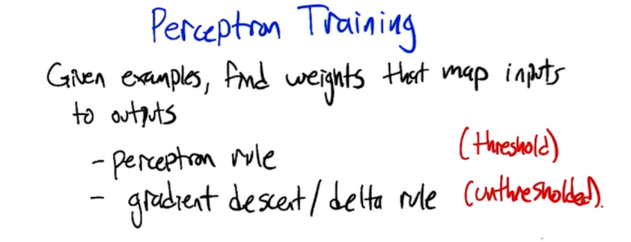
- perceptron rule:
	- for learning weight and theta:
		- we treat theta(bias) as weight.
		- threshold becomes folded into the weights making the firing threshold 0
	- 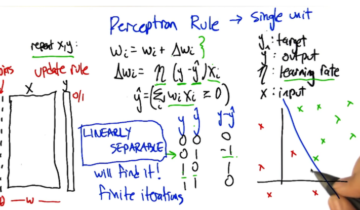
	- 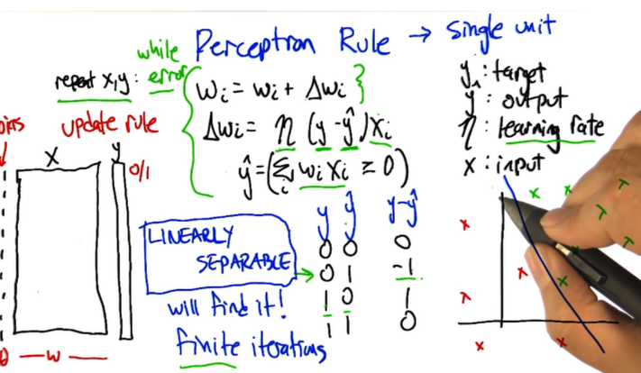
	-
- for linearly inseparable: Gradient descent:
	- 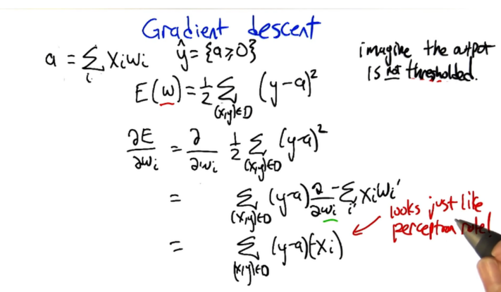
- 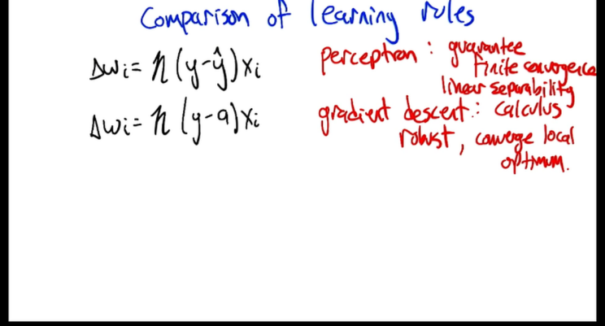
- 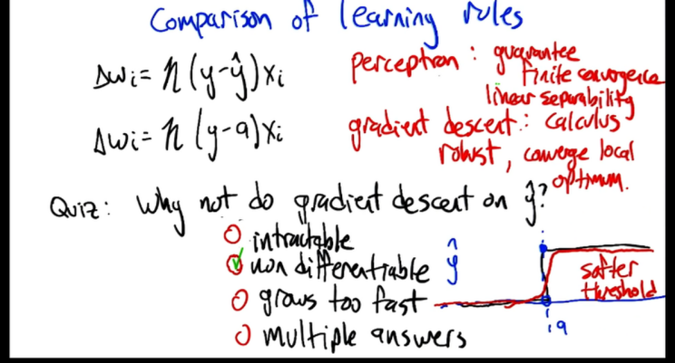
- Sigmoid:
	- 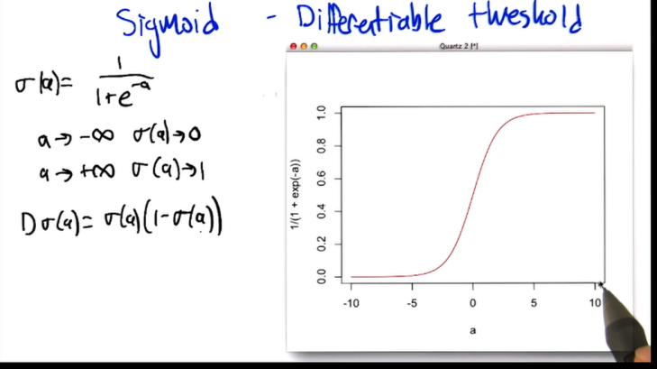
- Full network sketch:
	- 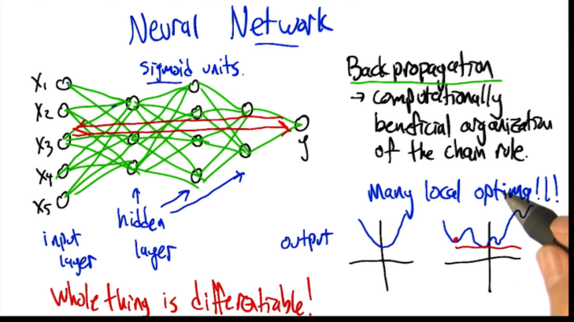
	- optimization problem == learning problem:
		- 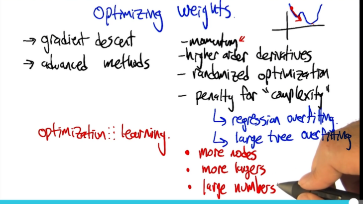
		- 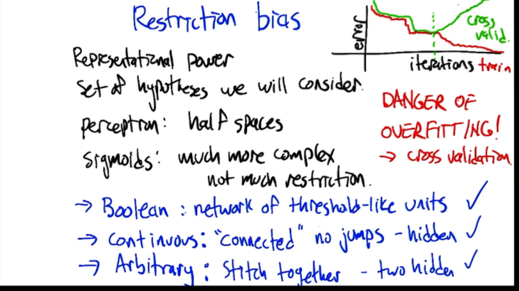
		- what you re able to represent
		- Preference bias :
			- algorithm selection for one representation over another.
			- initial weights small random values.
				- avoid local minima for variability while training.
				- big weights : overfitting due to power of presenting more complex functions. so prefer low complexity simpler explanation. Occam's razor : entities should not be multiplied unnes
			- 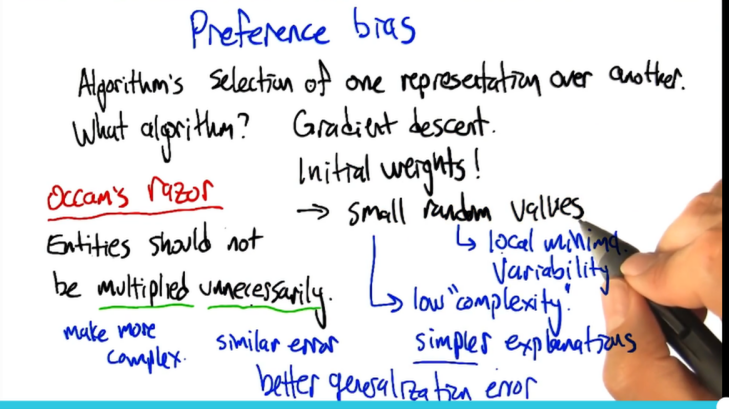
			- 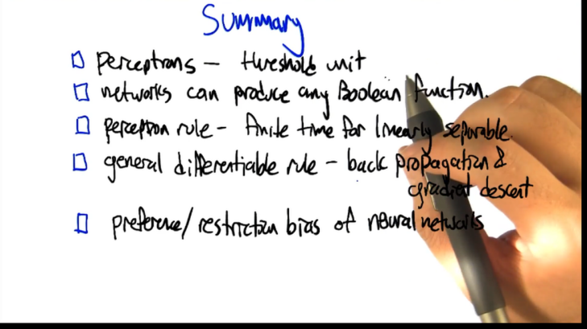
			-
			-