- 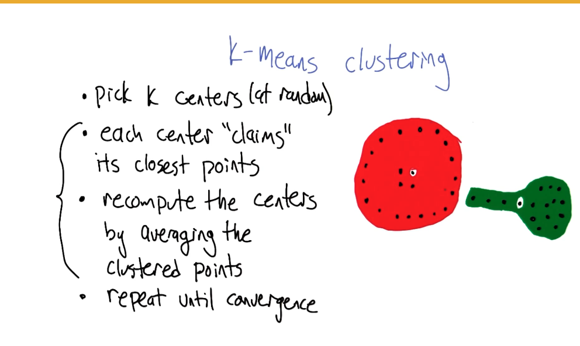
- does it always converge, does it always get a good answer?
- 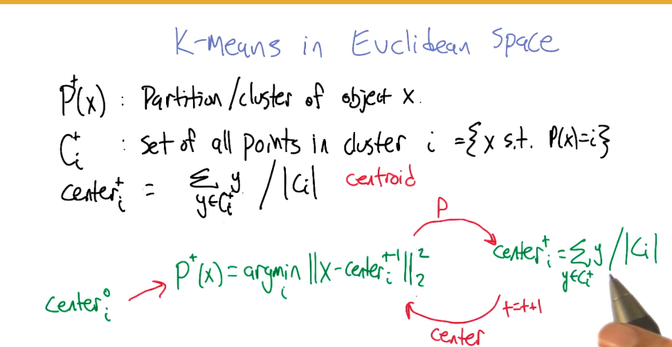
- 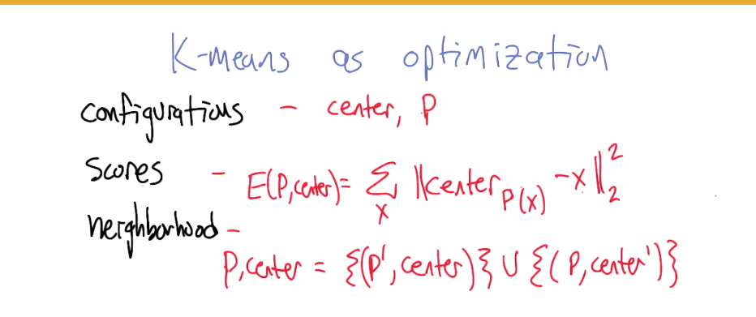
- 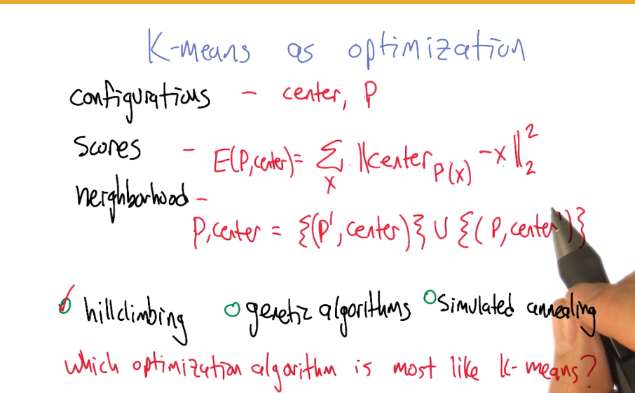
- 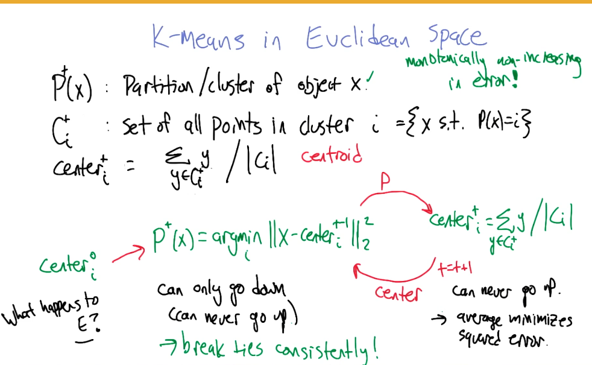
- 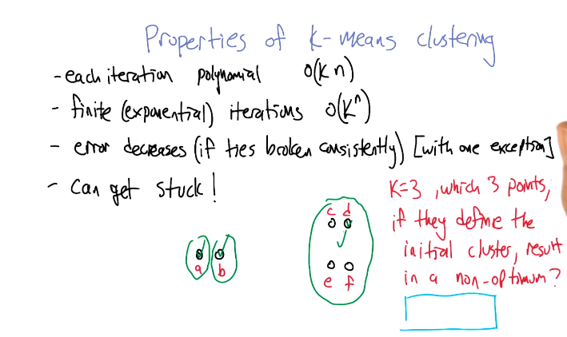
- 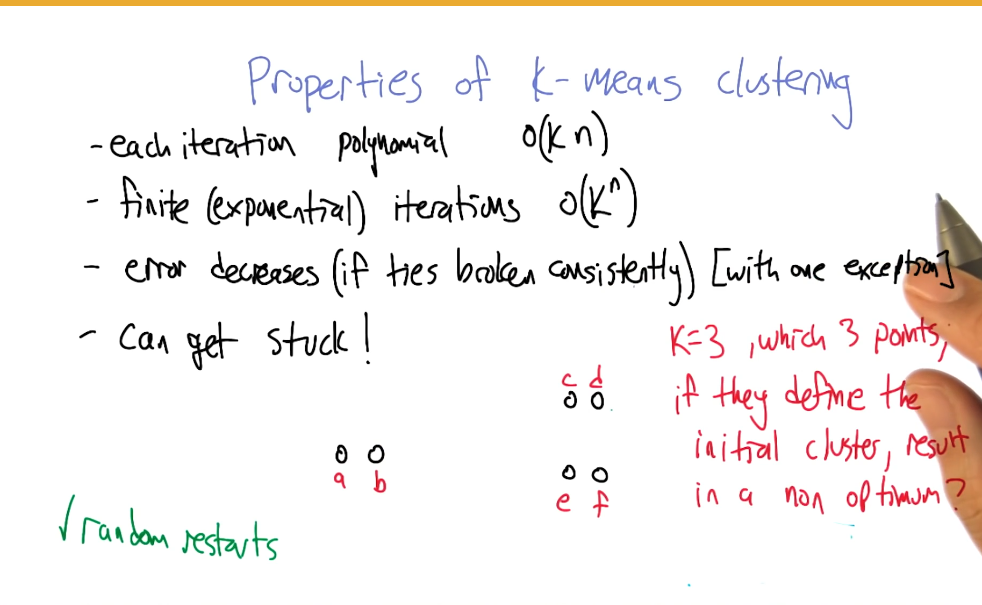
- another is also to pick next cluster center that is further from the intial.
- 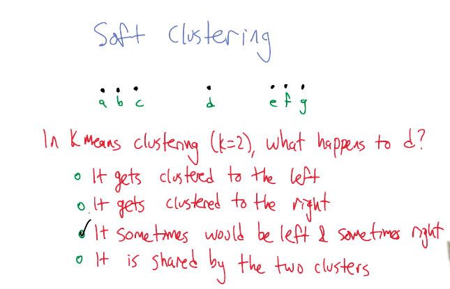
- 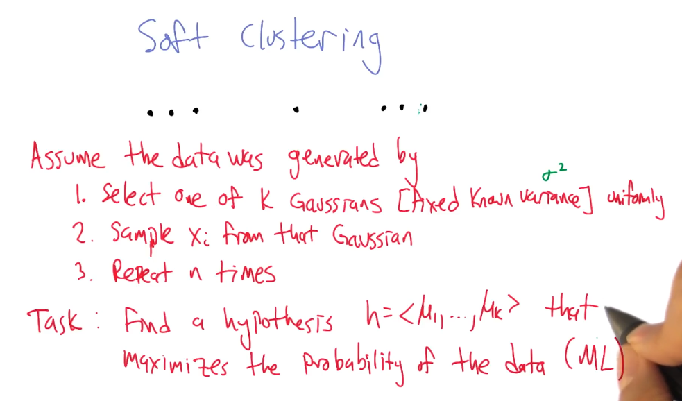
- 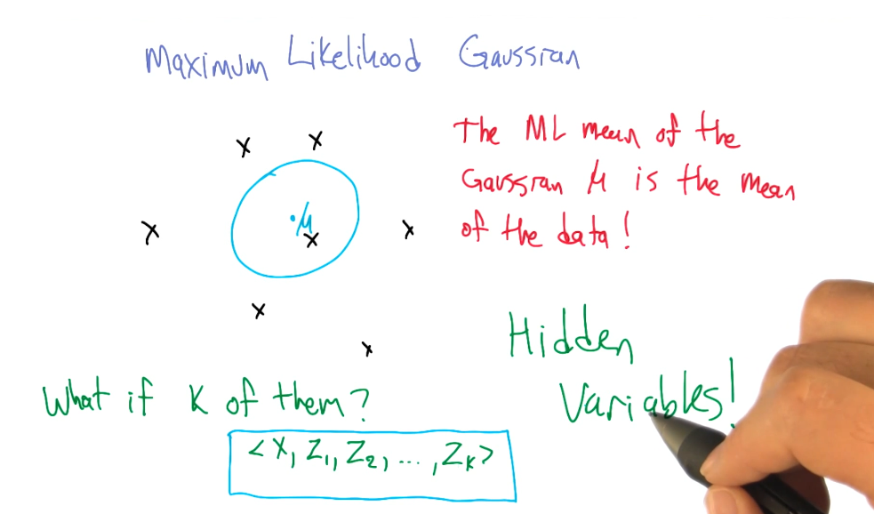
- hidden variables are how we set k different means for this dataset
- 
- update means by getting the average of the xi likelihood to each cluster/ weighted average
-
- 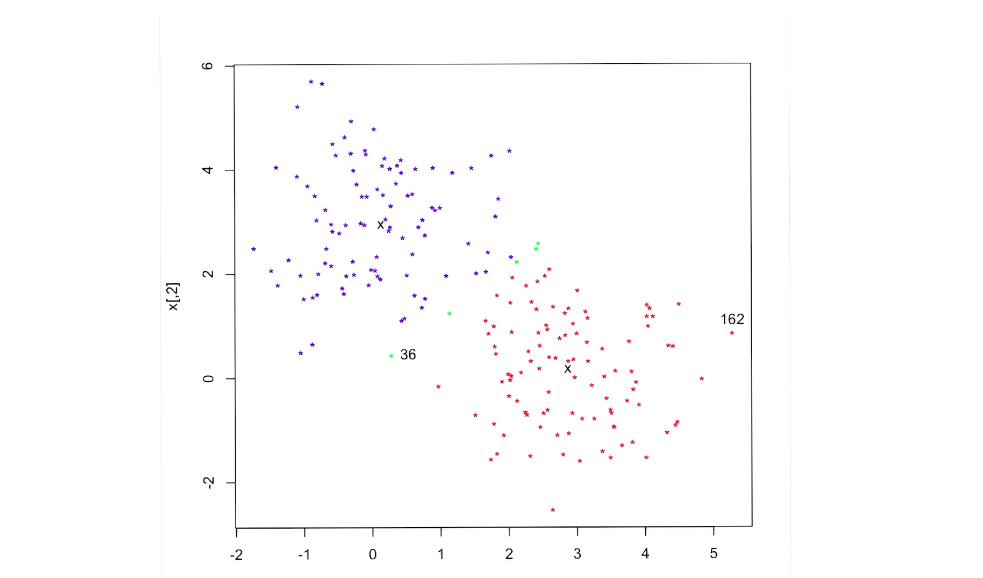
- EM shows through soft clustering some chance always of belonging to the other cluster/s . Probabilty of belonging rather then a set decision of which cluster to choose.
- 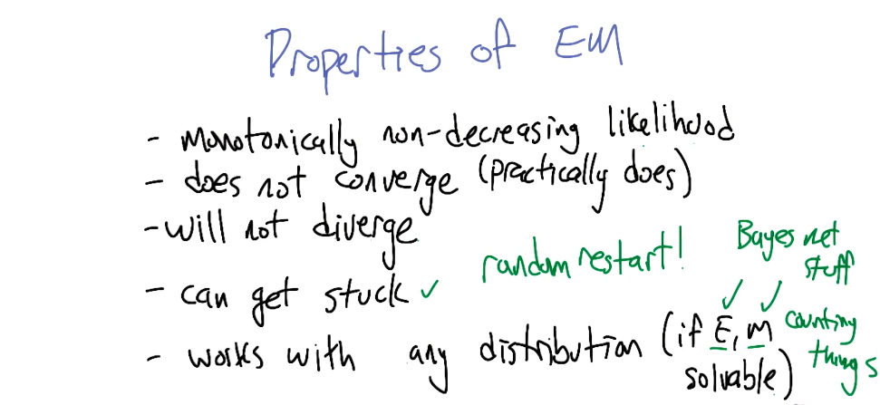{:height 367, :width 780}
- 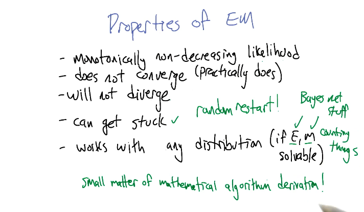
- vs kmeans, finite number of configs so kmeans must converge while EM doesnt have too. EM step keep getting smaller and smaller towards convergence so can theoratically not converge but practically does.
- 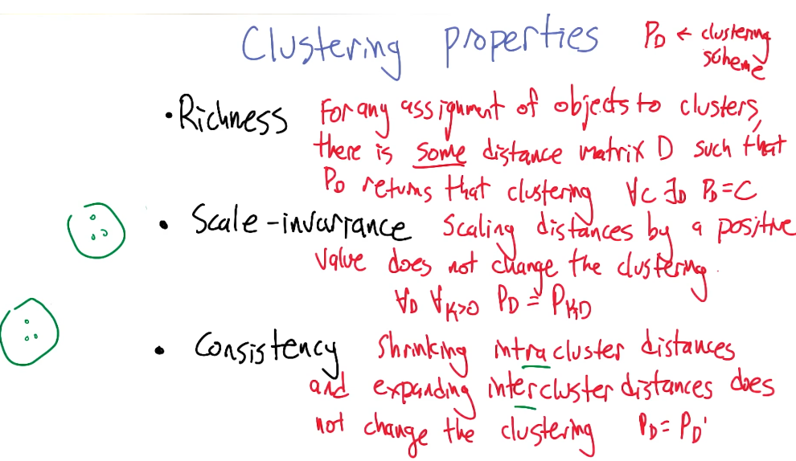
- richness all inputs are valid and all outputs are possible
- 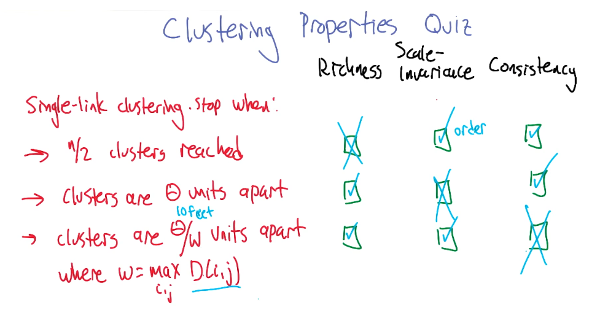
- last point consistency is broken as we can have clusters infinietly far apart , making the calculation usin w off.
- 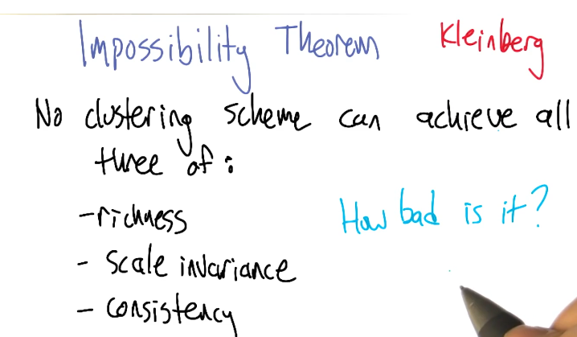
- 
-