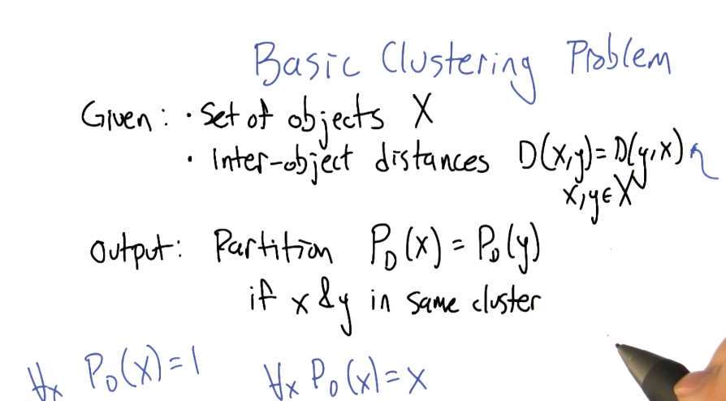
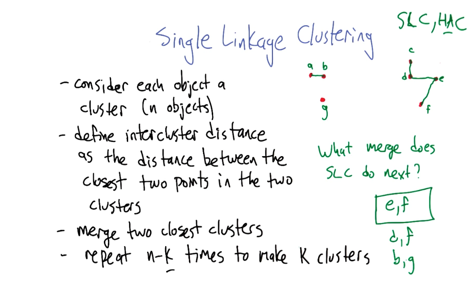
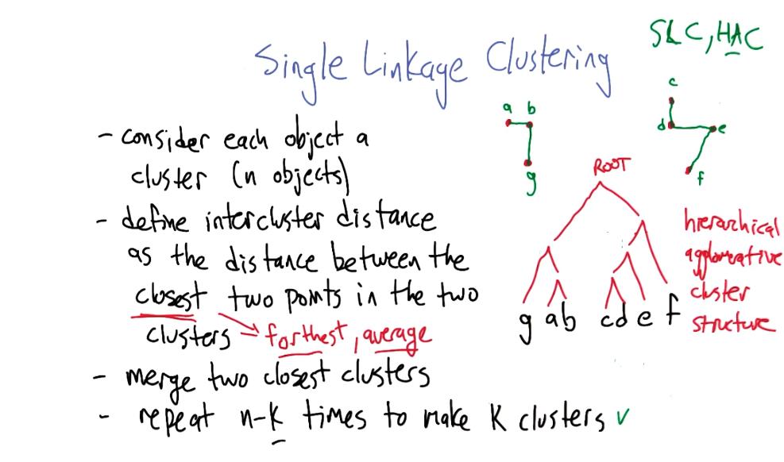
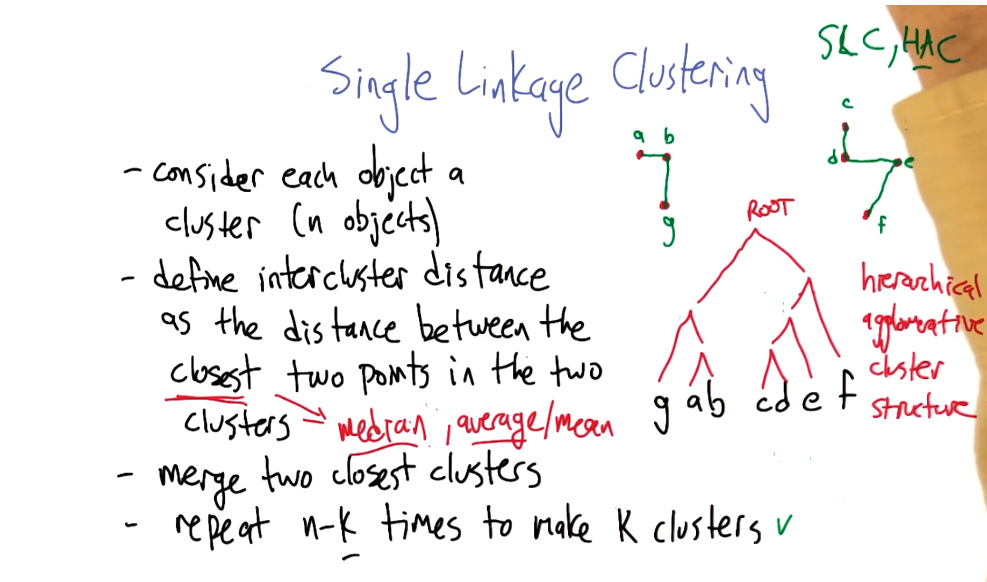
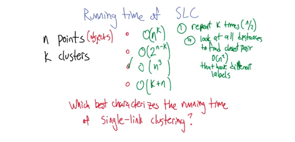

- 
- 
- same cluster points are not checked against each other and have an inter distance of 0.
- 
- {:height 468, :width 780}
- mean is a metric statistic , median is a non metric
- 
- [[Machine Learning/ Machine Learning CS 001/ UnSupervised Learning/Clustering/ K-means Clustering]]
-