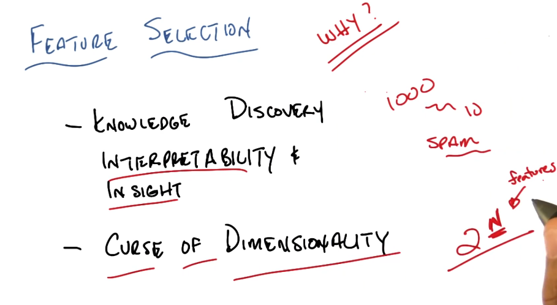
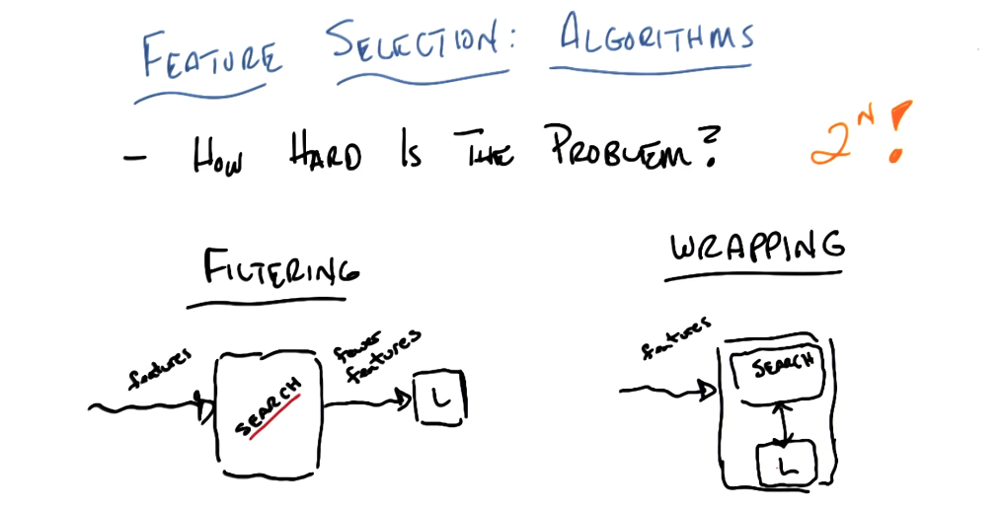

- 
- 
- 
- wrapping searches within the bounds of the learning algorithm(feedback loop).
- filtering considers its own criteria which doesn't necessarily suit the learner.
- wrapping takes into account the inductive bias of the learning algorithms.
- wrapping like algorithms: decision trees is an example
- 
- Filtering: by combining learners for filtering and learners e.g: DT and KNN respectively we get best of both compensating for knn curse of dimensionality while using its others strenghts and making use of DT feature selection.
-
- Information gain is conditional entropy that depends on the label , while entropy doesnot
- filtering depends on domain knowledge
- wrapping makes use of the bias of the learner
- 
- 
- while c doesnt add any information it is actually useful in introducing a bias to help add the bias unit to the perceptron.
- 
- 
- bayes optimal classifier (optimal thing to do)computes the best label given all prob that can be computes in all hypothesis space, measure of information.
- some label is good based on use. kmean and others, feature transformation. label == cluster name.
- 
-