- 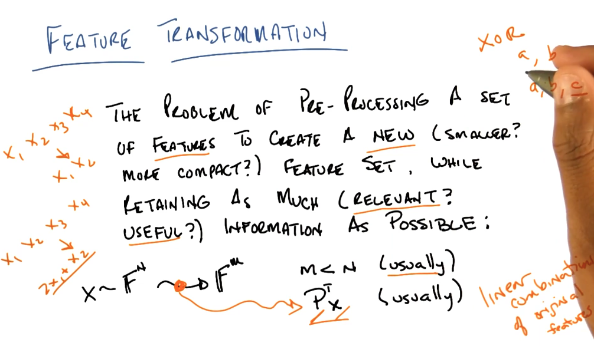
- 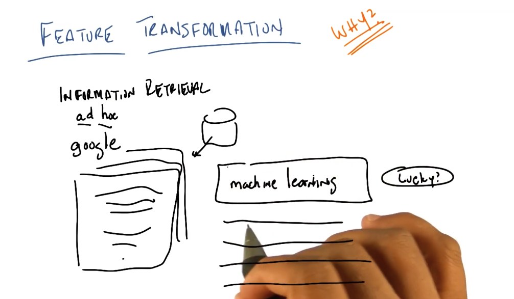
- return most relevant results
- 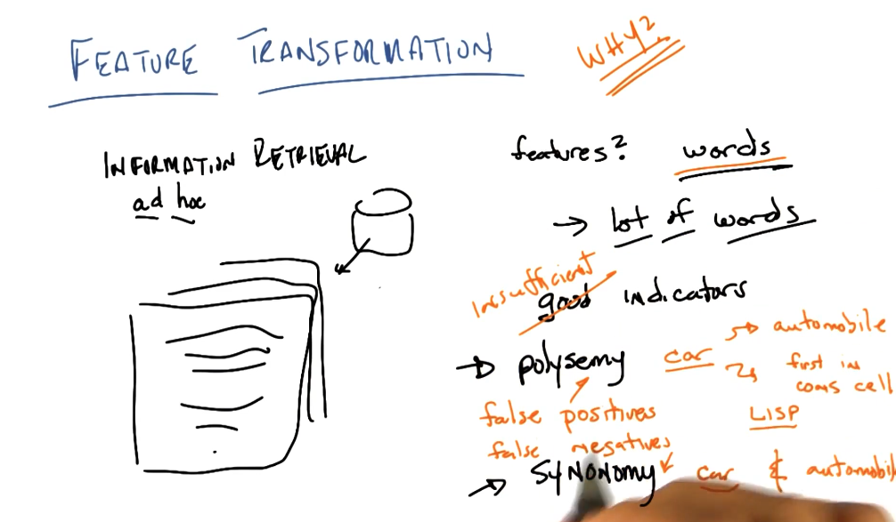
- multiple or same meaning for keywords
- Linear transformations:
	- Principle components Analysis:
		- EigenProblem?
		- 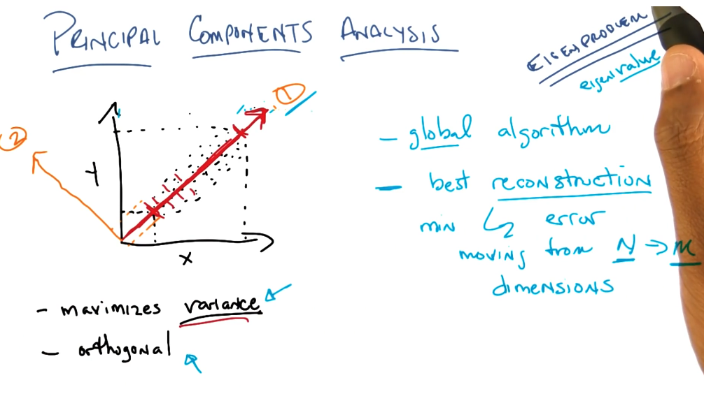
		- 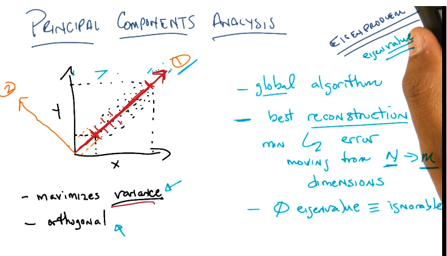
		- 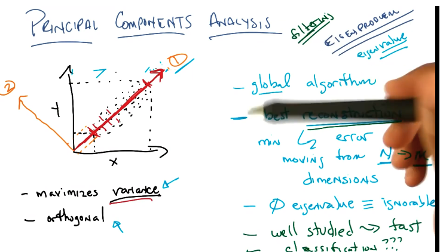
		-
	- Independent Component Analysis:
		- 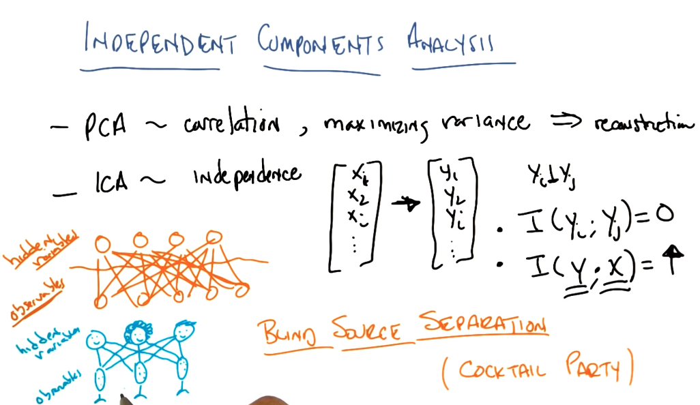
		- 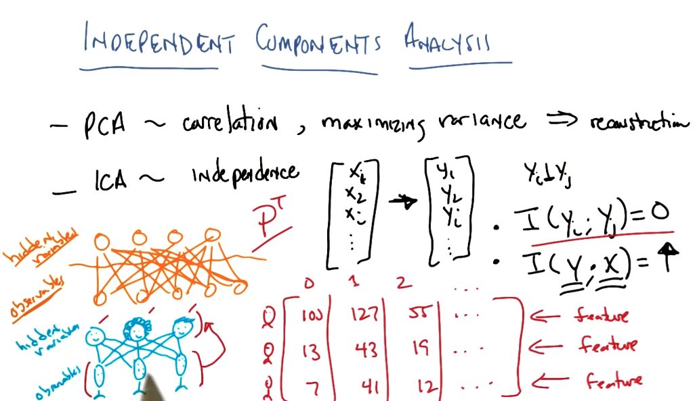
		- we not only want new features independent but we also want them to retain all the information
		- new and old matching features should be able to strongly predict one another , thus possible to predict one another.
	- 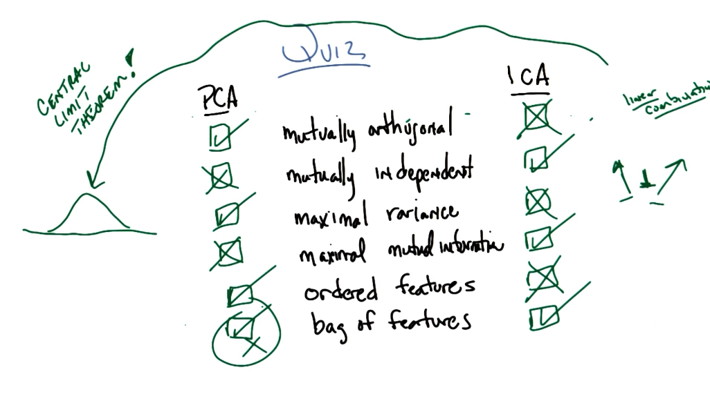
	- Coincidence due to normal Gaussian distributions(which is ideal for maximizing variance) found(when all features are normally distributed): cases where PCA finds independent/uncorrelated features due to maximizing variances.
	- sum independent variables into one (law of large number/ central limit theorm) will result in a normal distribution. therefore maximizing variables is not good to ICA as it will result in dependent variables(will mix dependent things). the assumption is that variables are highly not normally distributed.
	- ICA: maximize joined mutual information.
	- PCA ordered by maximum variance first.
	- only thing in common is trying to capture the original data in a new transformed better space. different cost functions and assumptions
	- BSS : blind source seperation problem
	- PCA finds global features , while ICA finds local selectors/ features
	- 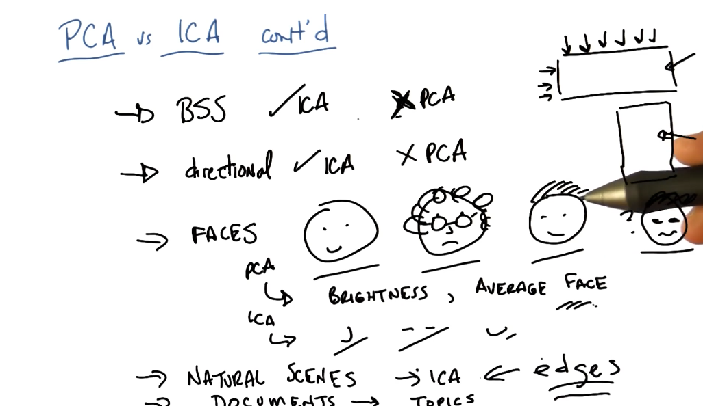
	- both help you understand and analyze the data. then we can write code to select for them.
	- RCA: random component analysis:
		- 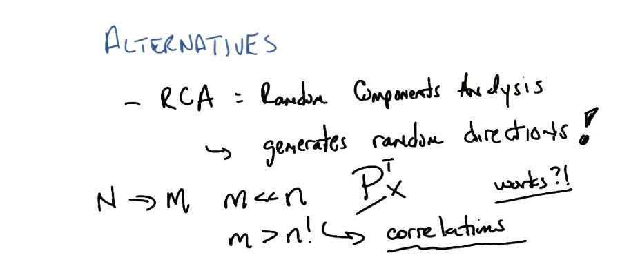
		- 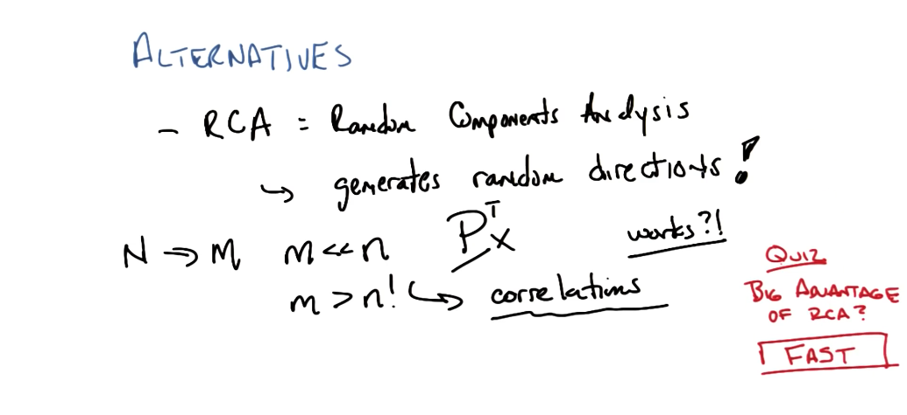
	- LDA: Linear discriminant analysis
		- 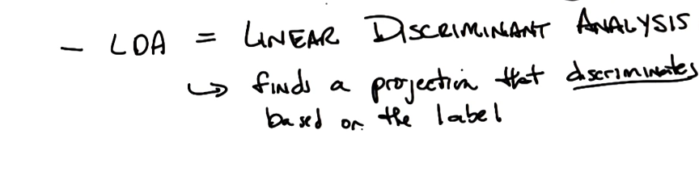
		- DIshcleie
	- PCA is more about linear algebra and sometimes alittle about probability. easier to think and do and often thought of in terms in prob. less prone to local minima and cheaper. but not always the answer.
	- ICA is mostly about probability and sometimes coincidentally about linear algebra. not always fits cause might not exists and more expensive. answers are more satisfying.
	- 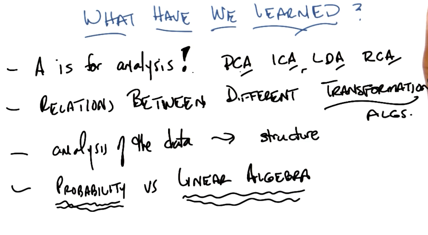
-