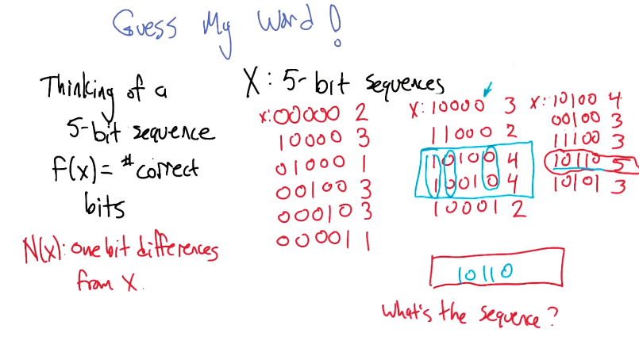

-
- 
-
- 
- 
- 
- 
- 
- 
- global optimum is local optimum that cant be improved by local steps
- 
- the win depends on the basin around the global optima , the bigger the better/ more lucky.
- 
- 
- 
- 
- 
- 
- 
- 
- MIMC:
	- 
	- 
	-
-
- 
- 
- 
	- we believe in some dependency so we allow one parent.
	- crossover presents structure/ locality. MIMIC is a generic way of capturing that without requiring locality.
	- 
	- conditional entropies are directional
	- mutual information (from information theory) are bidirectional. to find best tree maximize info between child and parent.
	- 
	- best dependency tree is one that captures dependencies the best.
	- 
	- Spanning tree??
- sampling generating from them a set of unconditional probabilities
- 
- 
- 
- MIMIC performs better when fitness function/ evaluation is hard. otherwise the MIMIC iteration is much costlier.
- 
-
- [[Machine Learning/ Machine Learning CS 001/ UnSupervised Learning/Clustering]]
- [[Machine Learning/ Machine Learning CS 001/ UnSupervised Learning/Feature Selection]]
- [[Machine Learning/ Machine Learning CS 001/ UnSupervised Learning/Feature Transformation]]
- [[Machine Learning/ Machine Learning CS 001/ UnSupervised Learning/Information theory]]
-