- coffee roasting
	- 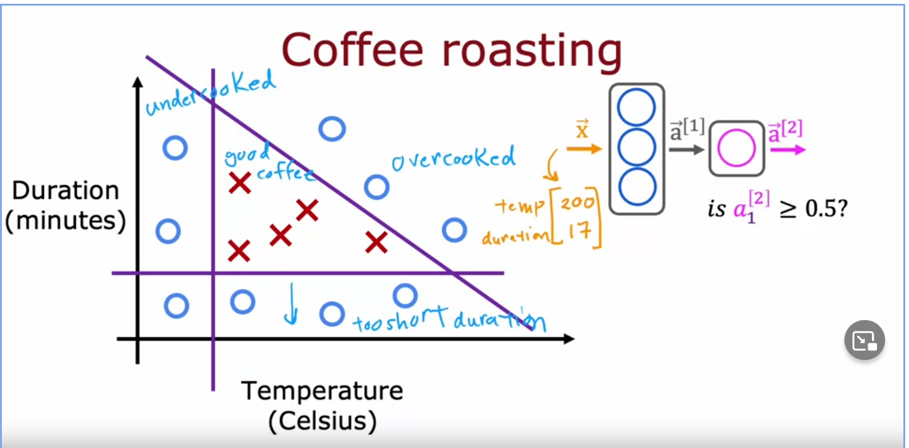
	- undercooked
	- overcooked
-
- Dense (fully connected)
	- 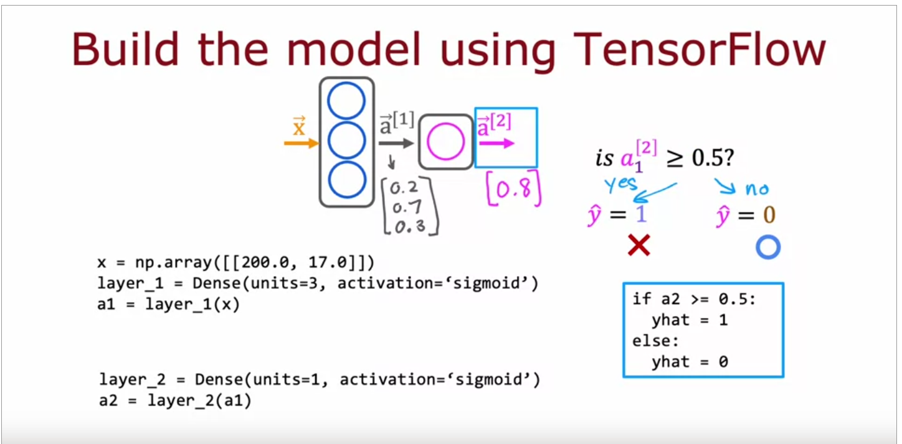
	- 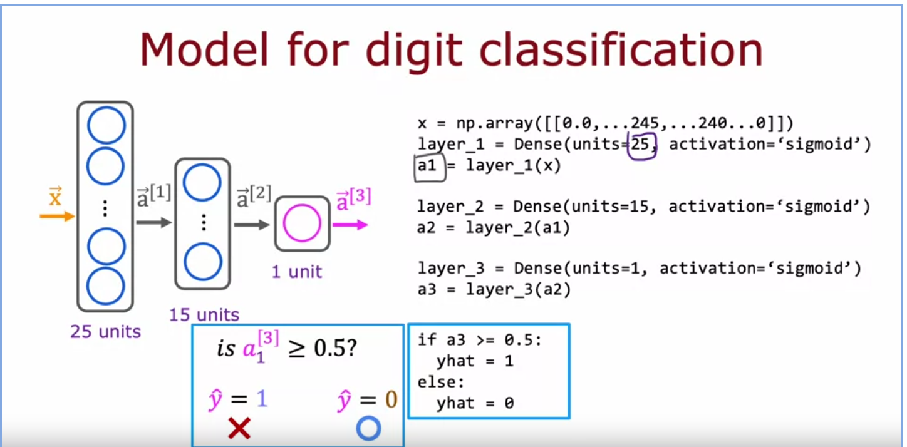
	-
- Tensorflow data representation:
	- feature vectors:
		- numpy version:
		- 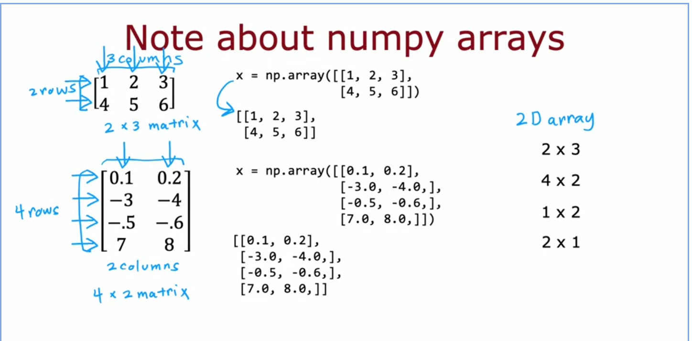
		- 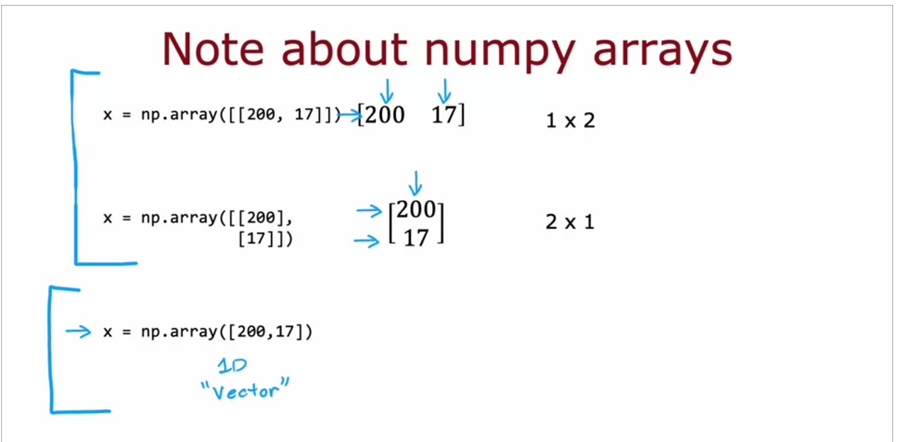
	- Tensorflow only uses matrices nt vectors.
	- 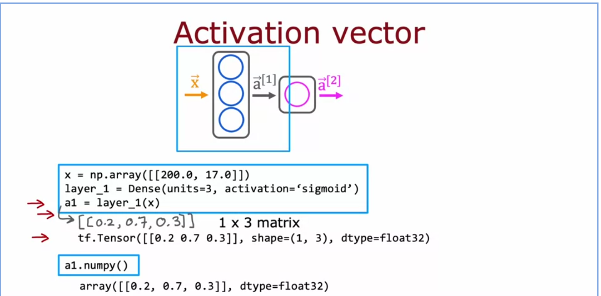
	- tensor is the type used for tensor flow and needs conversion back and forth between numpy.
	- 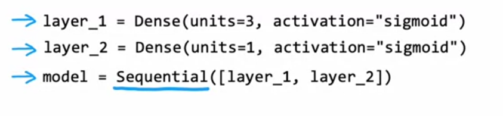
	- sequential function patches layers to create a nn.
	- 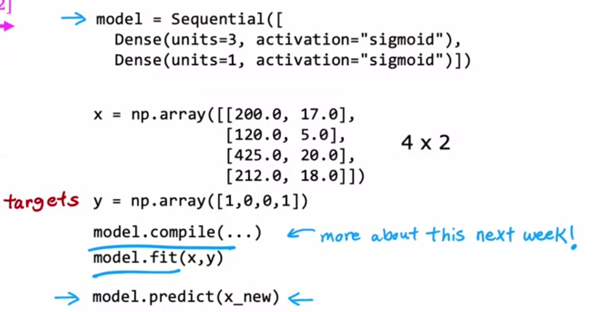
	- 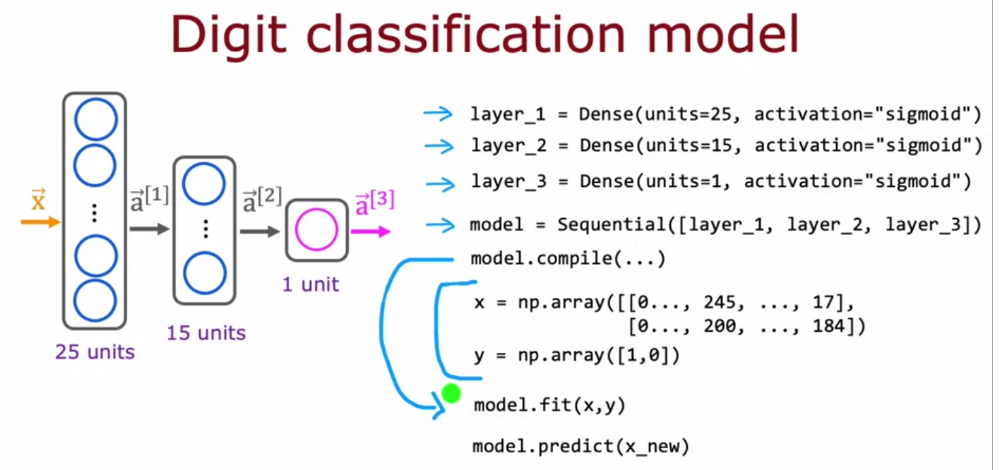
- Numpy naive implementation
	- 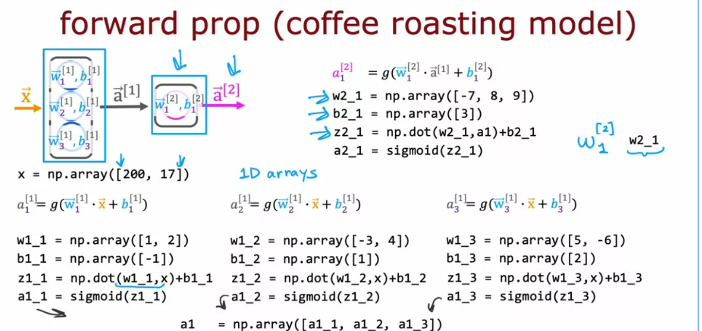
	- 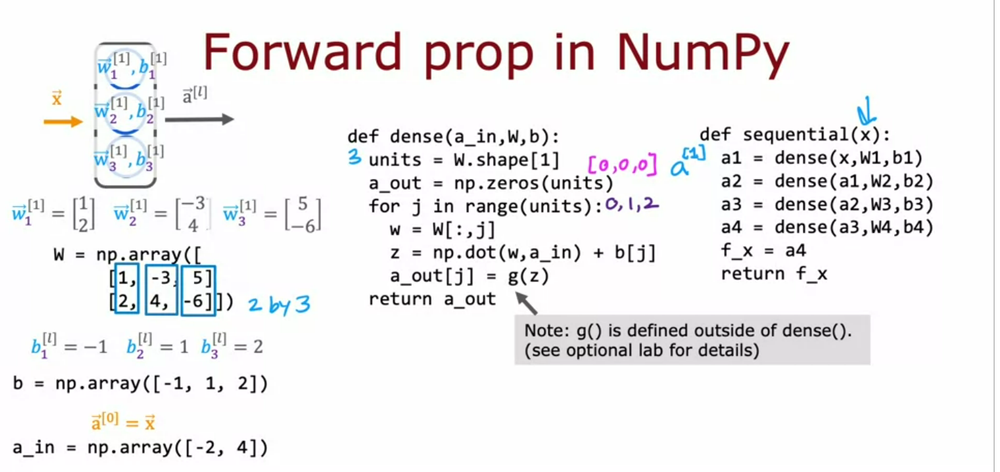
- Vectorization of neural networks.
	- 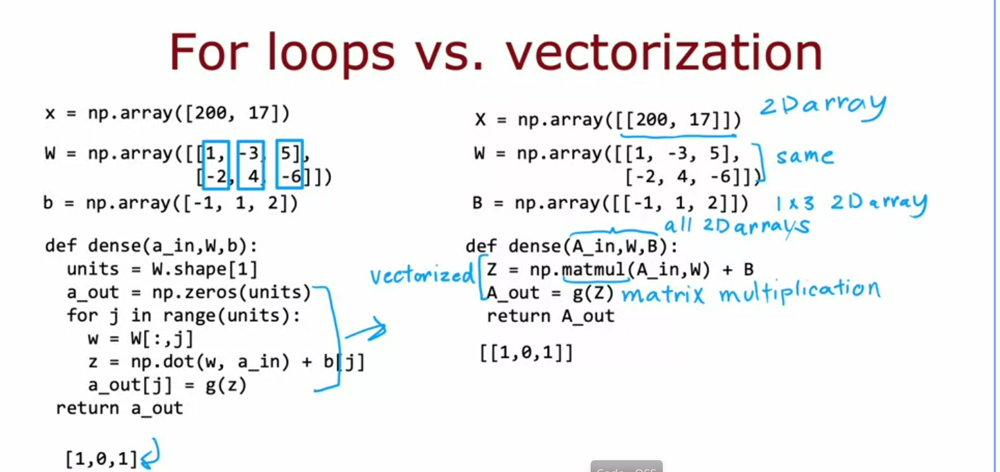
	- 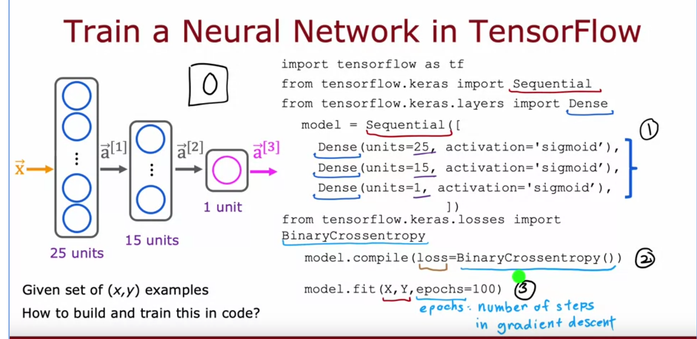
	- 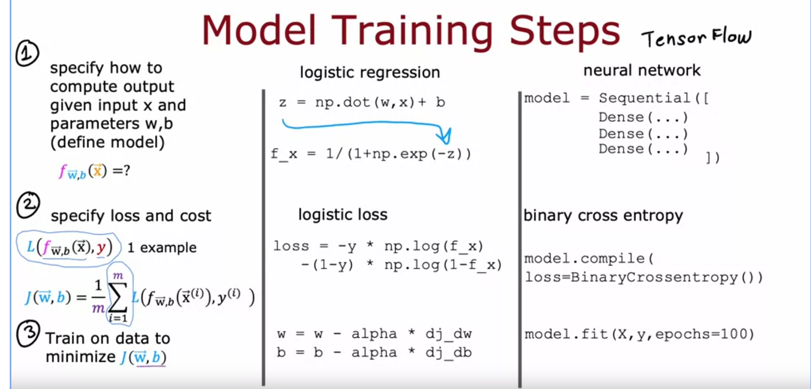
	-
	- 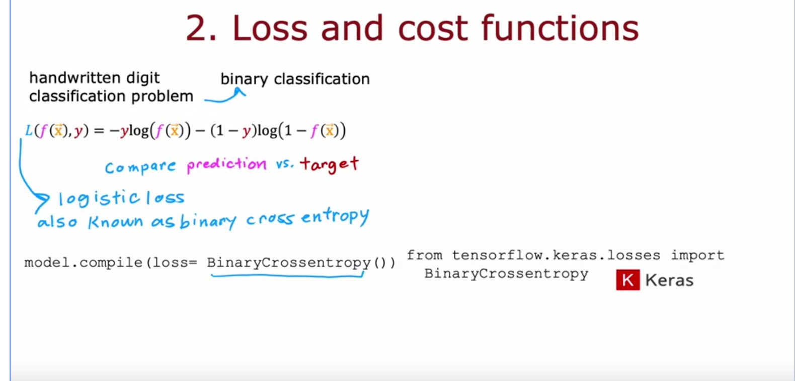
	-
- Numerical roundoffs for softmax
	-