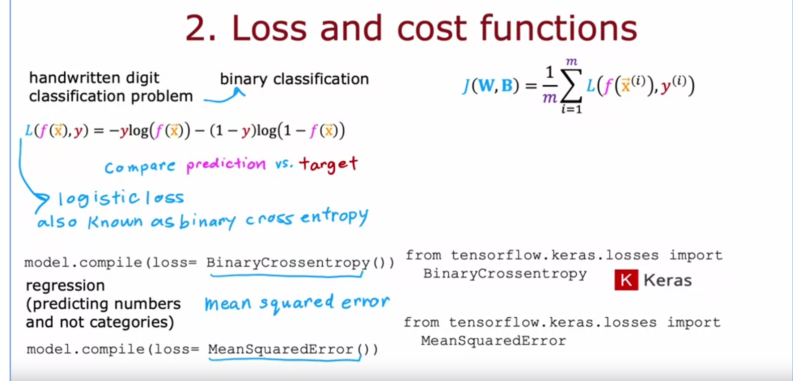
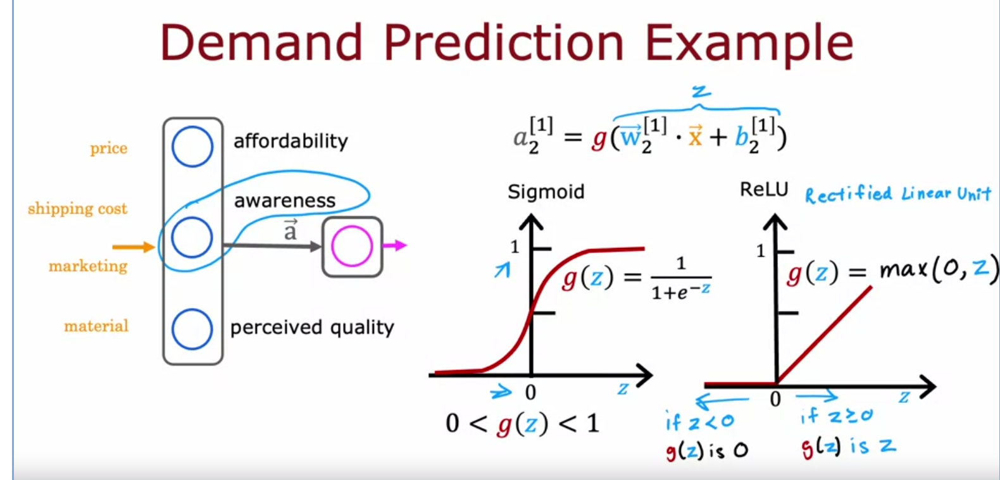
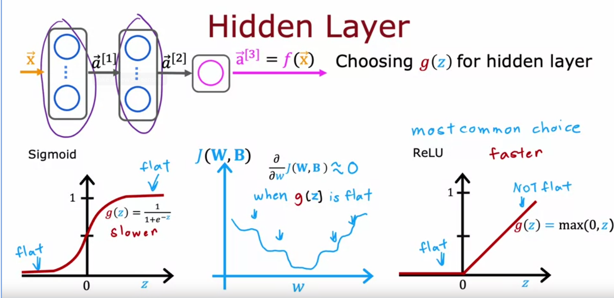
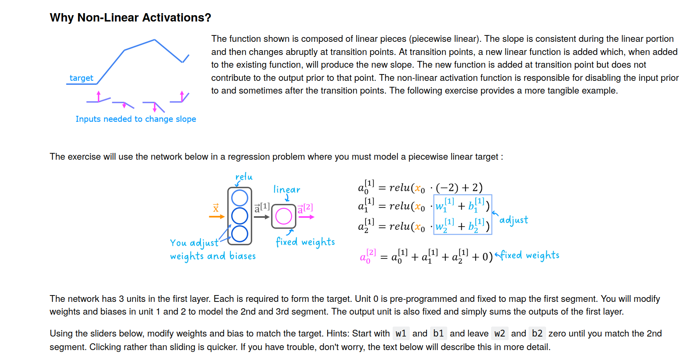

- coffee roasting
	- 
	- undercooked
	- overcooked
-
- Dense (fully connected)
	- 
	- 
	-
- Tensorflow data representation:
	- feature vectors:
		- numpy version:
		- 
		- 
	- Tensorflow only uses matrices nt vectors.
	- 
	- tensor is the type used for tensor flow and needs conversion back and forth between numpy.
	- 
	- sequential function patches layers to create a nn.
	- 
	- 
- Numpy naive implementation
	- 
	- 
- Vectorization of neural networks.
	- 
	- 
	- 
	-
	- 
		- Logistic loss for classification  or logistic regression, while mean loss is for regression problems(mean squared error)
	- [[Machine Learning/Logistic Loss]]
	- Steps:
		- define model and activation function.
		- define loss and cost function.
			- 
		- gradient descent or correction function.
			- 
- Activations functions:
	- 
	- Most popular:
		- 
	- How to choose for output layer:
		- binary classification sigmoid is often best
		- regression linear activation is better: values can be negative aswell
		- 
	- How to chose hidden layers:
		- why use relu instead of sigmoid:
			- sig. less efficient in computing
			- 2 flat regions. flatness slows down gradient decent...why?flattens scoring potential
			- 
			-
	- why use activation functions
		- 
		- Linear function of a linear function is a linear function therefore
		- 
		- why is RELU so different than a linear unit:
			- 
			- 
			-
-