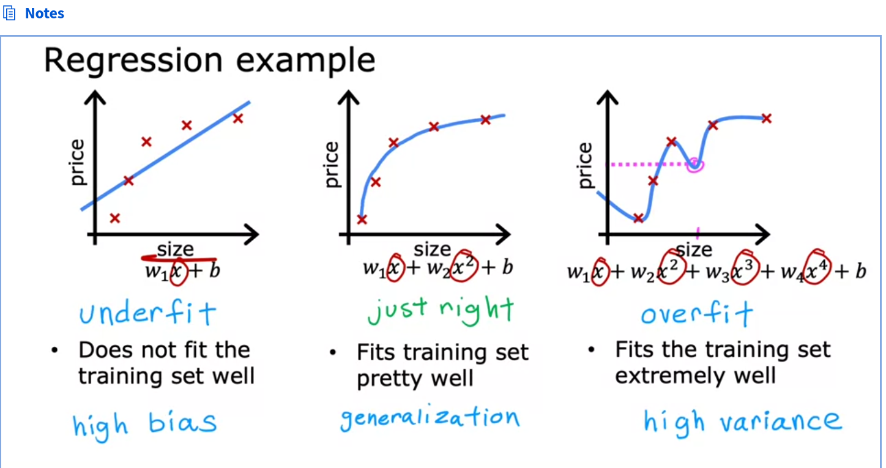
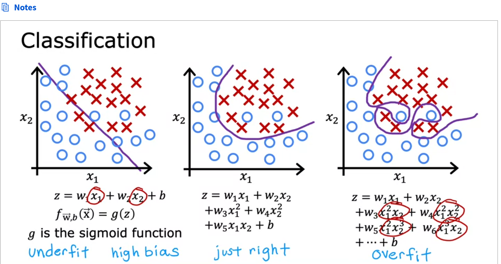
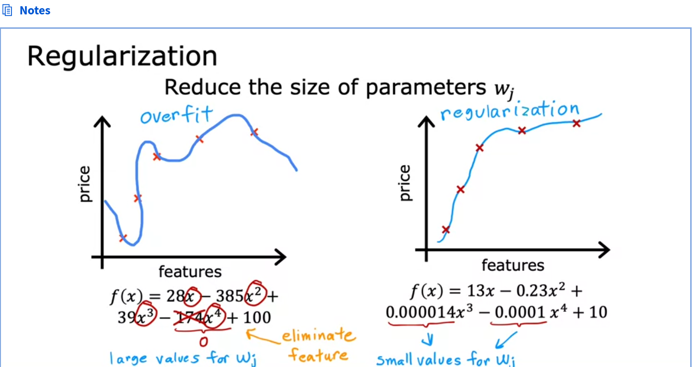
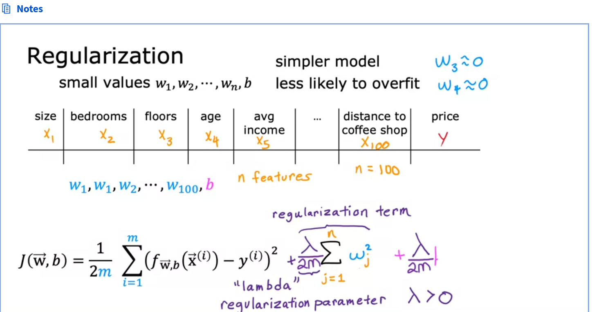
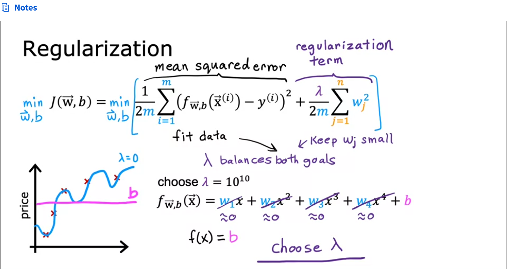

- What is overfitting:
	- 
	- 
- How to address overfitting:
	- collect more training data
	- correctly select features to include and exclude
		- useful features + insufficient data == overfitting
		- useful features might be lost.
	- regularization:  gently reduce impact of features without elimination.
		- 
		- a way to penalize features that dnt add to the fitting much.
		- Lambda ==> regularization parameter.
		- 
		- 
		-
	-