- Mars rover example:
	- 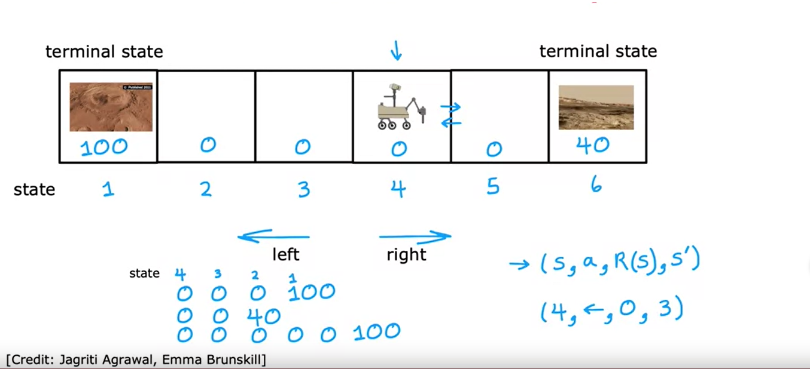{:height 338, :width 723}
- The Return
	- 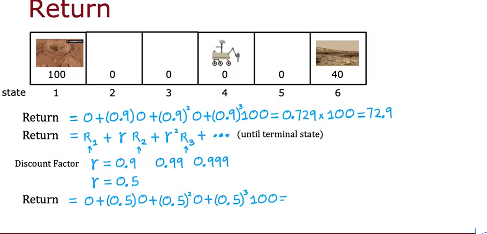
	- 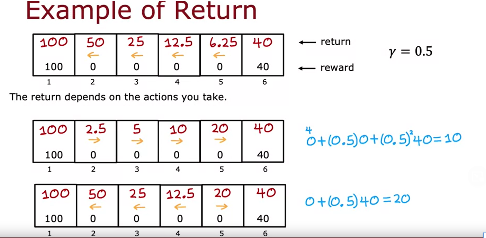
- Making decisions: policies:
	- 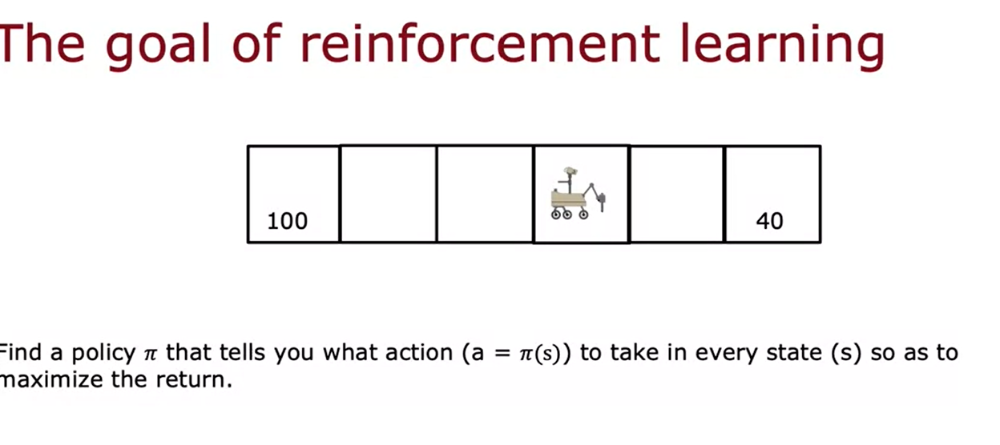
	- policy is the controller
- 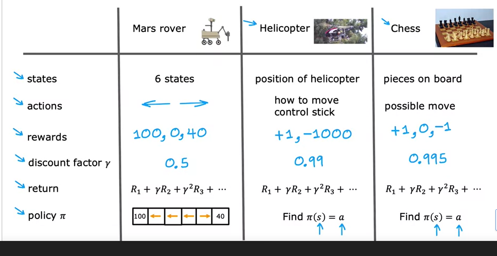
- Markov decision process:
	- depends on where you are now not how you got here.
	- 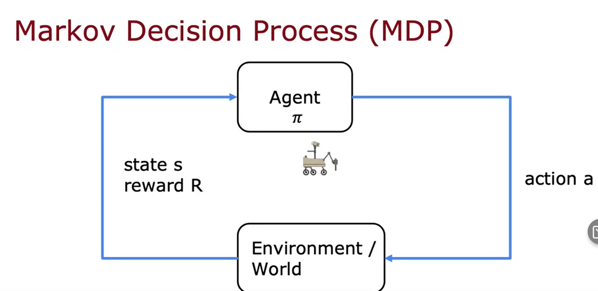
- state action value function definition:
	- 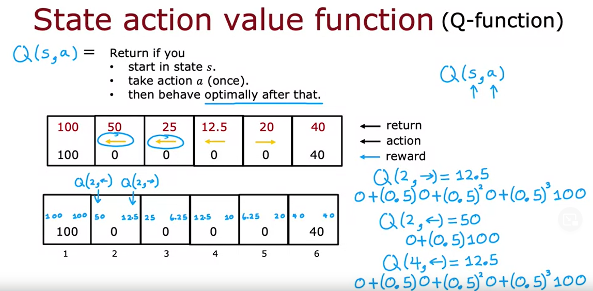{:height 363, :width 723}
	- 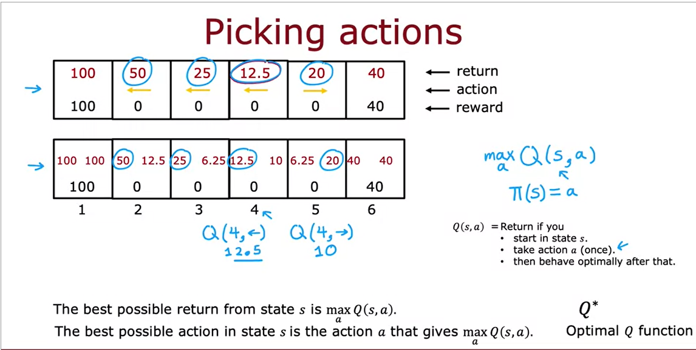
	-
- Bellman equation:
	- 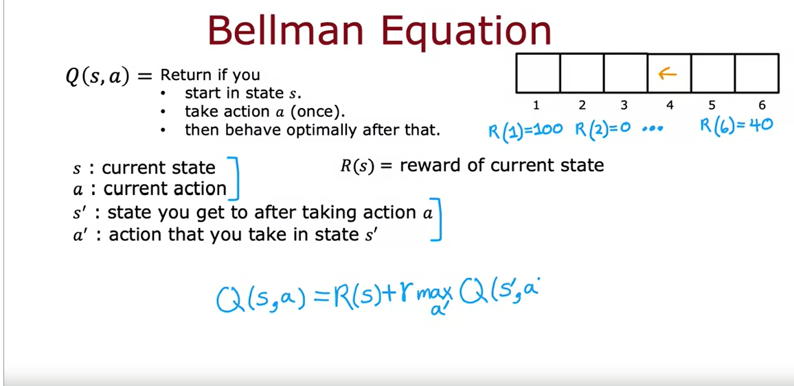{:height 361, :width 723}
	- 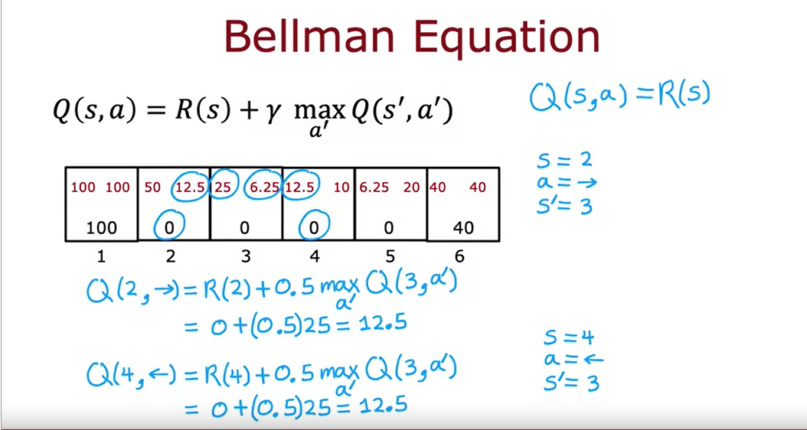
	- R1 is called immediate reward,
	- 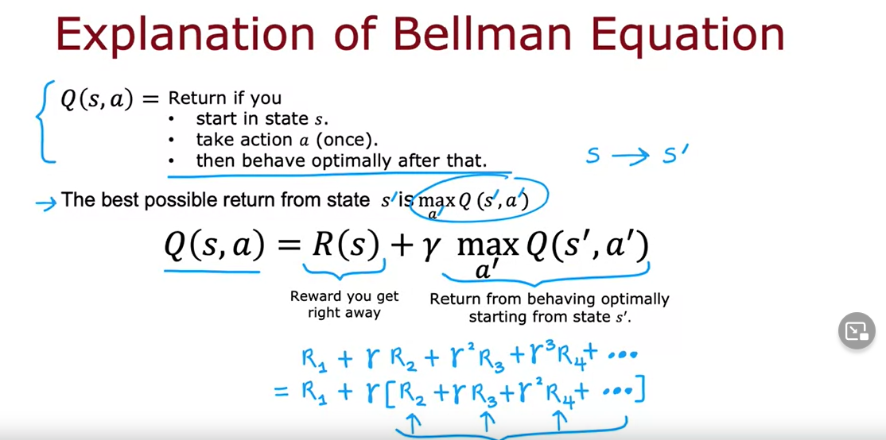
	-
- 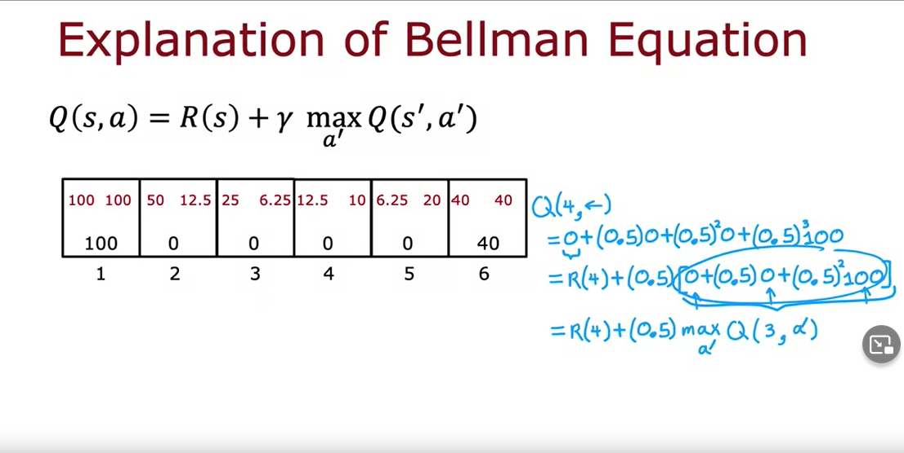
-
- action outcome reliability is not always guaranteed.
	-
	- Stochastic environment :
		- in a stochastic reinforcement environment we dnt seek highest reward but highest average.
		- 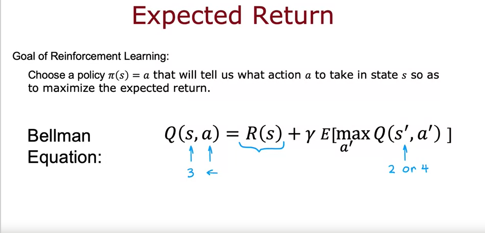
		-
-