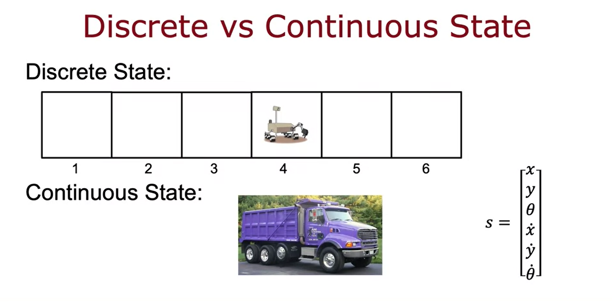
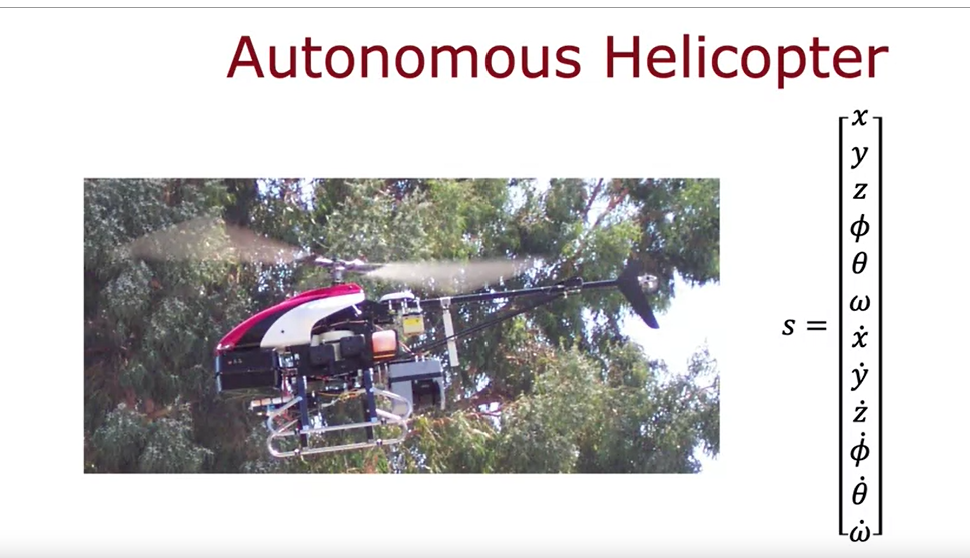
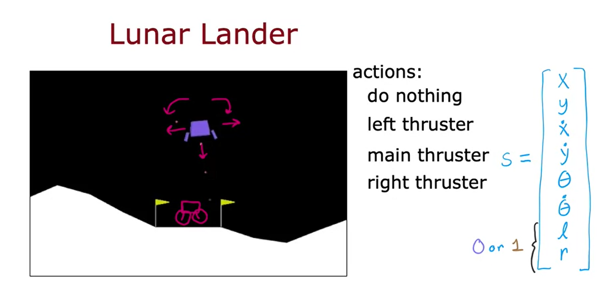
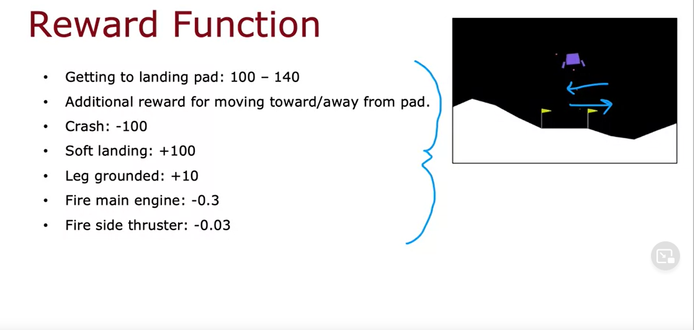
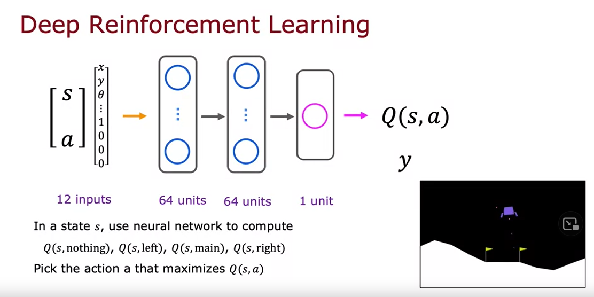
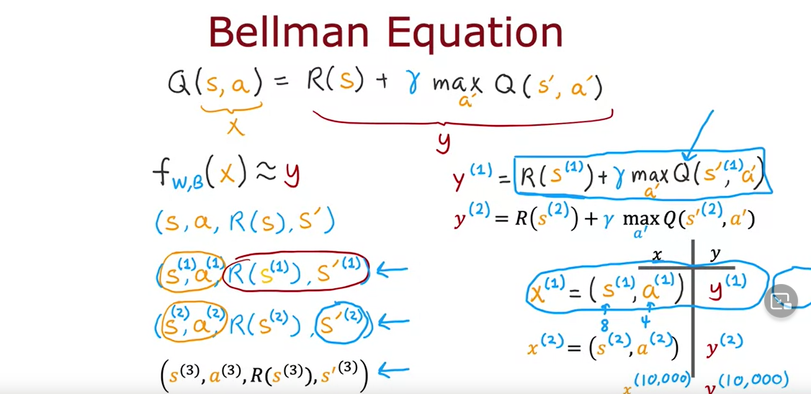
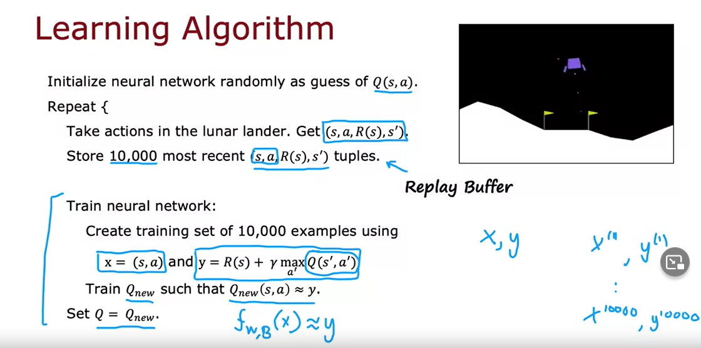
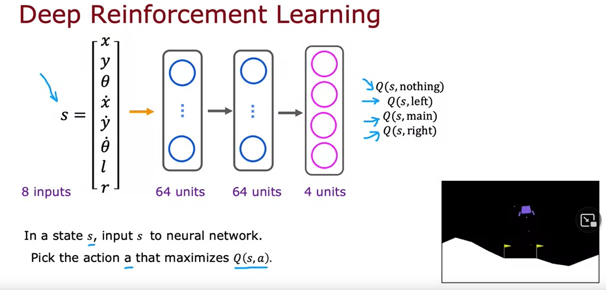
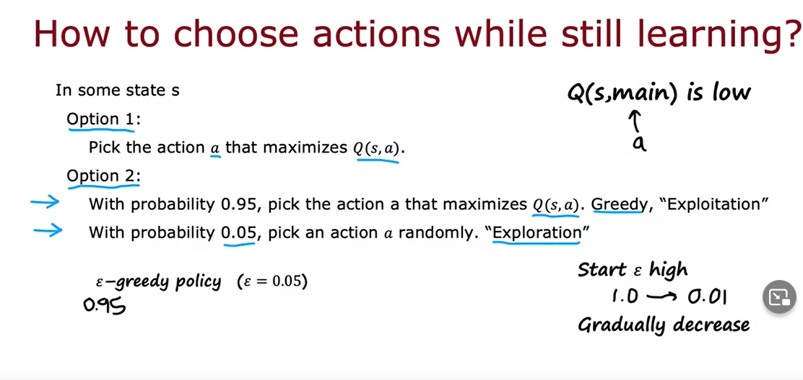

- Mars rover example:
	- {:height 338, :width 723}
- The Return
	- 
	- 
- Making decisions: policies:
	- 
	- policy is the controller
- 
- Markov decision process:
	- depends on where you are now not how you got here.
	- 
- state action value function definition:
	- {:height 363, :width 723}
	- 
	-
- Bellman equation:
	- {:height 361, :width 723}
	- 
	- R1 is called immediate reward,
	- 
	-
- 
-
- action outcome reliability is not always guaranteed.
	-
	- Stochastic environment :
		- in a stochastic reinforcement environment we dnt seek highest reward but highest average.
		- 
	- continuous states:
		- 
		-
- {:height 442, :width 754}
- 
- {:height 366, :width 754}
- Learning the state value:
	- 
	- make use of supervised learning and bellman equation to train the model.
	- 
	- deep q network algorithm:
		- 
	- refine network:
		- infer only once and have 4 outcomes instead of inferring 4 times one for each state, network then only computes q values. (more understanding needed)
		-
		- 
		- use epsilon greedy approach:
			- why not use max Q always?  due to initialization bias that might lead the algorithm to always think another action is a bad idea :
			- exploration v.s exploitation
			- 
		- Mini batch and soft
- due to the fickness of reinforcement learning one misconfiguring could the deter the algorithm much more than in supervised cases.
-