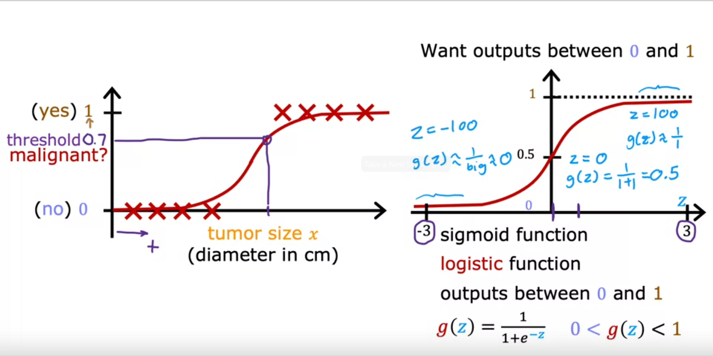
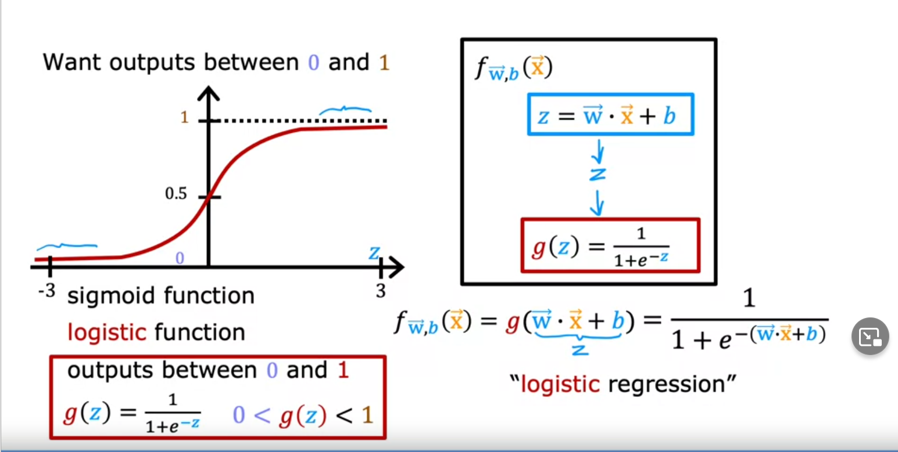
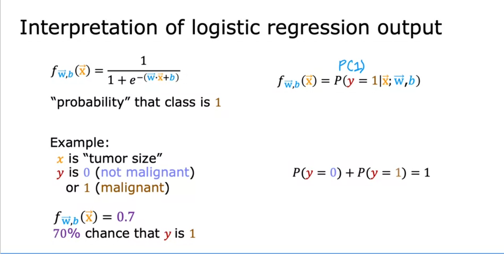
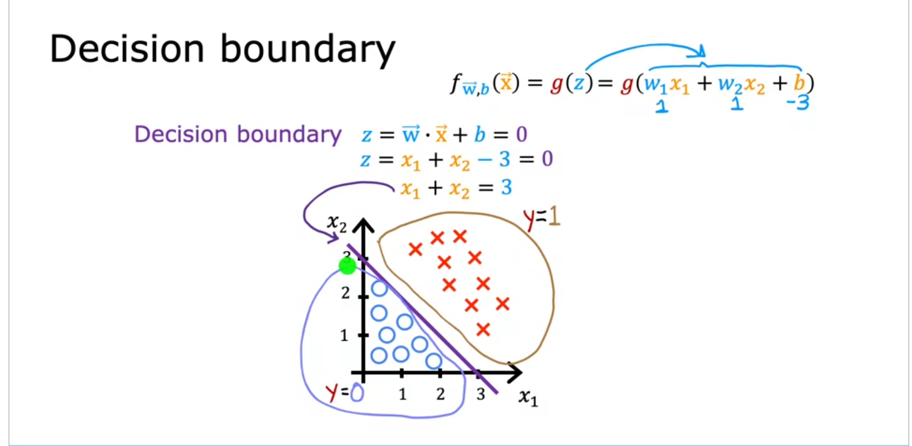
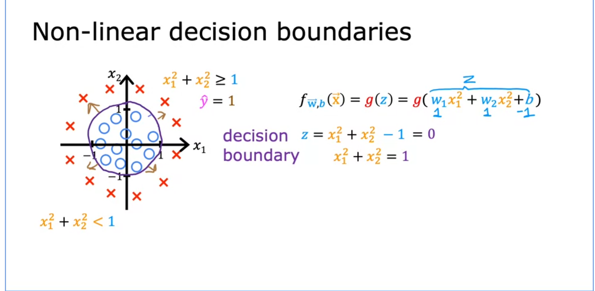
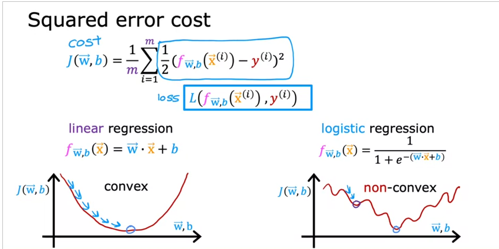
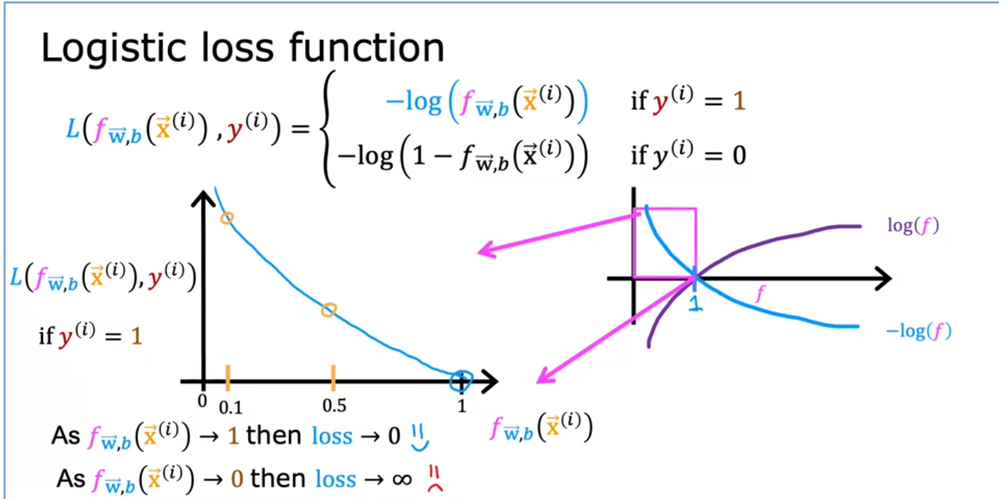
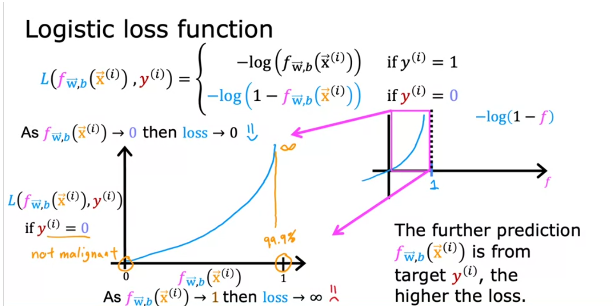

- threshold function , sigmoid or logistic function output of 0 or 1.
- 
- 
- output of sigmoid is like the probability of classification:
	- 
	- Desicion Boundary:
		- 
		- 
		- Cost function:
			- why squared error is not good for logistic regression:
				- many local minma:
				- 
			- 
			- 
			-
		-