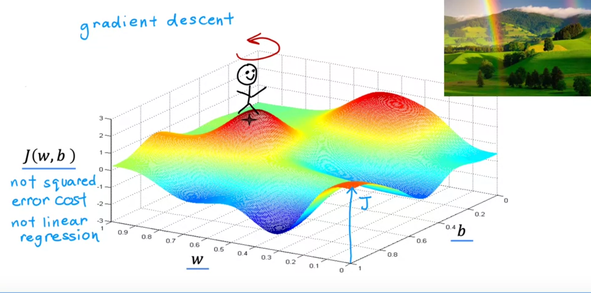
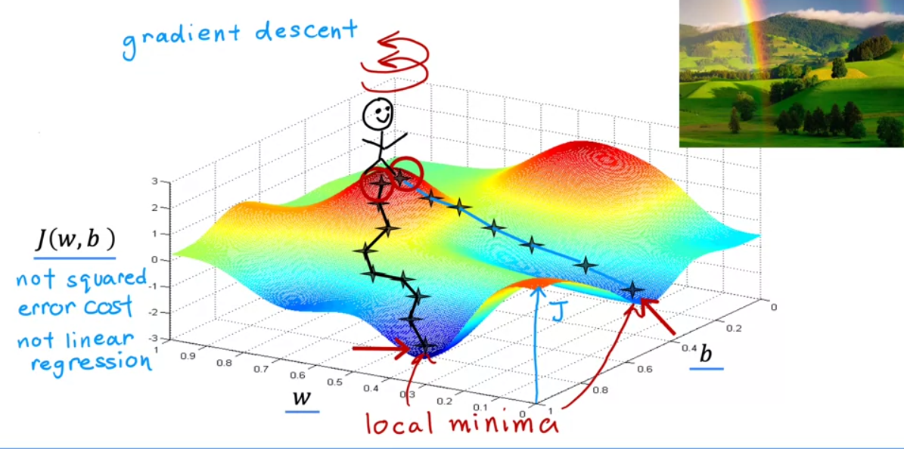
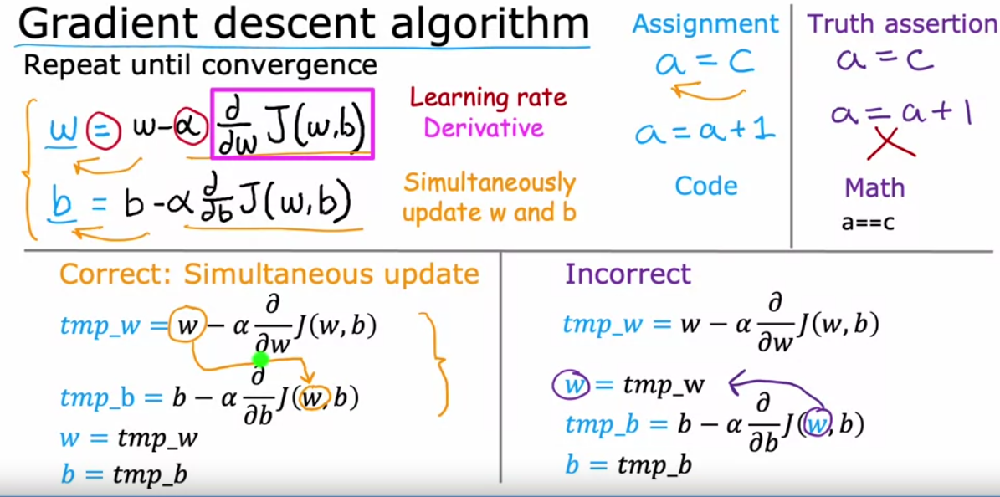
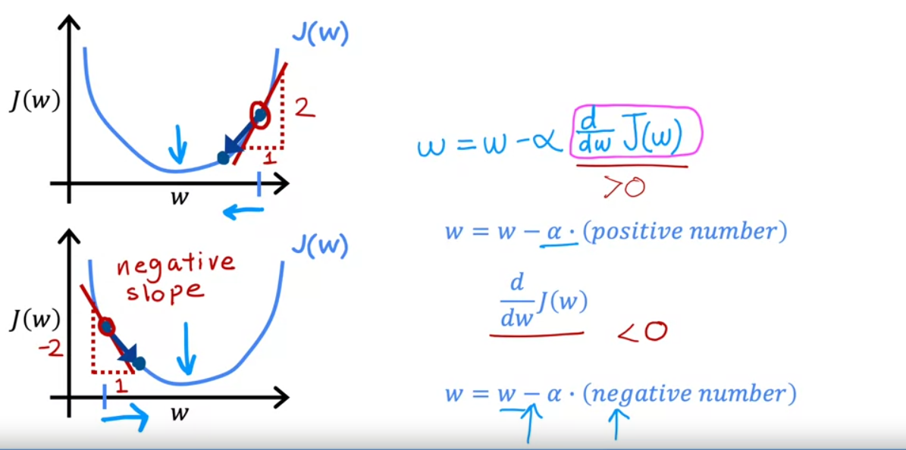
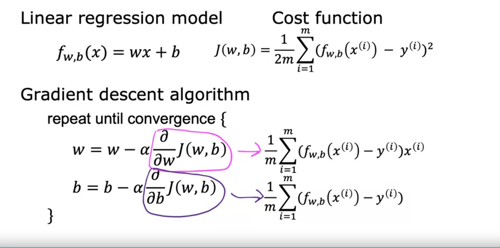
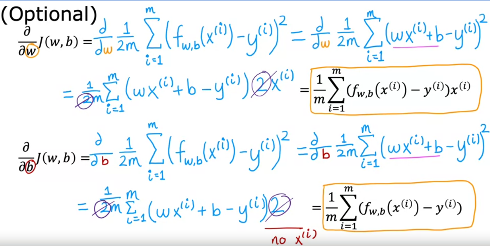

- algorithm for minimizing cost functions
- with least squares error function you will all always end up with a bow shape.
- 
- get to bottom of hill:
	- look around 360 to find best next step downwards.
	- repeat.
- 
- 
- larger alpha(learning rate)the more aggressive it is.
- 
- alpha , Learning rate too small  then alot of steps to reach goal.
- alpha too large GD might overshoot and never converge or even diverge.
- GD is likely to converge at a local minimum. and will automatically choose a smaller learning rate while approaching it.
- 
- 
- chain rule to derive differentiation.
-