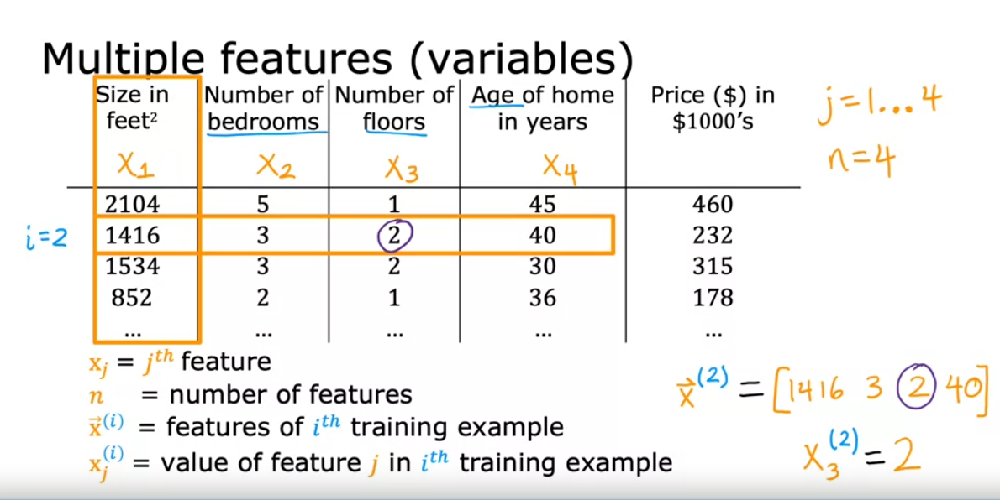
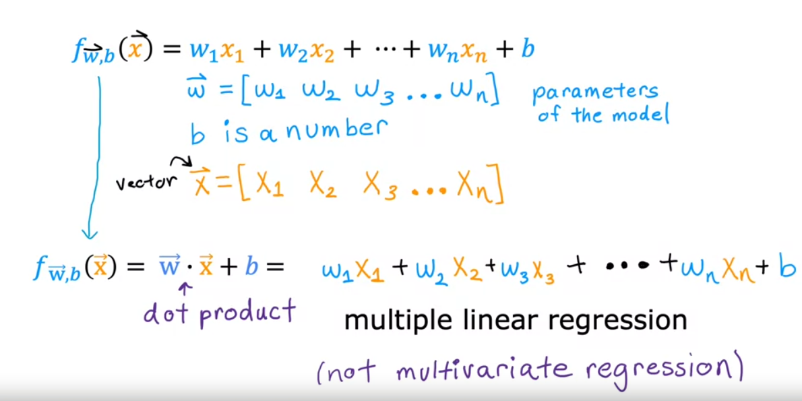
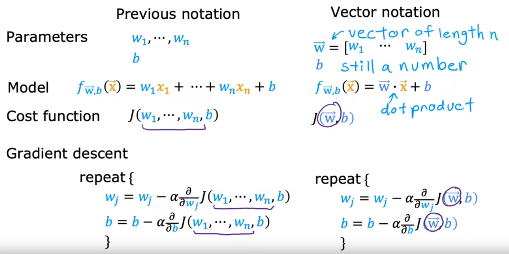
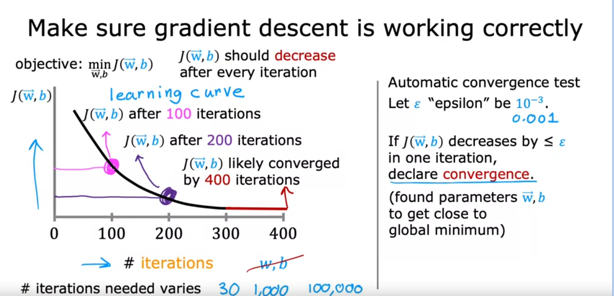
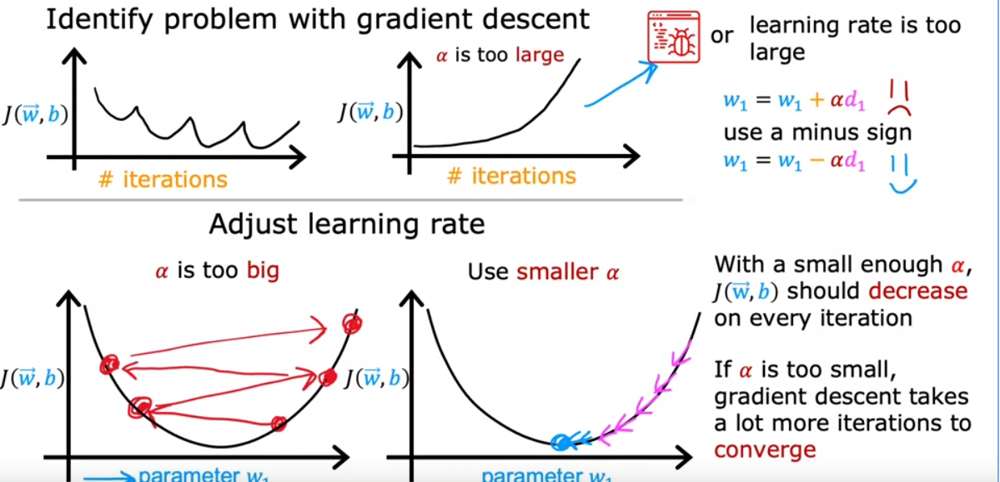

- algorithm for minimizing cost functions
- with least squares error function you will all always end up with a bow shape.
- 
- get to bottom of hill:
	- look around 360 to find best next step downwards.
	- repeat.
- 
- 
- larger alpha(learning rate)the more aggressive it is.
- 
- alpha , Learning rate too small  then alot of steps to reach goal.
- alpha too large GD might overshoot and never converge or even diverge.
- GD is likely to converge at a local minimum. and will automatically choose a smaller learning rate while approaching it.
- 
- 
- chain rule to derive differentiation.
- square error cost  is a convex function and will never  have a local minimum, as long as you choose the algorithm correctly you will always converge.
- Batch Gradient decent  evaluates on entire training data.
- Multi variant is not Multiple  Linear regression.
- Multi Features:
	- Multiple Linear regression.
		- methods
			- divide by max value (x-min)/(max-min).
			- mean normalization, first find mean/average of feature .  input - mean / max - min
			- z-score normalization. mean and standard deviation. input - mean/ standard deviation.
	- 
	- 
	- vectorization
		- [[Linear Algebra/ Vectors]]
		- shorter code, parallel execution
	- 
- check for convergence:
	- graph results
	- automatic convergence test
	- 
- Choose learning rate:
	- 
	- try very small and very large and adjust from there.
- Gradient Decent implementation:
	-